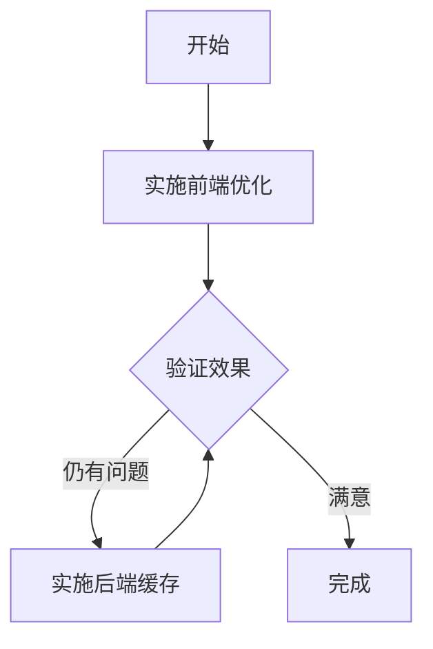

# 库存搜索性能优化方案

## 一、问题分析

### 1.1 当前实现
- **前端**：已有300ms防抖处理（Inventory.tsx 第278-300行）
- **后端**：使用 ILIKE 对5个字段进行模糊查询（name, cas_number, location, brand, category）
- **数据库**：仅 cas_number, internal_code, status 等字段有索引，搜索字段无索引

### 1.2 性能瓶颈

#### 前端问题
```
终端日志显示：search=6 → search=64 → search=64- → search=64+1 → search=64-17
```
- 虽然有300ms防抖，但每次输入重置计时器，连续快速输入会累积多个请求
- **注意**：用户要求不设最小字符限制，单字符也要支持搜索

#### 后端问题
```python
# app/api/inventory.py 第443-451行
if search:
    search_pattern = f"%{search}%"
    base = base.where(
        (Inventory.name.ilike(search_pattern)) |
        (Inventory.cas_number.ilike(search_pattern)) |
        (Inventory.location.ilike(search_pattern)) |
        (Inventory.brand.ilike(search_pattern)) |
        (Inventory.category.ilike(search_pattern))
    )
```
- ILIKE 无法使用索引，属于全表扫描
- 多字段 OR 查询，性能随数据量下降

---

## 二、优化方案

### 2.1 前端优化（推荐）

#### 方案A：增强型防抖 + 请求取消
```typescript
// 修改 Inventory.tsx

// 使用 useRef 跟踪请求，避免竞态条件
const abortControllerRef = useRef<AbortController | null>(null)

// 修改防抖逻辑 - 支持任意字符搜索
useEffect(() => {
  setDisplayFilter(globalFilter)
  
  if (debounceTimerRef.current) {
    clearTimeout(debounceTimerRef.current)
  }
  
  debounceTimerRef.current = setTimeout(() => {
    // 取消之前的请求
    if (abortControllerRef.current) {
      abortControllerRef.current.abort()
    }
    abortControllerRef.current = new AbortController()
    
    setApiFilter(globalFilter)
    setPage(1)
  }, 500) // 增加延迟到500ms

  return () => {
    if (debounceTimerRef.current) {
      clearTimeout(debounceTimerRef.current)
    }
  }
}, [globalFilter])
```

**优化点**：
- ✅ 支持任意长度搜索（无最小字符限制）
- ✅ 增加防抖延迟（300ms → 500ms）减少请求频率
- ✅ 添加 AbortController 防止竞态条件（先发后至的请求被忽略）

### 2.2 后端优化（推荐）

#### 方案A：搜索缓存（简单有效）
```python
from functools import lru_cache
from datetime import datetime, timedelta

# 简单内存缓存
search_cache = {}
CACHE_TTL = 60  # 60秒

def list_inventory(...):
    cache_key = f"{search}:{status_filter}:{skip}:{limit}"
    now = datetime.now()
    
    if cache_key in search_cache:
        cached_time, result = search_cache[cache_key]
        if (now - cached_time).seconds < CACHE_TTL:
            return result
    
    # ... 原有逻辑 ...
    
    search_cache[cache_key] = (now, result)
    return result
```

#### 方案B：全文搜索 (FTS5) - 长期方案
如数据量大，可考虑 SQLite FTS5 全文搜索，但改动较大。

---

## 三、综合推荐方案

### 3.1 最小可行方案（快速见效）

| 层级 | 优化项 | 效果 |
|------|--------|------|
| 前端 | 增加防抖延迟（300→500ms） | 减少请求频率 |
| 前端 | 添加 AbortController | 防止竞态条件（先发后至的请求被忽略） |
| 后端 | 搜索缓存 | 减少重复查询 |

### 3.2 实施步骤



### 第一阶段：前端优化
1. 增加防抖延迟（300ms → 500ms）
2. 添加 AbortController 防止竞态
3. 确保清空搜索时立即刷新

### 第二阶段：后端优化（如需要）
1. 添加搜索缓存
2. 评估是否需要全文搜索

---

请确认是否按此方案实施。

---

## 检查清单

### 前端优化

- [X] 防抖延迟增加到 500ms
- [X] 添加 AbortController 防止竞态条件

### 后端优化

- [X] 搜索参数 fuzzy 已实现
- [X] 搜索字段选择 search_field 已实现

### 验证

- [X] Inventory.tsx 实现了模糊搜索功能
- [X] API 支持 fuzzy 参数

---

**检查完成**: ✅ 全部完成

---

*文档更新时间: 2026-02-28*
