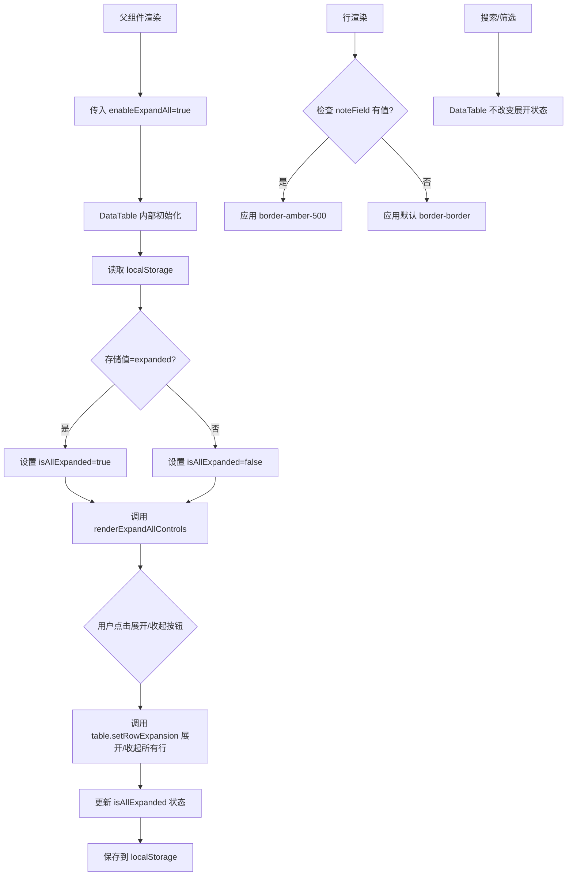

# DataTable 组件增强功能实施计划（修订版）

## 需求概述

为 DataTable 组件增加两个新功能：
1. **一键展开/收起** - 按钮放在组件外部（搜索框旁边）
2. **备注信息提示** - 有备注的行更换下边框颜色

---

## 功能详细设计

### 功能一：一键展开/收起

#### 1.1 新增 Props 参数

```typescript
interface DataTableProps<TData> {
  // ... 现有参数
  enableExpandAll?: boolean           // 是否启用展开/收起功能
  expandAllStorageKey?: string       // localStorage 存储 key
}
```

#### 1.2 设计方案（修订）

**核心思路**：按钮放在 DataTable 组件外部，由父组件渲染

DataTable 组件提供：
1. `renderExpandAllControls` - render prop 函数，返回展开/收起控制组件
2. 内部状态管理 + localStorage 持久化

```typescript
// DataTable 使用方式（父组件）
<DataTable
  enableExpandAll={true}
  expandAllStorageKey="inventory-table-expand-all"
  renderExpandAllControls={({ isExpanded, toggle, expandAll, collapseAll }) => (
    <Button 
      variant="outline" 
      size="sm"
      onClick={toggle}
    >
      {isExpanded ? <ChevronsUpDown /> : <ChevronsDownUp />}
      {isExpanded ? '收起全部' : '展开全部'}
    </Button>
  )}
/>
```

#### 1.3 功能逻辑

| 场景 | 行为 |
|-----|------|
| 首次加载 | 读取 localStorage，若无则默认收起 |
| 点击展开按钮 | 展开所有行，保存状态到 localStorage |
| 点击收起按钮 | 收起所有行，保存状态到 localStorage |
| 搜索/筛选时 | **保持当前展开状态不变**（如果 enableExpandAll=true） |
| 排序时 | **保持当前展开状态不变**（如果 enableExpandAll=true） |

#### 1.4 localStorage 存储

```typescript
// 存储格式
localStorage.setItem(expandAllStorageKey, 'expanded' | 'collapsed')
```

---

### 功能二：备注信息提示

#### 2.1 新增 Props 参数

```typescript
interface DataTableProps<TData> {
  // ... 现有参数
  noteField?: string                 // 备注字段名（如 'notes'）
}
```

#### 2.2 功能逻辑

| 场景 | 行为 |
|-----|------|
| 行渲染时 | 检查 `noteField` 字段是否有值 |
| 有备注 | 该行下边框颜色更换为 `border-amber-500`（琥珀色） |
| 无备注 | 使用默认颜色 `border-border` |

#### 2.3 UI 设计

- 仅改变有备注行的下边框颜色
- 使用语义化颜色，支持暗黑模式
- 颜色方案：
  - 浅色模式：`border-amber-500`
  - 暗色模式：`border-amber-400/50`

---

## 实施步骤

### 步骤 1：修改 DataTable.tsx

- [ ] 1.1 添加新的 Props 类型定义
- [ ] 1.2 实现展开/收起状态管理（内部 state）
- [ ] 1.3 实现 localStorage 读写
- [ ] 1.4 实现 `renderExpandAllControls` render prop
- [ ] 1.5 暴露展开/收起方法给外部
- [ ] 1.6 实现备注行边框样式（HeadlessVirtualRow 组件）

### 步骤 2：修改 Inventory.tsx

- [ ] 2.1 导入 `ChevronsDownUp` / `ChevronsUpDown` 图标
- [ ] 2.2 添加 `enableExpandAll` 和 `expandAllStorageKey` 参数
- [ ] 2.3 添加 `noteField="notes"` 参数
- [ ] 2.4 在搜索框旁边渲染展开/收起按钮
- [ ] 2.5 移除原有的 `collapseAllRowsRef` 逻辑（因为 DataTable 内部处理）

### 步骤 3：测试验证

- [ ] 3.1 测试展开/收起功能
- [ ] 3.2 测试 localStorage 持久化
- [ ] 3.3 测试搜索/筛选后保持展开状态
- [ ] 3.4 测试备注行边框颜色
- [ ] 3.5 测试暗黑模式兼容性

---

## 代码变更清单

### 文件：frontend/src/components/ui/DataTable.tsx

| 位置 | 变更内容 |
|-----|---------|
| Props 定义 | 添加 `enableExpandAll`、`expandAllStorageKey`、`noteField` |
| Props 定义 | 添加 `renderExpandAllControls` render prop |
| 组件内状态 | 添加 `isAllExpanded` state |
| useEffect | 添加 localStorage 读取/保存逻辑 |
| 渲染逻辑 | 调用 `renderExpandAllControls` 渲染外部按钮 |
| HeadlessVirtualRow | 动态边框样式（支持 noteField） |

### 文件：frontend/src/pages/Inventory.tsx

| 位置 | 变更内容 |
|-----|---------|
| 导入 | 添加 `ChevronsDownUp`、`ChevronsUpDown` 图标 |
| DataTable 调用 | 添加 `enableExpandAll={true}` |
| DataTable 调用 | 添加 `expandAllStorageKey="inventory-table-expand-all"` |
| DataTable 调用 | 添加 `noteField="notes"` |
| DataTable 调用 | 添加 `renderExpandAllControls` prop |
| 搜索区域 | 将按钮放在搜索框旁边 |

---

## Mermaid 流程图



---

## 验收标准

1. ✅ 展开/收起按钮正确显示在搜索框旁边（父组件控制位置）
2. ✅ 点击按钮可一键展开/收起所有行
3. ✅ 状态正确保存到 localStorage，刷新后恢复
4. ✅ 搜索/筛选后保持展开状态（当开启保持展开时）
5. ✅ 有备注的行显示特殊下边框颜色（amber-500）
6. ✅ 暗黑模式下颜色正确适配
