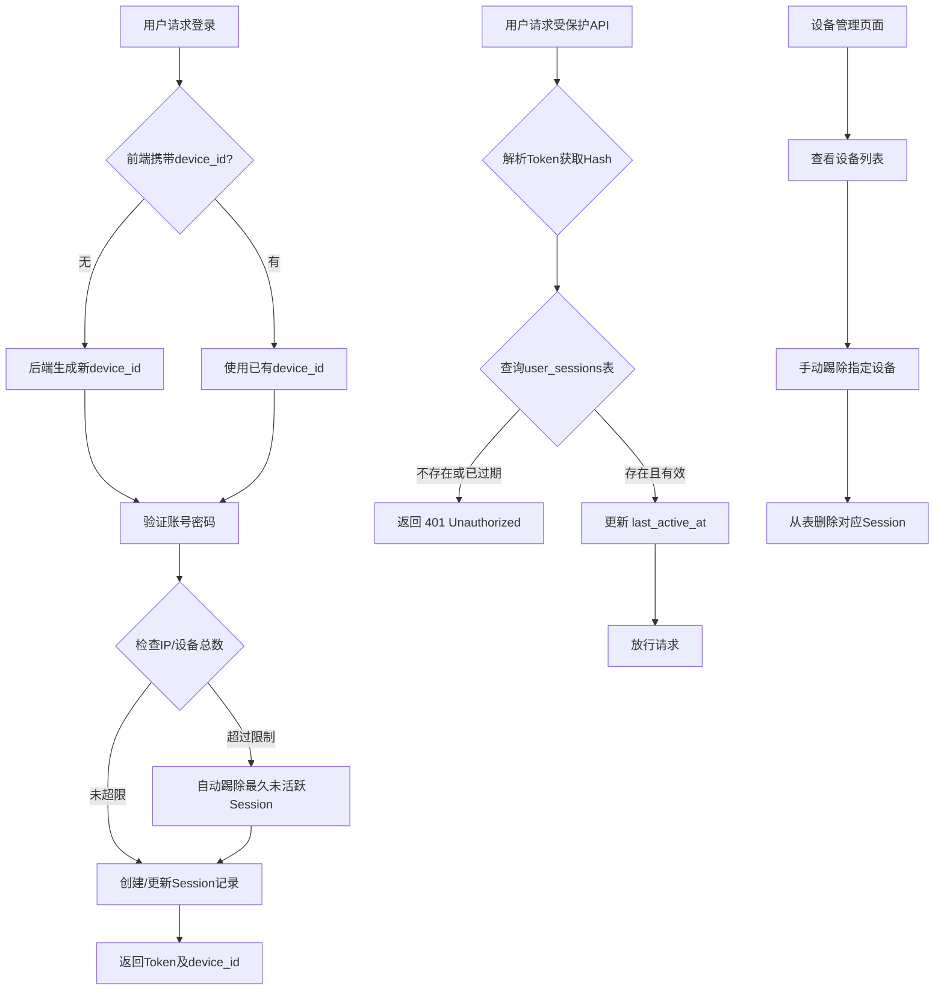

# 账号-IP及设备登录限制实现计划 (V2.0)

## 概述

为 LabStorageManager 系统实现账号-IP及设备登录限制功能，采用**方案A（基础限制）+ 方案B（设备管理）**的进阶组合。本计划不仅限制并发登录数量，还确保了被踢出设备的实时拦截，以及防止用户因达到上限而被意外锁死的冲突解决机制。

- **基础限制**：限制同一账号同时在线的IP数量（默认5个）和总设备数量（默认10个）。
- **设备管理**：支持设备管理页面，用户可查看当前登录的所有设备并手动踢除。
- **冲突策略**：达到上限时，自动顶替最久未活跃的设备，保障新设备的正常登录。

---

## 系统架构



---

## 数据模型设计

### 新增表：`user_sessions`

| 字段                | 类型     | 说明                                               |
| :------------------ | :------- | :------------------------------------------------- |
| `id`              | Integer  | 主键                                               |
| `user_id`         | Integer  | 用户ID (外键)                                      |
| `device_id`       | String   | 设备唯一标识 (UUID，前端持久化)                    |
| `device_name`     | String   | 设备名称 (从User-Agent解析，如: Chrome on Windows) |
| `ip_address`      | String   | 当前/初始登录IP地址                                |
| `last_ip_address` | String   | 最后活跃IP (用于IP异地登录异常检测)                |
| `user_agent`      | String   | 完整的 User-Agent 字符串                           |
| `token_hash`      | String   | JWT Token 的 SHA-256 哈希值 (防Token泄露)          |
| `created_at`      | DateTime | 首次登录时间                                       |
| `last_active_at`  | DateTime | 最后一次接口调用时间                               |
| `expires_at`      | DateTime | Session绝对过期时间                                |

---

## 核心实现步骤

### 1. 数据库模型定义

**文件**: `app/models/user_session.py`

```python
from sqlmodel import SQLModel, Field
from datetime import datetime
from typing import Optional

class UserSession(SQLModel, table=True):
    __tablename__ = "user_sessions"
  
    id: Optional[int] = Field(default=None, primary_key=True)
    user_id: int = Field(foreign_key="users.id", index=True)
    device_id: str = Field(index=True)
    device_name: str
    ip_address: str
    last_ip_address: str
    user_agent: str
    token_hash: str = Field(index=True)
    created_at: datetime = Field(default_factory=datetime.utcnow)
    last_active_at: datetime = Field(default_factory=datetime.utcnow)
    expires_at: datetime
```

### 2. 系统配置项更新

**文件**: `app/core/config.py`

```python
# Session & Device Settings
MAX_IP_PER_USER: int = 5         # 同一账号最大允许的独立IP数
MAX_DEVICE_PER_USER: int = 10    # 同一账号最大允许的设备数
SESSION_EXPIRE_HOURS: int = 168  # Session过期时间(7天)
```

### 3. API 实时拦截层 (依赖项/中间件)

**文件**: `app/api/deps.py`
这是确保“踢人实时生效”的核心。

```python
import hashlib
from fastapi import Depends, HTTPException, status
from datetime import datetime

async def get_current_session(
    db: Session = Depends(get_db),
    token: str = Depends(oauth2_scheme)
) -> UserSession:
    # 1. 计算 Token Hash
    token_hash = hashlib.sha256(token.encode()).hexdigest()
  
    # 2. 查询数据库中是否存在该有效Session
    session = db.query(UserSession).filter(UserSession.token_hash == token_hash).first()
  
    if not session or session.expires_at < datetime.utcnow():
        raise HTTPException(
            status_code=status.HTTP_401_UNAUTHORIZED, 
            detail="会话已过期或已被在其他设备上登出"
        )
  
    # 3. 异步更新最后活跃时间 (避免阻塞主流程，可结合Redis优化)
    session.last_active_at = datetime.utcnow()
    db.commit()
  
    return session
```

### 4. 登录接口逻辑升级

**文件**: `app/api/users.py`

1. **接收设备ID**：从请求体或 Header 获取 `device_id`，若无则由后端生成 UUID 并返回给前端（前端需保存到 `localStorage`）。
2. **UA 解析**：使用 `user_agents` 库将原始 User-Agent 解析为易读的 `device_name` (如 "Safari on macOS")。
3. **并发限制检查 & 顶替策略**：
   - 统计当前用户的 `user_sessions` 数量。
   - 若超出 `MAX_DEVICE_PER_USER`，按 `last_active_at` 升序排序，删除最旧的记录。
4. **存储 Session**：哈希化生成的 JWT Token，并将其与设备信息一同存入 `user_sessions`。

### 5. 设备管理 API

**文件**: `app/api/user_sessions.py` (新建)

| 方法       | 路径                            | 权限要求 | 说明                                       |
| :--------- | :------------------------------ | :------- | :----------------------------------------- |
| `GET`    | `/api/users/me/sessions`      | 需登录   | 获取当前用户的设备列表，标识出“当前设备” |
| `DELETE` | `/api/users/me/sessions/{id}` | 需登录   | 踢除指定设备 (删除对应记录)                |
| `DELETE` | `/api/users/me/sessions`      | 需登录   | 一键登出所有**其他**设备             |

---

## 前端实现要点

### 1. `device_id` 持久化管理

* 登录前检查 `localStorage.getItem('device_id')`。
* 若存在，附加在登录请求中。若不存在，读取后端登录成功后返回的 `device_id` 并存入 `localStorage`。

### 2. 设备管理页面 (`DeviceManagement.tsx`)

* **列表展示**：展示 `device_name`（附带设备图标）、`last_ip_address` 和 `last_active_at`。
* **当前设备高亮**：通过比竖列表中的 `device_id` 和本地 `localStorage` 中的 `device_id`，为当前设备添加 **"本机"** 徽标。
* **踢除二次确认**：点击“踢除本机”时，弹出红色警告：“踢除本机将立即退出登录，是否继续？”。

---

## 错误字典

| 状态码  | 业务错误码               | 说明               | 前端应对策略                          |
| :------ | :----------------------- | :----------------- | :------------------------------------ |
| `401` | `ERR_SESSION_EXPIRED`  | Session过期或被踢  | 清除本地Token，跳转至登录页并提示用户 |
| `403` | `ERR_IP_LIMIT_REACHED` | 短时间触发安全风控 | 提示用户稍后再试或联系管理员          |

---

## 数据库迁移脚本 (Alembic / SQL)

```sql
-- 1. 在 users 表补充最后登录时间
ALTER TABLE users ADD COLUMN last_login_at DATETIME;

-- 2. 创建 user_sessions 表
CREATE TABLE user_sessions (
    id INTEGER PRIMARY KEY AUTOINCREMENT,
    user_id INTEGER NOT NULL REFERENCES users(id) ON DELETE CASCADE,
    device_id VARCHAR(255) NOT NULL,
    device_name VARCHAR(255),
    ip_address VARCHAR(45) NOT NULL,
    last_ip_address VARCHAR(45),
    user_agent TEXT,
    token_hash VARCHAR(64) NOT NULL,
    created_at DATETIME DEFAULT CURRENT_TIMESTAMP,
    last_active_at DATETIME DEFAULT CURRENT_TIMESTAMP,
    expires_at DATETIME NOT NULL
);

-- 3. 创建索引优化查询速度
CREATE INDEX idx_user_sessions_user_id ON user_sessions(user_id);
CREATE INDEX idx_user_sessions_device_id ON user_sessions(device_id);
CREATE INDEX idx_user_sessions_token_hash ON user_sessions(token_hash);
```

---

## 检查清单

### 数据库模型

- [X] 创建 UserSession 模型 (app/models/user_session.py)

### 后端 API

- [X] 登录时创建 Session 记录
- [X] Session 验证中间件
- [X] 设备列表 API (GET /api/users/me/sessions)
- [X] 踢除设备 API (DELETE /api/users/me/sessions/{id})
- [X] 一键登出其他设备 API

### 前端

- [X] device_id 持久化到 localStorage
- [X] DeviceManagement.tsx 设备管理页面

### 待完善

- [ ] IP 限制数量检查逻辑（MAX_IP_PER_USER, MAX_DEVICE_PER_USER）
- [ ] 自动顶替最久未活跃设备逻辑

---

**检查完成**: ⚠️ 部分完成

---

*文档更新时间: 2026-02-28*
