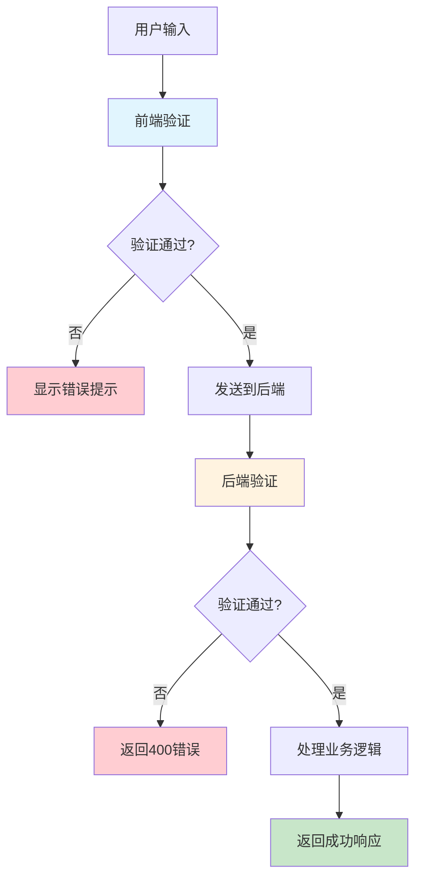

# LabStorageManager 输入验证与状态管理文档

## 一、输入验证

### 1.1 前端验证

| 验证类型             | 验证内容                 | 库/实现               | 文件位置                                                   |
| -------------------- | ------------------------ | --------------------- | ---------------------------------------------------------- |
| **登录表单**   | 用户名、密码非空         | react-hook-form + Zod | [`Login.tsx`](frontend/src/pages/Login.tsx)                 |
| **CAS号**      | 格式校验 + 校验码验证    | 自定义函数            | [`inputValidation.ts`](frontend/src/lib/inputValidation.ts) |
| **用户名**     | 3-20字符、字母数字下划线 | 自定义函数            | [`inputValidation.ts`](frontend/src/lib/inputValidation.ts) |
| **密码**       | 强度检测（弱/中/强）     | 自定义函数            | [`inputValidation.ts`](frontend/src/lib/inputValidation.ts) |
| **规格**       | 格式验证（500ml, 1L等）  | 自定义函数 + 正则     | [`inputValidation.ts`](frontend/src/lib/inputValidation.ts) |
| **价格**       | 范围验证（0-999999）     | 自定义函数            | [`inputValidation.ts`](frontend/src/lib/inputValidation.ts) |
| **必填字段**   | 非空验证                 | 自定义函数            | [`inputValidation.ts`](frontend/src/lib/inputValidation.ts) |
| **字符串长度** | 范围验证                 | 自定义函数            | [`inputValidation.ts`](frontend/src/lib/inputValidation.ts) |
| **正数验证**   | 大于0                    | 自定义函数            | [`inputValidation.ts`](frontend/src/lib/inputValidation.ts) |
| **非负数验证** | >=0                      | 自定义函数            | [`inputValidation.ts`](frontend/src/lib/inputValidation.ts) |

#### 前端验证库依赖

```json
{
  "react-hook-form": "^7.71.1",
  "@hookform/resolvers": "^5.2.2",
  "zod": "^4.3.6"
}
```

#### 前端验证示例

```typescript
// Login.tsx - Zod 验证
import { zodResolver } from '@hookform/resolvers/zod'
import { z } from 'zod'

const loginSchema = z.object({
  username: z.string().min(1, '用户名不能为空'),
  password: z.string().min(1, '密码不能为空'),
})

const { register, handleSubmit } = useForm<LoginForm>({
  resolver: zodResolver(loginSchema),
})
```

```typescript
// inputValidation.ts - CAS号验证
export function validateCASNumber(casNumber: string): { 
  isValid: boolean; 
  error?: string;
  normalized?: string;
} {
  // 格式校验 + 校验码计算
  const basicFormatRegex = /^\d{2,6}-\d{2}-\d$/;
  // ...校验码计算逻辑
}
```

---

### 1.2 后端验证

| 验证类型              | 验证内容           | 库/实现             | 文件位置                                    |
| --------------------- | ------------------ | ------------------- | ------------------------------------------- |
| **CAS号标准化** | 去除空格、转大写   | SQLModel + 自定义   | [`cas_utils.py`](app/services/cas_utils.py)  |
| **数据类型**    | 字段类型约束       | SQLModel (Pydantic) | [`models/*.py`](app/models/)                 |
| **数值范围**    | gt, ge, max_length | SQLModel Field      | [`inventory.py`](app/models/inventory.py)    |
| **必填字段**    | 非空约束           | SQLModel (Optional) | [`models/*.py`](app/models/)                 |
| **枚举值**      | 状态枚举           | Enum                | [`inventory.py:16`](app/models/inventory.py) |
| **外键约束**    | 关联完整性         | SQLModel ForeignKey | [`models/*.py`](app/models/)                 |

#### 后端验证库依赖

```toml
sqlmodel = "^0.0.20"
pydantic = "^2.10"
```

#### 后端验证示例

```python
# inventory.py - SQLModel 字段验证
class InventoryBase(SQLModel):
    cas_number: str = Field(index=True, max_length=50)
    name: str = Field(index=True, max_length=200)
    initial_quantity: float = Field(gt=0)  # 必须大于0
    remaining_quantity: float = Field(default=0.0)

class InventoryBorrowReturn(SQLModel):
    remaining_quantity: float = Field(ge=0)  # 必须大于等于0
    unit: str = Field(max_length=20)
```

```python
# cas_utils.py - CAS号标准化
def normalize_cas(cas: str) -> str:
    """标准化CAS号：去除空格、转大写"""
    return cas.strip().upper()
```

---

### 1.3 前后端验证对比

| 验证项     | 前端               | 后端              | 说明                     |
| ---------- | ------------------ | ----------------- | ------------------------ |
| CAS号格式  | ✅ Zod + 自定义    | ✅ SQLModel       | **后端是最终防线** |
| 用户名格式 | ✅ 自定义          | ❌                | 后端未验证               |
| 密码强度   | ✅ 自定义          | ❌                | 后端仅存哈希             |
| 数值范围   | ✅ 自定义          | ✅ SQLModel Field | **后端是最终防线** |
| 必填字段   | ✅ react-hook-form | ✅ SQLModel       | **后端是最终防线** |
| 枚举值     | ❌                 | ✅ Enum           | 后端控制                 |

---

### 1.4 前后端验证对照表

#### 库存模块 (Inventory)

| 字段               | 前端验证                                   | 后端验证                        | 验证文件位置                                         |
| ------------------ | ------------------------------------------ | ------------------------------- | ---------------------------------------------------- |
| cas_number         | CAS号格式 + 校验码 (`validateCASNumber`) | `max_length=50`               | 前端:`inputValidation.ts` / 后端: `inventory.py` |
| name               | 必填 (`validateRequired`)                | `max_length=200`, 必填        | 前端:`inputValidation.ts` / 后端: `inventory.py` |
| english_name       | -                                          | `max_length=200`, 可选        | 后端:`inventory.py`                                |
| alias              | -                                          | `max_length=200`, 可选        | 后端:`inventory.py`                                |
| category           | -                                          | `max_length=100`, 可选, 索引  | 后端:`inventory.py`                                |
| brand              | -                                          | `max_length=100`, 可选, 索引  | 后端:`inventory.py`                                |
| storage_location   | -                                          | `max_length=200`, 可选        | 后端:`inventory.py`                                |
| initial_quantity   | 正数 (`validatePositiveNumber`)          | `gt=0`                        | 前端:`inputValidation.ts` / 后端: `inventory.py` |
| remaining_quantity | 非负数 (`validateNonNegativeNumber`)     | `default=0.0`                 | 前端:`inputValidation.ts` / 后端: `inventory.py` |
| specification      | 格式验证 (`validateSpecification`)       | -                               | 前端:`inputValidation.ts`                          |
| quantity_bottles   | 正数 (`validatePositiveNumber`)          | `ge=1, default=1`             | 前端:`inputValidation.ts` / 后端: `inventory.py` |
| unit               | -                                          | `max_length=20, default="ml"` | 后端:`inventory.py`                                |
| is_hazardous       | -                                          | `bool, default=False`         | 后端:`inventory.py`                                |
| notes              | -                                          | `max_length=500`, 可选        | 后端:`inventory.py`                                |

#### 试剂订单模块 (ReagentOrder)

| 字段          | 前端验证                             | 后端验证                 | 验证文件位置                                             |
| ------------- | ------------------------------------ | ------------------------ | -------------------------------------------------------- |
| cas_number    | CAS号格式 (`validateCASNumber`)    | `max_length=50`, 必填  | 前端:`inputValidation.ts` / 后端: `reagent_order.py` |
| name          | 必填 (`validateRequired`)          | `max_length=200`, 必填 | 前端:`inputValidation.ts` / 后端: `reagent_order.py` |
| english_name  | -                                    | `max_length=200`, 可选 | 后端:`reagent_order.py`                                |
| alias         | -                                    | `max_length=200`, 可选 | 后端:`reagent_order.py`                                |
| category      | -                                    | `max_length=100`, 可选 | 后端:`reagent_order.py`                                |
| brand         | -                                    | `max_length=100`, 可选 | 后端:`reagent_order.py`                                |
| specification | 格式验证 (`validateSpecification`) | `max_length=100`, 必填 | 前端:`inputValidation.ts` / 后端: `reagent_order.py` |
| quantity      | 正数 (`validatePositiveNumber`)    | `gt=0`, 必填           | 前端:`inputValidation.ts` / 后端: `reagent_order.py` |
| price         | 价格范围 (`validatePrice`)         | `ge=0`, 可选           | 前端:`inputValidation.ts` / 后端: `reagent_order.py` |
| supplier      | -                                    | -                        | -                                                        |
| notes         | -                                    | `max_length=500`, 可选 | 后端:`reagent_order.py`                                |

#### 耗材订单模块 (ConsumableOrder)

| 字段          | 前端验证                             | 后端验证                 | 验证文件位置                                                |
| ------------- | ------------------------------------ | ------------------------ | ----------------------------------------------------------- |
| name          | 必填 (`validateRequired`)          | `max_length=200`, 必填 | 前端:`inputValidation.ts` / 后端: `consumable_order.py` |
| english_name  | -                                    | `max_length=200`, 可选 | 后端:`consumable_order.py`                                |
| alias         | -                                    | `max_length=200`, 可选 | 后端:`consumable_order.py`                                |
| category      | -                                    | `max_length=100`, 可选 | 后端:`consumable_order.py`                                |
| brand         | -                                    | `max_length=100`, 可选 | 后端:`consumable_order.py`                                |
| specification | 格式验证 (`validateSpecification`) | `max_length=100`, 必填 | 前端:`inputValidation.ts` / 后端: `consumable_order.py` |
| quantity      | 正数 (`validatePositiveNumber`)    | `gt=0`, 必填           | 前端:`inputValidation.ts` / 后端: `consumable_order.py` |
| price         | 价格范围 (`validatePrice`)         | `ge=0`, 可选           | 前端:`inputValidation.ts` / 后端: `consumable_order.py` |
| notes         | -                                    | `max_length=500`, 可选 | 后端:`consumable_order.py`                                |

#### 用户模块 (User)

| 字段      | 前端验证                                        | 后端验证                                  | 验证文件位置                                    |
| --------- | ----------------------------------------------- | ----------------------------------------- | ----------------------------------------------- |
| username  | 3-20字符、字母数字下划线 (`validateUsername`) | `min_length=3, max_length=50`, 唯一索引 | 前端:`inputValidation.ts` / 后端: `user.py` |
| password  | 强度检测 (`validatePassword`)                 | `min_length=6`, 哈希存储                | 前端:`inputValidation.ts` / 后端: `user.py` |
| full_name | -                                               | `max_length=100`, 可选                  | 后端:`user.py`                                |
| role      | -                                               | `UserRole` 枚举                         | 后端:`user.py`                                |
| email     | -                                               | -                                         | -                                               |

---

## 二、状态管理

### 2.1 客户端状态 (Zustand)

| Store                  | 用途         | 存储方式               | 文件位置                                       |
| ---------------------- | ------------ | ---------------------- | ---------------------------------------------- |
| **useAuthStore** | 用户登录信息 | localStorage (持久化)  | [`useStore.ts`](frontend/src/store/useStore.ts) |
| **useUIStore**   | 侧边栏状态   | localStorage (3天过期) | [`useStore.ts`](frontend/src/store/useStore.ts) |

#### 2.1.1 所有前端状态及持久化一览

| 状态名称               | 所属模块  | 存储位置                      | 持久化方式 | localStorage Key               |
| ---------------------- | --------- | ----------------------------- | ---------- | ------------------------------ |
| **主题模式**     | 全局      | `useTheme` hook             | ✅ 持久化  | `theme`                      |
| **侧边栏折叠**   | 全局      | Zustand useUIStore            | ✅ 持久化  | `ui-storage`                 |
| **用户登录信息** | 全局      | Zustand useAuthStore          | ✅ 持久化  | `auth-storage`               |
| **列宽**         | Inventory | DataTable 组件 state          | ✅ 持久化  | `inventory-table-col-sizes`  |
| **展开/收起**    | Inventory | DataTable 组件 state          | ✅ 持久化  | `inventory-table-expand-all` |
| **模糊搜索开关** | Inventory | 组件 state (`fuzzySearch`)  | ❌ 仅内存  | -                              |
| **搜索关键词**   | Inventory | 组件 state (`globalFilter`) | ❌ 仅内存  | -                              |
| **搜索字段**     | Inventory | 组件 state (`searchField`)  | ❌ 仅内存  | -                              |
| **状态筛选**     | Inventory | 组件 state (`statusFilter`) | ❌ 仅内存  | -                              |
| **排序**         | Inventory | 组件 state (`sorting`)      | ❌ 仅内存  | -                              |
| **当前页码**     | Inventory | 组件 state                    | ❌ 仅内存  | -                              |
| **对话框状态**   | 各页面    | 组件 state (`dialogState`)  | ❌ 仅内存  | -                              |
| **表单数据**     | 各页面    | 组件 state (`formData`)     | ❌ 仅内存  | -                              |
| **表单错误**     | 各页面    | 组件 state (`formErrors`)   | ❌ 仅内存  | -                              |

##### 状态持久化说明

- **✅ 持久化**：状态变更后会保存到 localStorage，刷新页面后保留
- **❌ 仅内存**：状态仅保存在 React 组件内存中，刷新页面后重置

##### 持久化实现示例

```typescript
// useTheme.ts - 持久化示例
const [theme, setTheme] = useState<Theme>(() => {
  if (typeof window !== 'undefined') {
    const saved = localStorage.getItem('theme') as Theme
    if (saved) return saved
    // 检查系统偏好
    if (window.matchMedia('(prefers-color-scheme: dark)').matches) {
      return 'dark'
    }
  }
  return 'light'
})

useEffect(() => {
  localStorage.setItem('theme', theme)
}, [theme])

// Inventory.tsx - 列宽持久化示例
const [columnSizing] = useState(() => {
  const saved = localStorage.getItem('inventory-table-col-sizes')
  return saved ? JSON.parse(saved) : {}
})

useEffect(() => {
  localStorage.setItem('inventory-table-col-sizes', JSON.stringify(columnSizing))
}, [columnSizing])
```

#### Zustand 依赖

```json
{
  "zustand": "^5.0.11"
}
```

#### Zustand 使用示例

```typescript
// useStore.ts - 定义 Store
import { create } from 'zustand'
import { persist } from 'zustand/middleware'

interface AuthState {
  user: User | null
  isAuthenticated: boolean
  setAuth: (user: User) => void
  logout: () => Promise<void>
}

export const useAuthStore = create<AuthState>()(
  persist(
    (set) => ({
      user: null,
      isAuthenticated: false,
      setAuth: (user) => set({ user, isAuthenticated: true }),
      logout: async () => { /* ... */ },
    }),
    { name: 'auth-storage' }
  )
)
```

```typescript
// 组件中使用
const { user, logout } = useAuthStore()
const { sidebarCollapsed, toggleSidebar } = useUIStore()
```

---

### 2.2 服务端状态 (TanStack Query)

| 用途               | Hook                 | 数据源   |
| ------------------ | -------------------- | -------- |
| **库存列表** | `useInfiniteQuery` | API 端点 |
| **数据获取** | `useQuery`         | API 端点 |
| **数据突变** | `useMutation`      | API 端点 |

#### TanStack Query 依赖

```json
{
  "@tanstack/react-query": "^5.0.0"
}
```

#### TanStack Query 使用示例

```typescript
// Inventory.tsx
import { useInfiniteQuery } from '@tanstack/react-query'

const { data, fetchNextPage, hasNextPage } = useInfiniteQuery({
  queryKey: ['inventory', statusFilter, globalFilter, searchField, fuzzySearch, sorting],
  queryFn: ({ pageParam = 0 }) => fetchInventory({ cursor: pageParam }),
  getNextPageParam: (lastPage) => lastPage.nextCursor,
})
```

---

### 2.3 状态管理架构

```
┌─────────────────────────────────────────────────────────────┐
│                      前端 (React)                            │
├─────────────────────────────────────────────────────────────┤
│  客户端状态 (Zustand)          │  服务端状态 (TanStack Query)│
│  ┌──────────────────┐         │  ┌──────────────────┐     │
│  │  useAuthStore    │         │  │  useInfiniteQuery│     │
│  │  - user          │         │  │  - inventory     │     │
│  │  - isAuthenticated│        │  │  - orders        │     │
│  └──────────────────┘         │  └──────────────────┘     │
│  ┌──────────────────┐         │  ┌──────────────────┐     │
│  │  useUIStore      │         │  │  useMutation     │     │
│  │  - sidebarCollapsed│       │  │  - CRUD操作      │     │
│  └──────────────────┘         │  └──────────────────┘     │
│           ↓ localStorage                 ↓ API 回调       │
└─────────────────────────────────────────────────────────────┘
                            ↓
┌─────────────────────────────────────────────────────────────┐
│                      后端 (FastAPI)                          │
├─────────────────────────────────────────────────────────────┤
│  数据模型 (SQLModel)                                         │
│  ┌──────────────────┐  ┌──────────────────┐                  │
│  │  Inventory       │  │  User            │                  │
│  │  - 字段验证      │  │  - 字段验证      │                  │
│  └──────────────────┘  └──────────────────┘                  │
└─────────────────────────────────────────────────────────────┘
```

---

## 三、库汇总

### 3.1 输入验证

| 类别       | 库/技术             | 版本    |
| ---------- | ------------------- | ------- |
| 表单验证   | react-hook-form     | ^7.71.1 |
| Schema校验 | Zod                 | ^4.3.6  |
| 表单解析器 | @hookform/resolvers | ^5.2.2  |
| 后端验证   | SQLModel (Pydantic) | 内置    |
| 后端枚举   | Python Enum         | 内置    |

### 3.2 状态管理

| 类别       | 库                      | 版本     |
| ---------- | ----------------------- | -------- |
| 客户端状态 | Zustand                 | ^5.0.11  |
| 服务端状态 | @tanstack/react-query   | ^5.0.0   |
| 表格数据   | @tanstack/react-table   | ^8.21.3  |
| 虚拟滚动   | @tanstack/react-virtual | ^3.13.19 |

---

## 四、验证流程图



---


# LabStorageManager 输入验证与状态管理改进目标

## 一、输入验证

### 1.1 前端验证 (统一基于 Valibot)

前端验证从“Zod + 零散自定义函数”全面迁移至高度内聚的 **Valibot** 管道 (Pipeline) 模式，实现了表单验证和业务逻辑的统一。

| 验证类型            | 验证内容                 | 库/实现                                  | 文件位置                                                       |
| ------------------- | ------------------------ | ---------------------------------------- | -------------------------------------------------------------- |
| **登录表单**  | 用户名、密码非空         | react-hook-form + Valibot                | [`Login.tsx`](frontend/src/pages/Login.tsx)                     |
| **CAS号**     | 格式校验 + 校验码验证    | Valibot (`v.custom`)                   | [`validationSchemas.ts`](frontend/src/lib/validationSchemas.ts) |
| **用户名**    | 3-20字符、字母数字下划线 | Valibot (`v.regex`, `v.minLength`)   | [`validationSchemas.ts`](frontend/src/lib/validationSchemas.ts) |
| **密码强度**  | 强度检测（弱/中/强）     | Valibot (`v.custom`)                   | [`validationSchemas.ts`](frontend/src/lib/validationSchemas.ts) |
| **规格**      | 格式验证（500ml, 1L等）  | Valibot (`v.regex`)                    | [`validationSchemas.ts`](frontend/src/lib/validationSchemas.ts) |
| **数值/价格** | 正数、非负数、范围       | Valibot (`v.minValue`, `v.maxValue`) | [`validationSchemas.ts`](frontend/src/lib/validationSchemas.ts) |

#### 前端验证库依赖

```json
{
  "react-hook-form": "^7.51.0",
  "@hookform/resolvers": "^3.3.4",
  "valibot": "^0.30.0"
}
```

#### 前端验证示例 (Valibot 架构)

**TypeScript**

```
// Login.tsx - 标准表单验证
import { valibotResolver } from '@hookform/resolvers/valibot'
import * as v from 'valibot'

const loginSchema = v.object({
  username: v.pipe(v.string(), v.minLength(1, '用户名不能为空')),
  password: v.pipe(v.string(), v.minLength(1, '密码不能为空')),
})

const { register, handleSubmit } = useForm<LoginForm>({
  resolver: valibotResolver(loginSchema),
})
```

**TypeScript**

```
// validationSchemas.ts - 复杂业务逻辑 (CAS号) 封装
import * as v from 'valibot'

// 核心校验算法
const checkCASLogic = (input: string) => {
  const basicFormatRegex = /^\d{2,6}-\d{2}-\d$/;
  if (!basicFormatRegex.test(input)) return false;
  // ...校验码计算逻辑
  return true;
}

// 导出高度复用的 Schema
export const CasNumberSchema = v.pipe(
  v.string(),
  v.custom(checkCASLogic, 'CAS号格式或校验码无效')
)
```

---

### 1.2 后端验证

后端主要防线保持不变，利用 SQLModel 和 Pydantic 提供强大的底层约束。

| **验证类型**    | **验证内容** | **库/实现**   | **文件位置**                                                          |
| --------------------- | ------------------ | ------------------- | --------------------------------------------------------------------------- |
| **CAS号标准化** | 去除空格、转大写   | SQLModel + 自定义   | [`cas_utils.py`](https://www.google.com/search?q=app/services/cas_utils.py)  |
| **数据类型**    | 字段类型约束       | SQLModel (Pydantic) | [`models/*.py`](https://www.google.com/search?q=app/models/)                 |
| **数值范围**    | gt, ge, max_length | SQLModel Field      | [`inventory.py`](https://www.google.com/search?q=app/models/inventory.py)    |
| **必填字段**    | 非空约束           | SQLModel (Optional) | [`models/*.py`](https://www.google.com/search?q=app/models/)                 |
| **枚举值**      | 状态枚举           | Enum                | [`inventory.py:16`](https://www.google.com/search?q=app/models/inventory.py) |
| **外键约束**    | 关联完整性         | SQLModel ForeignKey | [`models/*.py`](https://www.google.com/search?q=app/models/)                 |

#### 后端验证示例

**Python**

```
# inventory.py - SQLModel 字段验证
class InventoryBase(SQLModel):
    cas_number: str = Field(index=True, max_length=50)
    name: str = Field(index=True, max_length=200)
    initial_quantity: float = Field(gt=0)  # 必须大于0
    remaining_quantity: float = Field(default=0.0)
```

---

### 1.3 前后端验证对比

| **验证项** | **前端 (Valibot)** | **后端 (SQLModel)** | **说明**           |
| ---------------- | ------------------------ | ------------------------- | ------------------------ |
| CAS号格式        | ✅ Valibot 管道          | ✅ SQLModel               | **后端是最终防线** |
| 用户名格式       | ✅ Valibot 管道          | ❌                        | 后端未验证               |
| 密码强度         | ✅ Valibot 管道          | ❌                        | 后端仅存哈希             |
| 数值范围         | ✅ Valibot 管道          | ✅ SQLModel Field         | **后端是最终防线** |
| 必填字段         | ✅ react-hook-form       | ✅ SQLModel               | **后端是最终防线** |
| 枚举值           | ✅ Valibot `v.enum_`   | ✅ Enum                   | 双端控制，确保严格       |

---

### 1.4 前后端验证对照表 (核心模块)

#### 库存模块 (Inventory)

| **字段**     | **前端验证 (Valibot)** | **后端验证 (SQLModel)** |
| ------------------ | ---------------------------- | ----------------------------- |
| cas_number         | `CasNumberSchema`          | `max_length=50`             |
| name               | `v.minLength(1)`           | `max_length=200`, 必填      |
| initial_quantity   | `v.minValue(0.001)`        | `gt=0`                      |
| remaining_quantity | `v.minValue(0)`            | `default=0.0`               |
| specification      | 格式正则验证                 | -                             |
| quantity_bottles   | `v.minValue(1)`            | `ge=1, default=1`           |

*(注：订单模块与用户模块的字段验证规则同上，前端已全面替换为 Valibot Pipe 拦截。)*

---

## 二、状态管理架构 (三足鼎立)

本系统采用现代化的状态管理哲学，将状态严格划分为： **客户端全局状态 (Zustand)** 、**服务端缓存状态 (TanStack Query)** 以及  **URL 路由状态 (TanStack Router)** 。

### 2.1 状态分类与存储一览

| **状态名称**        | **状态类别** | **管理方案 / Hook** | **持久化方式**               |
| ------------------------- | ------------------ | ------------------------- | ---------------------------------- |
| **主题模式**        | UI 状态            | Zustand `useUIStore`    | ✅ localStorage (`theme`)        |
| **侧边栏折叠**      | UI 状态            | Zustand `useUIStore`    | ✅ localStorage (`ui-storage`)   |
| **用户登录信息**    | 认证状态           | Zustand `useAuthStore`  | ✅ localStorage (`auth-storage`) |
| **列宽 / 展开状态** | UI 状态            | 组件内部 state            | ✅ localStorage                    |
| **模糊搜索开关**    | **业务查询** | **TanStack Router** | 🔗**URL Query Params**       |
| **搜索关键词**      | **业务查询** | **TanStack Router** | 🔗**URL Query Params**       |
| **搜索字段**        | **业务查询** | **TanStack Router** | 🔗**URL Query Params**       |
| **状态筛选**        | **业务查询** | **TanStack Router** | 🔗**URL Query Params**       |
| **排序 (Sorting)**  | **业务查询** | **TanStack Router** | 🔗**URL Query Params**       |
| **当前页码/游标**   | 业务查询           | TanStack Query 内部接管   | ❌ 内存 / 缓存                     |
| **对话框 / 表单**   | 临时交互           | React `useState`        | ❌ 仅内存 (关闭即销毁)             |

### 2.2 状态管理方案详解

#### 1. 客户端状态 (Zustand)

处理用户登录信息和侧边栏状态，通过 `persist` 中间件实现持久化。

**TypeScript**

```
export const useAuthStore = create<AuthState>()(
  persist((set) => ({ ... }), { name: 'auth-storage' })
)
```

#### 2. 服务端状态 (TanStack Query v5)

处理库存列表的无限加载和数据的突变（增删改），极大简化了请求生命周期的管理。

**TypeScript**

```
const { data } = useSuspenseInfiniteQuery({
  queryKey: ['inventory', searchParams], // 强绑定 URL 参数
  queryFn: fetchInventory
})
```

#### 3. 路由状态 (TanStack Router) **[核心重构]**

摒弃了组件内的 `useState`，将所有的列表过滤、搜索条件映射至 URL。天然支持页面状态防抖、刷新不丢失及链接一键分享。

**TypeScript**

```
// 通过 Route.useSearch() 订阅 URL 状态
const { globalFilter, statusFilter } = Route.useSearch()
```

---

### 2.3 现代化状态流转架构图

```
┌─────────────────────────────────────────────────────────────┐
│                      前端 (React)                            │
├─────────────────────────────────────────────────────────────┤
│ 客户端状态 (Zustand) │ 路由状态 (TanStack Router)│ 服务端状态 (Query)  │
│ ┌────────────────┐ │ ┌─────────────────────┐ │ ┌───────────────┐ │
│ │ useAuthStore   │ │ │ URL Search Params   │ │ │ useInfinite   │ │
│ │ useUIStore     │ │ │ - globalFilter      │ │ │ Query         │ │
│ └────────────────┘ │ │ - statusFilter      │ │ └───────────────┘ │
│        ↓           │ └─────────────────────┘ │         ↓         │
│  localStorage      │           ↓             │     API 回调      │
│                    │     触发 Loader 预取      │                   │
└─────────────────────────────────────────────────────────────┘
                            ↓
┌─────────────────────────────────────────────────────────────┐
│                      后端 (FastAPI)                          │
├─────────────────────────────────────────────────────────────┤
│  数据模型 (SQLModel & Pydantic 验证防线)                         │
└─────────────────────────────────────────────────────────────┘
```

---

## 三、库汇总

### 3.1 输入验证与路由

| **类别**         | **库/技术**                | **版本**    |
| ---------------------- | -------------------------------- | ----------------- |
| **表单校验引擎** | **Valibot**                | **^0.30.0** |
| 表单状态管理           | react-hook-form                  | ^7.51.0           |
| 表单解析器             | @hookform/resolvers              | ^3.3.4            |
| **前端路由**     | **@tanstack/react-router** | **^1.0.0**  |

### 3.2 状态管理与展现

| **类别** | **库**            | **版本** |
| -------------- | ----------------------- | -------------- |
| 客户端状态     | Zustand                 | ^5.0.11        |
| 服务端状态     | @tanstack/react-query   | ^5.0.0         |
| 表格数据       | @tanstack/react-table   | ^8.21.3        |
| 虚拟滚动       | @tanstack/react-virtual | ^3.13.19       |

---

## 四、验证与请求防抖流程图

**代码段**

```
graph TD
    A[用户输入搜索词/修改筛选] --> B[Zod/Valibot 实时表单验证]
    B --> C{验证通过?}
    C -->|否| D[显示表单错误]
    C -->|是| E[触发 400ms 防抖]
    E --> F[更新 URL (TanStack Router)]
    F --> G[Router 拦截 URL 变化]
    G --> H[TanStack Query 提取新 URL 参数]
    H --> I[发起后端 API 请求]
    I --> J[渲染虚拟列表]
  
    style B fill:#e1f5fe
    style F fill:#fff3e0
    style D fill:#ffcdd2
    style I fill:#c8e6c9
```

---

## 五、未来改进建议

1. **后端补齐验证防线** ：当前后端未验证用户名格式，建议在 SQLModel 中增加正则表达式约束，确保前后端逻辑对齐。
2. **前后端类型共享** ：探索使用 `valibot-to-json-schema` 或相关工具，让前端的 Valibot Schema 和后端的 Pydantic Model 实现一定程度的自动同步。
3. **沉淀通用 Valibot Pipe** ：将 `validatePrice`、`validateSpecification` 等常用的业务逻辑，沉淀为单独的 `npm` 包或工具文件，供所有后台系统复用。

## 六、代码迁移


在 Valibot 中，我们不再返回 `{ isValid: boolean, error: string }` 这种自定义对象，而是直接抛出标准化的 Schema 错误，这能完美被 `react-hook-form` 自动拦截并映射到 UI 上。

以下是为您量身定制的快速迁移指南和完整替换代码：

---

## 🚀 核心迁移对照速查表

| **原有自定义函数**      | **Valibot 等效实现 (Pipeline)**       |
| ----------------------------- | ------------------------------------------- |
| `normalizeCASNumber`        | `v.trim()`,`v.toUpperCase()`            |
| `validateRequired`          | `v.minLength(1, '不能为空')`              |
| `validateStringLength`      | `v.minLength(min)`,`v.maxLength(max)`   |
| `validateNonNegativeNumber` | `v.minValue(0, '不能为负数')`             |
| `validatePositiveNumber`    | `v.custom((val) => val > 0, '必须大于0')` |
| `validatePrice`             | `v.minValue(min)`,`v.maxValue(max)`     |

---

## 🛠️ 完整的 Valibot 迁移代码 (`validationSchemas.ts`)

您可以直接用以下代码替换您原来的文件。我保留了您所有的核心业务逻辑（尤其是 CAS 校验码的计算）和错误提示语：

**TypeScript**

```
import * as v from 'valibot';

// ==========================================
// 1. 基础通用类型验证
// ==========================================

// 替代: validateRequired & validateStringLength
export const createStringSchema = (fieldName: string, min = 1, max = 255) => 
  v.pipe(
    v.string(`${fieldName}必须是字符串`),
    v.trim(),
    v.minLength(min, min === 1 ? `${fieldName}不能为空` : `${fieldName}至少${min}个字符`),
    v.maxLength(max, `${fieldName}最多${max}个字符`)
  );

// 替代: validatePositiveNumber
export const PositiveNumberSchema = (fieldName: string) =>
  v.pipe(
    v.number(`${fieldName}必须是数字`),
    v.custom<number>((val) => val > 0, `${fieldName}必须大于0`)
  );

// 替代: validateNonNegativeNumber
export const NonNegativeNumberSchema = (fieldName: string) =>
  v.pipe(
    v.number(`${fieldName}必须是数字`),
    v.minValue(0, `${fieldName}不能为负数`)
  );

// 替代: validatePrice
export const PriceSchema = (min = 0, max = 999999) =>
  v.pipe(
    v.number('价格必须是数字'),
    v.minValue(min, `价格不能小于${min}`),
    v.maxValue(max, `价格不能大于${max}`)
  );

// ==========================================
// 2. 复杂业务字段验证
// ==========================================

// 替代: validateUsername
export const UsernameSchema = v.pipe(
  v.string('用户名不能为空'),
  v.trim(),
  v.minLength(3, '用户名至少3个字符'),
  v.maxLength(20, '用户名最多20个字符'),
  v.regex(/^[a-zA-Z0-9_]+$/, '用户名只能包含字母、数字和下划线')
);

// 替代: validateSpecification
export const SpecificationSchema = v.pipe(
  v.string('规格不能为空'),
  v.trim(),
  v.toLowerCase(), // 自动转小写后再校验
  v.regex(
    /^\d+(\.\d+)?\s*(ml|l|g|kg|mg|个|瓶|支|盒|包|套)$/i,
    '规格格式无效'
  )
);

// ==========================================
// 3. CAS 号高级验证逻辑
// ==========================================

// 剥离出的 CAS 纯逻辑计算函数（供 Valibot 内部调用）
const validateCASLogic = (input: string): boolean => {
  const parts = input.split('-');
  const firstPart = parts[0]; 
  const secondPart = parts[1]; 
  const thirdPart = parts[2]; 
  
  const sequenceNumber = firstPart + secondPart;
  const digits = sequenceNumber.split('').reverse(); 
  
  let sum = 0;
  for (let i = 0; i < digits.length; i++) {
    const digit = parseInt(digits[i], 10);
    const multiplier = i + 1; 
    sum += digit * multiplier;
  }
  
  const calculatedCheckDigit = sum % 10;
  const actualCheckDigit = parseInt(thirdPart, 10);
  
  return calculatedCheckDigit === actualCheckDigit;
};

// 替代: validateCASNumber & normalizeCASNumber
export const CasNumberSchema = v.pipe(
  v.string('CAS号不能为空'),
  v.trim(),
  v.toUpperCase(), // 数据进入下一步前会自动大写
  v.regex(/^\d{2,6}-\d{2}-\d$/, 'CAS号格式无效'),
  v.custom<string>(validateCASLogic, 'CAS号校验码错误') 
);
```

---

## 💡 坦诚的架构建议：关于 `validatePassword`

您可能注意到了，我**没有**将 `validatePassword`（密码强度计算）转化为 Valibot Schema。

**原因如下：**

Valibot（包括 Zod）的职责是**“拦截非法数据” **（返回 True/False 和错误信息）。而您原来的 `validatePassword` 附带了** “计算密码强度 (weak/medium/strong)”**这种额外的副作用（Side Effects）和 UI 状态衍生。

将这种逻辑强行塞进验证库会导致代码极度不优雅。最佳实践是：

1. **拦截底线 (Valibot)** ：只用 Valibot 拦截“密码至少6个字符”。
2. **计算状态 (Component)** ：密码强度条的计算应该作为一个独立的 UI 工具函数，在 React 组件的 `watch('password')` 变动时实时计算并渲染。

**密码底线验证 Schema 如下：**

**TypeScript**

```
export const PasswordBaseSchema = v.pipe(
  v.string('密码不能为空'),
  v.minLength(6, '密码至少6个字符')
);
```
