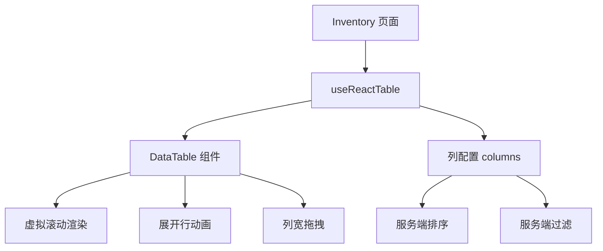

# 库存表格重构综合文档

## 一、文档版本

| 版本 | 日期 | 说明 |
| ---- | ---- | ---- |
| v1.0 | 2026-02-26 | 初始版本，汇总所有重构文档 |
| v1.1 | 2026-02-27 | 更新检查清单，标记实际实现状态 |
| v2.0 | 2026-02-27 | 重写文档，以 Inventory 页面为例 |

---

## 二、重构目标

将库存列表页面从原生 `<table>` 标签迁移到 TanStack Table + 虚拟滚动架构，实现海量数据（万级别）的高性能渲染。

---

## 三、技术架构

### 3.1 核心技术栈

| 技术 | 用途 |
|-----|------|
| `@tanstack/react-table` | Headless Table 状态管理 |
| `@tanstack/react-virtual` | 虚拟滚动渲染 |
| `framer-motion` | 展开行动画 |
| Tailwind CSS | 样式引擎 |

### 3.2 架构图



---

## 四、以 Inventory 页面为例的实现

### 4.1 文件结构

```
frontend/src/
├── components/ui/
│   └── DataTable.tsx       # 通用表格组件
└── pages/
    └── Inventory.tsx       # 库存页面（使用示例）
```

### 4.2 DataTable 组件 (DataTable.tsx)

核心功能：
- 虚拟滚动
- 展开行动画
- 列宽拖拽
- 粘性表头

```tsx
// DataTable.tsx - 核心实现

// 1. 虚拟滚动配置
const rowVirtualizer = useVirtualizer({
  count: rows.length,
  estimateSize: () => 53,      // 估算行高
  overscan: 10,                // 预渲染行数
  getScrollElement: () => bodyScrollRef.current,
})

// 2. 粘性表头 - 表头与表体分离
// 表头在滚动容器外部，自然固定
<div className="z-30 w-full border-b-2 border-border">
  <div ref={headerScrollRef}>
    {/* 表头内容 */}
  </div>
</div>

// 3. 横向滚动同步
<div onScroll={(e) => {
  headerScrollRef.current.scrollLeft = e.currentTarget.scrollLeft
}}>
  {/* 表体内容 */}
</div>

// 4. 展开行动画
<AnimatePresence>
  {isExpanded && (
    <motion.div
      initial={{ height: 0, opacity: 0 }}
      animate={{ height: "auto", opacity: 1 }}
      exit={{ height: 0, opacity: 0 }}
    >
      {renderExpandedRow(original)}
    </motion.div>
  )}
</AnimatePresence>

// 5. 列宽拖拽 - 相邻列此消彼长
const handleCustomResize = useCallback((e, header) => {
  // 计算像素比例
  const pixelPerWeight = tablePxWidth / totalWeight
  const deltaWeight = deltaX / pixelPerWeight
  
  // 左右列此消彼长，总和不变
  table.setColumnSizing(old => ({
    [leftCol.id]: newLeft,
    [rightCol.id]: newRight
  }))
}, [visibleColumns, totalWeight])
```

### 4.3 Inventory 页面 (Inventory.tsx)

#### 4.3.1 状态管理

```tsx
// Inventory.tsx

// 1. 排序状态
const [sorting, setSorting] = useState<SortingState>([])

// 2. 列宽持久化状态
const [columnSizing, setColumnSizing] = useState<ColumnSizingState>(() => {
  try {
    const saved = localStorage.getItem('inventory-table-col-sizes')
    return saved ? JSON.parse(saved) : {}
  } catch { return {} }
})

// 3. 列宽持久化 effect
useEffect(() => {
  localStorage.setItem('inventory-table-col-sizes', JSON.stringify(columnSizing))
}, [columnSizing])
```

#### 4.3.2 列配置

```tsx
// Inventory.tsx - 列配置

const columns = useMemo(() => [
  columnHelper.accessor('cas_number', {
    header: 'CAS号',
    size: 120,
    minSize: 80,
    maxSize: 300,
    enableSorting: true,        // 启用服务端排序
    cell: info => <span>{info.getValue()}</span>,
  }),
  columnHelper.accessor('name', {
    header: '名称',
    size: 160,
    enableSorting: true,
    cell: info => <HighlightText ... />,
  }),
  // ... 其他列
  columnHelper.display({
    id: 'actions',
    header: '操作',
    size: 100,
    enableSorting: false,       // 操作列不排序
    cell: info => <ActionButtons ... />,
  }),
], [displayFilter, handleEditClick])
```

#### 4.3.3 Table 实例配置

```tsx
// Inventory.tsx - Table 实例

const table = useReactTable({
  data,
  columns,
  getCoreRowModel: getCoreRowModel(),
  getRowCanExpand: () => true,
  getExpandedRowModel: getExpandedRowModel(),
  
  // 列宽配置
  columnResizeMode: 'onChange',
  enableColumnResizing: true,
  onColumnSizingChange: setColumnSizing,
  
  // 服务端排序
  manualSorting: true,
  onSortingChange: (updater) => {
    setSorting(updater)
    setPage(1)  // 切换排序时回到第一页
  },
  
  state: { sorting, columnSizing },
})
```

#### 4.3.4 数据加载（服务端排序）

```tsx
// Inventory.tsx - loadInventory 函数

const loadInventory = useCallback(async () => {
  const params = {
    skip: (page - 1) * pageSize,
    limit: pageSize,
  }

  // 添加排序参数
  if (sorting.length > 0) {
    params.sort_by = sorting[0].id
    params.sort_order = sorting[0].desc ? 'desc' : 'asc'
  }

  // 添加搜索参数
  if (searchQuery) {
    params.search = searchQuery
    params.fuzzy = fuzzySearch
  }

  const response = await inventoryAPI.list(params)
  setData(response.data)
  setTotal(response.total)
}, [page, pageSize, searchQuery, fuzzySearch, sorting])
```

### 4.4 后端 API (inventory.py)

```python
# app/api/inventory.py

@router.get("/")
def list_inventory(
    skip: int = 0,
    limit: int = 50,
    sort_by: Optional[str] = None,      # 排序字段
    sort_order: Optional[str] = "desc", # 排序方向
    search: Optional[str] = None,
    status_filter: Optional[str] = None,
    db: Session = Depends(get_db),
):
    # 排序字段映射
    sort_field_map = {
        'cas_number': Inventory.cas_number,
        'name': Inventory.name,
        'category': Inventory.category,
        'brand': Inventory.brand,
        'created_at': Inventory.created_at,
    }
    
    # 应用排序
    order_column = sort_field_map.get(sort_by, Inventory.created_at)
    query = query.order_by(
        order_column.desc() if sort_order == 'desc' else order_column.asc()
    )
    
    # 分页
    items = query.offset(skip).limit(limit).all()
    return {"data": items, "total": total}
```

---

## 五、功能实现检查清单

### 5.1 DataTable 组件 (DataTable.tsx)

| 功能 | 状态 | 实现位置 |
| ---- | ---- | -------- |
| 虚拟滚动 | ✅ 已完成 | useVirtualizer |
| 展开行动画 | ✅ 已完成 | framer-motion AnimatePresence |
| 列宽拖拽 | ✅ 已完成 | handleCustomResize |
| 动态列宽计算 | ✅ 已完成 | getProportionalStyles |
| 拖动限制 | ✅ 已完成 | 相邻列此消彼长算法 |
| 粘性表头 | ✅ 已完成 | 表头与表体分离布局 |
| 展开状态托管 | ✅ 已完成 | row.getToggleExpandedHandler() |

### 5.2 Inventory 页面 (Inventory.tsx)

| 功能 | 状态 | 实现位置 |
| ---- | ---- | -------- |
| 引入 DataTable | ✅ 已完成 | import 语句 |
| 展开行渲染 | ✅ 已完成 | renderExpandedRow prop |
| 粘性表头 | ✅ 已完成 | 分离布局 |
| 服务端排序 | ✅ 已完成 | manualSorting + 后端 API |
| 列宽持久化 | ✅ 已完成 | localStorage |

### 5.3 后端 API (inventory.py)

| 功能 | 状态 | 实现位置 |
| ---- | ---- | -------- |
| 排序参数 | ✅ 已完成 | sort_by/sort_order |
| 中文拼音排序 | ✅ 已完成 | pinyin_sort_fields |
| 搜索过滤 | ✅ 已完成 | search 参数 |

---

## 六、性能优化

### 6.1 前端优化措施

| 优化技术 | 效果 |
|---------|------|
| 虚拟滚动 | 10000+条数据无压力 |
| React.memo | 避免不必要重渲染 |
| useCallback/useMemo | 减少重复计算 |
| 服务端分页 (50条/页) | 减少单次加载量 |
| 服务端排序 | 避免前端大量排序 |
| 列宽持久化 | 避免重复计算 |

### 6.2 性能指标

| 指标 | 数值 |
|-----|------|
| 默认页大小 | 50 条/页 |
| 虚拟滚动 overscan | 10 行 |
| 估算行高 | 53px |

---

## 七、代码位置索引

| 文件 | 路径 |
|-----|------|
| DataTable 组件 | `frontend/src/components/ui/DataTable.tsx` |
| Inventory 页面 | `frontend/src/pages/Inventory.tsx` |
| 后端 API | `app/api/inventory.py` |

---

*文档更新时间：2026-02-27*
