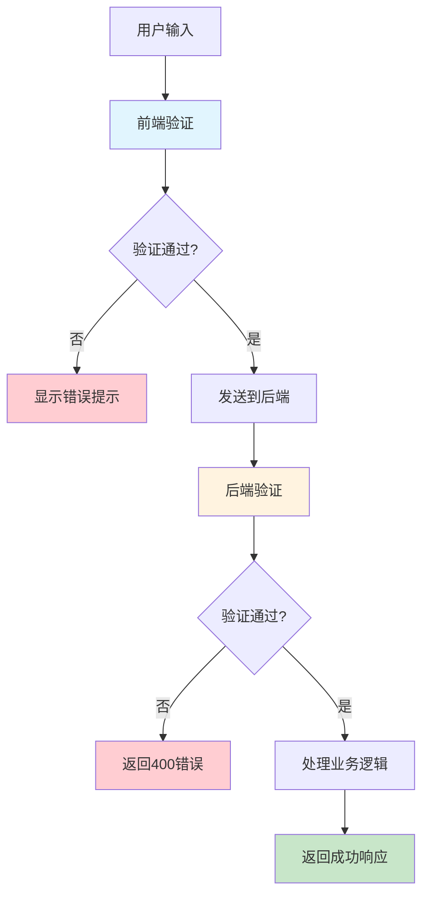

# LabStorageManager 输入验证与状态管理文档

## 一、输入验证

### 1.1 前端验证

| 验证类型 | 验证内容 | 库/实现 | 文件位置 |
|---------|---------|---------|----------|
| **登录表单** | 用户名、密码非空 | react-hook-form + Zod | [`Login.tsx`](frontend/src/pages/Login.tsx) |
| **CAS号** | 格式校验 + 校验码验证 | 自定义函数 | [`inputValidation.ts`](frontend/src/lib/inputValidation.ts) |
| **用户名** | 3-20字符、字母数字下划线 | 自定义函数 | [`inputValidation.ts`](frontend/src/lib/inputValidation.ts) |
| **密码** | 强度检测（弱/中/强） | 自定义函数 | [`inputValidation.ts`](frontend/src/lib/inputValidation.ts) |
| **规格** | 格式验证（500ml, 1L等） | 自定义函数 + 正则 | [`inputValidation.ts`](frontend/src/lib/inputValidation.ts) |
| **价格** | 范围验证（0-999999） | 自定义函数 | [`inputValidation.ts`](frontend/src/lib/inputValidation.ts) |
| **必填字段** | 非空验证 | 自定义函数 | [`inputValidation.ts`](frontend/src/lib/inputValidation.ts) |
| **字符串长度** | 范围验证 | 自定义函数 | [`inputValidation.ts`](frontend/src/lib/inputValidation.ts) |
| **正数验证** | 大于0 | 自定义函数 | [`inputValidation.ts`](frontend/src/lib/inputValidation.ts) |
| **非负数验证** | >=0 | 自定义函数 | [`inputValidation.ts`](frontend/src/lib/inputValidation.ts) |

#### 前端验证库依赖

```json
{
  "react-hook-form": "^7.71.1",
  "@hookform/resolvers": "^5.2.2",
  "zod": "^4.3.6"
}
```

#### 前端验证示例

```typescript
// Login.tsx - Zod 验证
import { zodResolver } from '@hookform/resolvers/zod'
import { z } from 'zod'

const loginSchema = z.object({
  username: z.string().min(1, '用户名不能为空'),
  password: z.string().min(1, '密码不能为空'),
})

const { register, handleSubmit } = useForm<LoginForm>({
  resolver: zodResolver(loginSchema),
})
```

```typescript
// inputValidation.ts - CAS号验证
export function validateCASNumber(casNumber: string): { 
  isValid: boolean; 
  error?: string;
  normalized?: string;
} {
  // 格式校验 + 校验码计算
  const basicFormatRegex = /^\d{2,6}-\d{2}-\d$/;
  // ...校验码计算逻辑
}
```

---

### 1.2 后端验证

| 验证类型 | 验证内容 | 库/实现 | 文件位置 |
|---------|---------|---------|----------|
| **CAS号标准化** | 去除空格、转大写 | SQLModel + 自定义 | [`cas_utils.py`](app/services/cas_utils.py) |
| **数据类型** | 字段类型约束 | SQLModel (Pydantic) | [`models/*.py`](app/models/) |
| **数值范围** | gt, ge, max_length | SQLModel Field | [`inventory.py`](app/models/inventory.py) |
| **必填字段** | 非空约束 | SQLModel (Optional) | [`models/*.py`](app/models/) |
| **枚举值** | 状态枚举 | Enum | [`inventory.py:16`](app/models/inventory.py) |
| **外键约束** | 关联完整性 | SQLModel ForeignKey | [`models/*.py`](app/models/) |

#### 后端验证库依赖

```toml
sqlmodel = "^0.0.20"
pydantic = "^2.10"
```

#### 后端验证示例

```python
# inventory.py - SQLModel 字段验证
class InventoryBase(SQLModel):
    cas_number: str = Field(index=True, max_length=50)
    name: str = Field(index=True, max_length=200)
    initial_quantity: float = Field(gt=0)  # 必须大于0
    remaining_quantity: float = Field(default=0.0)

class InventoryBorrowReturn(SQLModel):
    remaining_quantity: float = Field(ge=0)  # 必须大于等于0
    unit: str = Field(max_length=20)
```

```python
# cas_utils.py - CAS号标准化
def normalize_cas(cas: str) -> str:
    """标准化CAS号：去除空格、转大写"""
    return cas.strip().upper()
```

---

### 1.3 前后端验证对比

| 验证项 | 前端 | 后端 | 说明 |
|--------|------|------|------|
| CAS号格式 | ✅ Zod + 自定义 | ✅ SQLModel | **后端是最终防线** |
| 用户名格式 | ✅ 自定义 | ❌ | 后端未验证 |
| 密码强度 | ✅ 自定义 | ❌ | 后端仅存哈希 |
| 数值范围 | ✅ 自定义 | ✅ SQLModel Field | **后端是最终防线** |
| 必填字段 | ✅ react-hook-form | ✅ SQLModel | **后端是最终防线** |
| 枚举值 | ❌ | ✅ Enum | 后端控制 |

---

### 1.4 前后端验证对照表

#### 库存模块 (Inventory)

| 字段 | 前端验证 | 后端验证 | 验证文件位置 |
|------|----------|----------|--------------|
| cas_number | CAS号格式 + 校验码 (`validateCASNumber`) | `max_length=50` | 前端: `inputValidation.ts` / 后端: `inventory.py` |
| name | 必填 (`validateRequired`) | `max_length=200`, 必填 | 前端: `inputValidation.ts` / 后端: `inventory.py` |
| english_name | - | `max_length=200`, 可选 | 后端: `inventory.py` |
| alias | - | `max_length=200`, 可选 | 后端: `inventory.py` |
| category | - | `max_length=100`, 可选, 索引 | 后端: `inventory.py` |
| brand | - | `max_length=100`, 可选, 索引 | 后端: `inventory.py` |
| storage_location | - | `max_length=200`, 可选 | 后端: `inventory.py` |
| initial_quantity | 正数 (`validatePositiveNumber`) | `gt=0` | 前端: `inputValidation.ts` / 后端: `inventory.py` |
| remaining_quantity | 非负数 (`validateNonNegativeNumber`) | `default=0.0` | 前端: `inputValidation.ts` / 后端: `inventory.py` |
| specification | 格式验证 (`validateSpecification`) | - | 前端: `inputValidation.ts` |
| quantity_bottles | 正数 (`validatePositiveNumber`) | `ge=1, default=1` | 前端: `inputValidation.ts` / 后端: `inventory.py` |
| unit | - | `max_length=20, default="ml"` | 后端: `inventory.py` |
| is_hazardous | - | `bool, default=False` | 后端: `inventory.py` |
| notes | - | `max_length=500`, 可选 | 后端: `inventory.py` |

#### 试剂订单模块 (ReagentOrder)

| 字段 | 前端验证 | 后端验证 | 验证文件位置 |
|------|----------|----------|--------------|
| cas_number | CAS号格式 (`validateCASNumber`) | `max_length=50`, 必填 | 前端: `inputValidation.ts` / 后端: `reagent_order.py` |
| name | 必填 (`validateRequired`) | `max_length=200`, 必填 | 前端: `inputValidation.ts` / 后端: `reagent_order.py` |
| english_name | - | `max_length=200`, 可选 | 后端: `reagent_order.py` |
| alias | - | `max_length=200`, 可选 | 后端: `reagent_order.py` |
| category | - | `max_length=100`, 可选 | 后端: `reagent_order.py` |
| brand | - | `max_length=100`, 可选 | 后端: `reagent_order.py` |
| specification | 格式验证 (`validateSpecification`) | `max_length=100`, 必填 | 前端: `inputValidation.ts` / 后端: `reagent_order.py` |
| quantity | 正数 (`validatePositiveNumber`) | `gt=0`, 必填 | 前端: `inputValidation.ts` / 后端: `reagent_order.py` |
| price | 价格范围 (`validatePrice`) | `ge=0`, 可选 | 前端: `inputValidation.ts` / 后端: `reagent_order.py` |
| supplier | - | - | - |
| notes | - | `max_length=500`, 可选 | 后端: `reagent_order.py` |

#### 耗材订单模块 (ConsumableOrder)

| 字段 | 前端验证 | 后端验证 | 验证文件位置 |
|------|----------|----------|--------------|
| name | 必填 (`validateRequired`) | `max_length=200`, 必填 | 前端: `inputValidation.ts` / 后端: `consumable_order.py` |
| english_name | - | `max_length=200`, 可选 | 后端: `consumable_order.py` |
| alias | - | `max_length=200`, 可选 | 后端: `consumable_order.py` |
| category | - | `max_length=100`, 可选 | 后端: `consumable_order.py` |
| brand | - | `max_length=100`, 可选 | 后端: `consumable_order.py` |
| specification | 格式验证 (`validateSpecification`) | `max_length=100`, 必填 | 前端: `inputValidation.ts` / 后端: `consumable_order.py` |
| quantity | 正数 (`validatePositiveNumber`) | `gt=0`, 必填 | 前端: `inputValidation.ts` / 后端: `consumable_order.py` |
| price | 价格范围 (`validatePrice`) | `ge=0`, 可选 | 前端: `inputValidation.ts` / 后端: `consumable_order.py` |
| notes | - | `max_length=500`, 可选 | 后端: `consumable_order.py` |

#### 用户模块 (User)

| 字段 | 前端验证 | 后端验证 | 验证文件位置 |
|------|----------|----------|--------------|
| username | 3-20字符、字母数字下划线 (`validateUsername`) | `min_length=3, max_length=50`, 唯一索引 | 前端: `inputValidation.ts` / 后端: `user.py` |
| password | 强度检测 (`validatePassword`) | `min_length=6`, 哈希存储 | 前端: `inputValidation.ts` / 后端: `user.py` |
| full_name | - | `max_length=100`, 可选 | 后端: `user.py` |
| role | - | `UserRole` 枚举 | 后端: `user.py` |
| email | - | - | - |

---

## 二、状态管理

### 2.1 客户端状态 (Zustand)

| Store | 用途 | 存储方式 | 文件位置 |
|-------|------|----------|----------|
| **useAuthStore** | 用户登录信息 | localStorage (持久化) | [`useStore.ts`](frontend/src/store/useStore.ts) |
| **useUIStore** | 侧边栏状态 | localStorage (3天过期) | [`useStore.ts`](frontend/src/store/useStore.ts) |

#### 2.1.1 所有前端状态及持久化一览

| 状态名称 | 所属模块 | 存储位置 | 持久化方式 | localStorage Key |
|----------|----------|----------|------------|------------------|
| **主题模式** | 全局 | `useTheme` hook | ✅ 持久化 | `theme` |
| **侧边栏折叠** | 全局 | Zustand useUIStore | ✅ 持久化 | `ui-storage` |
| **用户登录信息** | 全局 | Zustand useAuthStore | ✅ 持久化 | `auth-storage` |
| **列宽** | Inventory | DataTable 组件 state | ✅ 持久化 | `inventory-table-col-sizes` |
| **展开/收起** | Inventory | DataTable 组件 state | ✅ 持久化 | `inventory-table-expand-all` |
| **模糊搜索开关** | Inventory | 组件 state (`fuzzySearch`) | ❌ 仅内存 | - |
| **搜索关键词** | Inventory | 组件 state (`globalFilter`) | ❌ 仅内存 | - |
| **搜索字段** | Inventory | 组件 state (`searchField`) | ❌ 仅内存 | - |
| **状态筛选** | Inventory | 组件 state (`statusFilter`) | ❌ 仅内存 | - |
| **排序** | Inventory | 组件 state (`sorting`) | ❌ 仅内存 | - |
| **当前页码** | Inventory | 组件 state | ❌ 仅内存 | - |
| **对话框状态** | 各页面 | 组件 state (`dialogState`) | ❌ 仅内存 | - |
| **表单数据** | 各页面 | 组件 state (`formData`) | ❌ 仅内存 | - |
| **表单错误** | 各页面 | 组件 state (`formErrors`) | ❌ 仅内存 | - |

##### 状态持久化说明

- **✅ 持久化**：状态变更后会保存到 localStorage，刷新页面后保留
- **❌ 仅内存**：状态仅保存在 React 组件内存中，刷新页面后重置

##### 持久化实现示例

```typescript
// useTheme.ts - 持久化示例
const [theme, setTheme] = useState<Theme>(() => {
  if (typeof window !== 'undefined') {
    const saved = localStorage.getItem('theme') as Theme
    if (saved) return saved
    // 检查系统偏好
    if (window.matchMedia('(prefers-color-scheme: dark)').matches) {
      return 'dark'
    }
  }
  return 'light'
})

useEffect(() => {
  localStorage.setItem('theme', theme)
}, [theme])

// Inventory.tsx - 列宽持久化示例
const [columnSizing] = useState(() => {
  const saved = localStorage.getItem('inventory-table-col-sizes')
  return saved ? JSON.parse(saved) : {}
})

useEffect(() => {
  localStorage.setItem('inventory-table-col-sizes', JSON.stringify(columnSizing))
}, [columnSizing])
```

#### Zustand 依赖

```json
{
  "zustand": "^5.0.11"
}
```

#### Zustand 使用示例

```typescript
// useStore.ts - 定义 Store
import { create } from 'zustand'
import { persist } from 'zustand/middleware'

interface AuthState {
  user: User | null
  isAuthenticated: boolean
  setAuth: (user: User) => void
  logout: () => Promise<void>
}

export const useAuthStore = create<AuthState>()(
  persist(
    (set) => ({
      user: null,
      isAuthenticated: false,
      setAuth: (user) => set({ user, isAuthenticated: true }),
      logout: async () => { /* ... */ },
    }),
    { name: 'auth-storage' }
  )
)
```

```typescript
// 组件中使用
const { user, logout } = useAuthStore()
const { sidebarCollapsed, toggleSidebar } = useUIStore()
```

---

### 2.2 服务端状态 (TanStack Query)

| 用途 | Hook | 数据源 |
|------|------|--------|
| **库存列表** | `useInfiniteQuery` | API 端点 |
| **数据获取** | `useQuery` | API 端点 |
| **数据突变** | `useMutation` | API 端点 |

#### TanStack Query 依赖

```json
{
  "@tanstack/react-query": "^5.0.0"
}
```

#### TanStack Query 使用示例

```typescript
// Inventory.tsx
import { useInfiniteQuery } from '@tanstack/react-query'

const { data, fetchNextPage, hasNextPage } = useInfiniteQuery({
  queryKey: ['inventory', statusFilter, globalFilter, searchField, fuzzySearch, sorting],
  queryFn: ({ pageParam = 0 }) => fetchInventory({ cursor: pageParam }),
  getNextPageParam: (lastPage) => lastPage.nextCursor,
})
```

---

### 2.3 状态管理架构

```
┌─────────────────────────────────────────────────────────────┐
│                      前端 (React)                            │
├─────────────────────────────────────────────────────────────┤
│  客户端状态 (Zustand)          │  服务端状态 (TanStack Query)│
│  ┌──────────────────┐         │  ┌──────────────────┐     │
│  │  useAuthStore    │         │  │  useInfiniteQuery│     │
│  │  - user          │         │  │  - inventory     │     │
│  │  - isAuthenticated│        │  │  - orders        │     │
│  └──────────────────┘         │  └──────────────────┘     │
│  ┌──────────────────┐         │  ┌──────────────────┐     │
│  │  useUIStore      │         │  │  useMutation     │     │
│  │  - sidebarCollapsed│       │  │  - CRUD操作      │     │
│  └──────────────────┘         │  └──────────────────┘     │
│           ↓ localStorage                 ↓ API 回调       │
└─────────────────────────────────────────────────────────────┘
                            ↓
┌─────────────────────────────────────────────────────────────┐
│                      后端 (FastAPI)                          │
├─────────────────────────────────────────────────────────────┤
│  数据模型 (SQLModel)                                         │
│  ┌──────────────────┐  ┌──────────────────┐                  │
│  │  Inventory       │  │  User            │                  │
│  │  - 字段验证      │  │  - 字段验证      │                  │
│  └──────────────────┘  └──────────────────┘                  │
└─────────────────────────────────────────────────────────────┘
```

---

## 三、库汇总

### 3.1 输入验证

| 类别 | 库/技术 | 版本 |
|------|---------|------|
| 表单验证 | react-hook-form | ^7.71.1 |
| Schema校验 | Zod | ^4.3.6 |
| 表单解析器 | @hookform/resolvers | ^5.2.2 |
| 后端验证 | SQLModel (Pydantic) | 内置 |
| 后端枚举 | Python Enum | 内置 |

### 3.2 状态管理

| 类别 | 库 | 版本 |
|------|-----|------|
| 客户端状态 | Zustand | ^5.0.11 |
| 服务端状态 | @tanstack/react-query | ^5.0.0 |
| 表格数据 | @tanstack/react-table | ^8.21.3 |
| 虚拟滚动 | @tanstack/react-virtual | ^3.13.19 |

---

## 四、验证流程图



---

## 五、改进建议

### 5.1 验证改进

1. **后端添加用户名格式验证**：当前后端未验证用户名格式
2. **统一使用 Zod Schema**：前端可共享 Schema 到后端（使用 zod-to-ts）
3. **添加更多后端校验**：如订单数量必须为正整数等

### 5.2 状态管理改进

1. **分离 Auth Store**：将认证和 UI 状态拆分为独立文件
2. **添加 TanStack Query DevTools**：方便调试
3. **考虑 React Query v5**：最新版本有更好的性能
