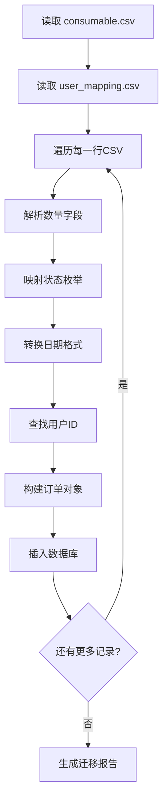

# 耗材订单 CSV 迁移字段对比文档

## 一、数据源与目标模型

### 1.1 CSV 原始字段 (consumable.csv)

| CSV 列名 | 示例值 | 数据类型 | 说明 |
|:---------|:-------|:---------|:-----|
| 订购人 | 霍童雨, 张梓曜 | string | 申请人姓名 |
| 登记时间 | 2021年4月27日 | date | 订单创建日期 |
| 耗材名称 | 硅胶, 乳胶手套 | string | 物品名称 |
| 规格 | 200-300目, 中号（黄色的那种） | string | 规格描述文本 |
| 货号 | （空） | string | 产品货号 |
| 数量 | 一箱, 60个, 两个 | string | 数量+单位文本 |
| 状态 | 已采购, 未采购 | enum | 订单状态 |
| 备注 | 到628取, 实验室库存, 库存, 上直径10 | string | **交流备注**（用于师生交流、管理员提示） |

**备注列实际用途**：
- 师生交流：如取货地点（"到628取"）
- 库存状态：如"实验室库存"、"库存"
- 管理员提示：如"已加购物车"（提示管理员在系统里操作）
- 其他信息：如规格补充（"上直径10"）

### 1.2 现有数据库模型字段 (ConsumableOrder)

| 字段名 | 类型 | 必填 | 说明 | 迁移操作 |
|:-------|:-----|:-----|:-----|:---------|
| id | int | 是 | 主键 | 自动生成 |
| name | str | 是 | 耗材名称 | ← 耗材名称 |
| english_name | str | 否 | 英文名称 | **删除** |
| alias | str | 否 | 别名 | **删除** |
| category | str | 否 | 分类 | **删除** |
| brand | str | 否 | 品牌 | 保留 |
| initial_quantity | float | 否 | 初始数量 | **删除** |
| unit | str | 否 | 单位 | 单位 （多为汉字） |
| specification | str | 否 | 规格 | ← 规格（新增） |
| product_code | str | 否 | 货号 | ← 货号（新增） |
| quantity | int | 是 | 订购数量 | ← 数量（需解析） |
| price | float | 否 | 单价 | 新数据录入 |
| order_reason | enum | 否 | 申购原因 | 默认 none |
| is_hazardous | bool | 否 | 是否危险品 | 默认 false |
| image_path | str | 否 | 图片路径 | 无 |
| **communication** | str | 否 | **交流备注** | ← 备注（新增） |
| notes | str | 否 | 备注 | 保留（原业务备注） |
| applicant_id | int | 否 | 申请人ID | ← 订购人（需映射） |
| status | enum | 是 | 订单状态 | ← 状态（需映射） |
| created_at | datetime | 是 | 创建时间 | ← 登记时间（需转换） |
| updated_at | datetime | 是 | 更新时间 | 自动生成 |
| name_pinyin | str | 否 | 拼音排序 | 自动生成 |

---

## 二、字段映射规则

### 2.1 直接映射

| CSV 字段 | → | 数据库字段 | 说明 |
|:---------|:--|:-----------|:-----|
| 耗材名称 | → | name | 直接映射 |
| 备注 | → | **communication** | 交流用备注（新增字段） |
| 规格 | → | specification | 文本字段，无需解析 |

### 2.2 需要转换的字段

#### 数量字段 (数量 → quantity)

CSV 中的数量是文本混合格式，需要解析：
- `"一箱"` → 需要建立单位映射表
- `"60个"` → 提取数字 60
- `"两个"` → 中文数字转换
- `"一瓶"` → 需要建立单位映射表

**建议处理方式**：
1. 建立中文单位到数字的映射
2. 提取数字部分
3. 如果无法解析，默认 quantity = 1

**单位映射表建议**：
```python
UNIT_MAP = {
    '箱': '箱', '盒': '盒', '包': '包', '个': '个',
    '瓶': '瓶', '支': '支', '卷': '卷', '件': '件',
    '双': '双', 't': '包', '袋': '包',
}
```

#### 货号 → product_code

CSV 中货号列大多为空，直接映射即可。

#### 状态字段 (状态 → status)

| CSV 值 | → | 数据库枚举值 | 说明 |
|:-------|:--|:-------------|:-----|
| 已采购 | → | completed | 采购完成 |
| 未采购 | → | pending | 待采购 |
| （其他） | → | pending | 默认待采购 |

#### 登记时间 → created_at

CSV 格式：`2021年4月27日`
需要转换为：`2021-04-27T00:00:00` (ISO 格式)

#### 订购人 → applicant_id

需要通过用户映射表 (scripts/user_mapping.csv) 进行关联：
1. 读取 CSV 中的订购人姓名
2. 在 user_mapping.csv 中查找对应的 user_id
3. 如果找不到，设置 applicant_id = NULL

---

## 三、模型修改清单

### 3.1 后端修改 (app/models/consumable_order.py)

```diff
 class ConsumableOrderBase(SQLModel):
     name: str = Field(index=True, max_length=200)
-    english_name: Optional[str] = Field(None, max_length=200)
-    alias: Optional[str] = Field(None, max_length=200)
-    category: Optional[str] = Field(None, max_length=100)
     brand: Optional[str] = Field(None, max_length=100)
-    initial_quantity: Optional[float] = Field(None, ge=0)
-    unit: Optional[str] = Field(None, max_length=20)
+    specification: Optional[str] = Field(None, max_length=100)  # 新增：规格
+    product_code: Optional[str] = Field(None, max_length=100)    # 新增：货号
     quantity: int = Field(gt=0)
     price: Optional[float] = Field(None, ge=0)
     order_reason: ConsumableOrderReason = ConsumableOrderReason.NONE
     is_hazardous: bool = False
     image_path: Optional[str] = None
+    communication: Optional[str] = Field(None, max_length=500)   # 新增：交流备注
     notes: Optional[str] = Field(None, max_length=500)
```

### 3.2 前端修改

#### 3.2.1 formConfigs.tsx

删除字段：
- english_name
- alias
- category

新增字段：
- product_code (货号)
- communication (交流备注)

#### 3.2.2 validationSchemas.ts

更新 ConsumableOrderSchema：
- 删除 english_name, alias, category 验证
- 新增 product_code 可选字段
- 新增 communication 可选字段

---

## 四、迁移脚本设计

### 4.1 迁移流程



### 4.2 关键处理逻辑

#### 数量解析函数
```python
def parse_quantity(text: str) -> tuple[int, Optional[str]]:
    """解析数量文本，返回 (数字, 单位)"""
    import re
    
    # 中文数字映射
    cn_map = {'一': 1, '二': 2, '三': 3, '四': 4, '五': 5,
              '六': 6, '七': 7, '八': 8, '九': 9, '十': 10}
    
    # 提取数字
    numbers = re.findall(r'\d+', text)
    if numbers:
        qty = int(numbers[0])
        # 提取单位
        unit_match = re.search(r'[箱盒包个瓶支卷件双袋t]', text)
        unit = unit_match.group() if unit_match else None
        return qty, unit
    
    # 中文数字
    for cn, num in cn_map.items():
        if cn in text:
            unit_match = re.search(r'[箱盒包个瓶支卷件双袋]', text)
            unit = unit_match.group() if unit_match else None
            return num, unit
    
    return 1, None  # 默认值
```

#### 日期解析函数
```python
def parse_date(text: str) -> datetime:
    """解析中文日期格式"""
    import re
    # 匹配格式: 2021年4月27日
    match = re.match(r'(\d+)年(\d+)月(\d+)日', text)
    if match:
        year, month, day = match.groups()
        return datetime(int(year), int(month), int(day))
    return get_utc_now()  # 默认当前时间
```

---

## 五、状态枚举值

### 5.1 现有枚举 (ConsumableOrderStatus)

```python
class ConsumableOrderStatus(str, Enum):
    PENDING = "pending"       # 已申购
    APPROVED = "approved"     # 已审批（采购完成）
    REJECTED = "rejected"    # 未通过
    COMPLETED = "completed"  # 已完成（耗材不需要入库）
```

### 5.2 CSV 到 DB 的映射

| CSV 状态值 | 数据库枚举值 |
|:-----------|:-------------|
| 已采购 | completed |
| 未采购 | pending |

---

## 六、执行步骤

1. **后端修改**
   - 修改 [`app/models/consumable_order.py`](app/models/consumable_order.py)
   - 删除 english_name, initial_quantity, unit, alias, category
   - 新增 specification, product_code, communication

2. **前端修改**
   - 修改 [`frontend/src/lib/formConfigs.tsx`](frontend/src/lib/formConfigs.tsx)
   - 修改 [`frontend/src/lib/validationSchemas.ts`](frontend/src/lib/validationSchemas.ts)
   - 更新表单字段配置

3. **创建迁移脚本**
   - 创建 [`scripts/migrate_consumable_csv.py`](scripts/migrate_consumable_csv.py)
   - 实现数量解析、日期转换、状态映射

4. **执行迁移**
   - 运行迁移脚本
   - 验证迁移结果

---

## 七、待确认问题

- [ ] CSV 中"货号"字段为空，是否需要设置默认值？
- [ ] 用户映射表中未找到的订购人如何处理？设置为 NULL 还是创建新用户？
- [ ] 迁移后是否需要重新计算 name_pinyin 字段？
- [ ] 现有数据库中是否已有数据？迁移前是否需要备份？
- [ ] communication 字段是否需要在列表页显示？

---

*文档更新时间: 2026-03-02*
