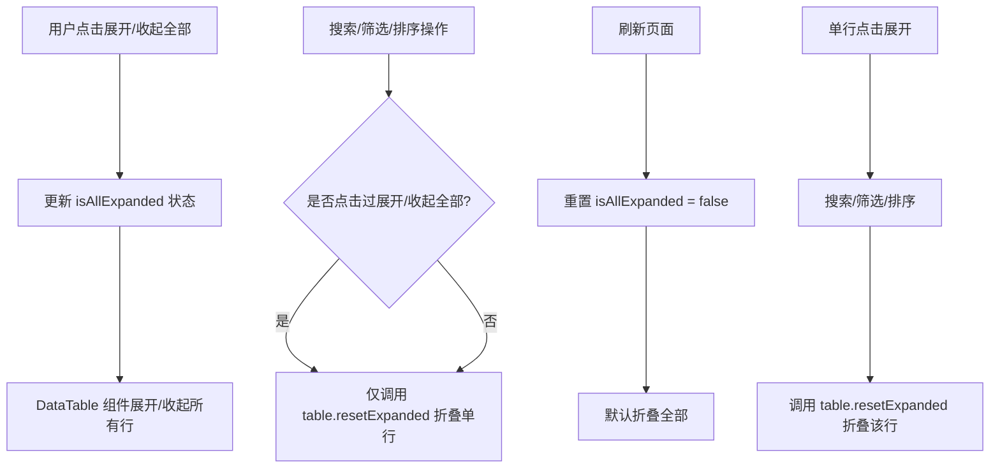

# 展开全部状态持久化修改计划

## 需求概述

修改展开/收起全部的状态管理逻辑：
1. 点击"展开/收起全部"后，搜索、筛选、排序等操作后**仍然保持展开/收起状态**
2. **刷新页面后失效**（移除 localStorage 持久化）
3. **默认折叠全部**
4. 单独点击某行展开/收起保持现有逻辑（搜索、筛选、排序等操作后刷新并折叠）

## 当前实现分析

### 涉及页面
- `frontend/src/pages/Inventory.tsx` - 库存管理页面
- `frontend/src/pages/ReagentOrders.tsx` - 试剂订单页面

### 当前逻辑问题

| 场景 | 当前行为 | 期望行为 |
|-----|---------|---------|
| 首次加载 | 读取 localStorage，无则默认收起 | 默认折叠全部 |
| 点击展开/收起按钮 | 展开/收起 + 保存到 localStorage | 展开/收起（不保存） |
| 搜索时 | `setIsAllExpanded(false)` + `table.resetExpanded()` | 仅 `table.resetExpanded()` |
| 筛选时 | `setIsAllExpanded(false)` + `table.resetExpanded()` | 仅 `table.resetExpanded()` |
| 排序时 | `setIsAllExpanded(false)` + `table.resetExpanded()` | 仅 `table.resetExpanded()` |
| 刷新页面 | 读取 localStorage 恢复状态 | 重置为默认折叠 |

## 实施步骤

### 步骤 1：修改 Inventory.tsx

**位置：第 205-221 行**

修改 `isAllExpanded` 状态初始化，移除 localStorage 读取：
```typescript
// 修改前
const [isAllExpanded, setIsAllExpanded] = useState<boolean>(() => {
  return localStorage.getItem('inventory-table-expand-all') === 'expanded'
})

// 修改后
const [isAllExpanded, setIsAllExpanded] = useState<boolean>(false)
```

**删除第 217-219 行的 localStorage 保存逻辑：**
```typescript
// 删除这个 useEffect
useEffect(() => {
  localStorage.setItem('inventory-table-expand-all', isAllExpanded ? 'expanded' : 'collapsed')
}, [isAllExpanded])
```

**修改搜索防抖逻辑（第 288-297 行）：**

移除 `setIsAllExpanded(false)` 调用：
```typescript
// 修改前
const timer = setTimeout(() => {
  if (globalFilter !== searchInput) {
    setIsAllExpanded(false)  // 删除这行
    if (tableRef.current) tableRef.current.resetExpanded()
    setGlobalFilter(searchInput)
  }
}, 300)

// 修改后
const timer = setTimeout(() => {
  if (globalFilter !== searchInput) {
    if (tableRef.current) tableRef.current.resetExpanded()
    setGlobalFilter(searchInput)
  }
}, 300)
```

**修改排序逻辑（第 592-600 行）：**

移除 `setIsAllExpanded(false)` 调用：
```typescript
// 修改前
onSortingChange: (updater) => {
  setIsAllExpanded(false)  // 删除这行
  table.resetExpanded()
  // ...
}

// 修改后
onSortingChange: (updater) => {
  table.resetExpanded()
  // ...
}
```

**修改模糊搜索切换逻辑（第 659-662 行）：**

移除 `setIsAllExpanded(false)` 调用：
```typescript
// 修改前
onCheckedChange={(checked) => {
  startTransition(() => {
    setIsAllExpanded(false)  // 删除这行
    table.resetExpanded()
    setFuzzySearch(checked === true)
  })
}}

// 修改后
onCheckedChange={(checked) => {
  startTransition(() => {
    table.resetExpanded()
    setFuzzySearch(checked === true)
  })
}}
```

**修改搜索字段切换逻辑（第 667 行）：**

移除 `setIsAllExpanded(false)` 调用：
```typescript
// 修改前
<Select value={searchField} onValueChange={(val) => { setIsAllExpanded(false); table.resetExpanded(); setSearchField(val) }}>

// 修改后
<Select value={searchField} onValueChange={(val) => { table.resetExpanded(); setSearchField(val) }}>
```

**修改状态筛选切换逻辑（第 678 行）：**

移除 `setIsAllExpanded(false)` 调用：
```typescript
// 修改前
<Select value={statusFilter} onValueChange={(val) => { setIsAllExpanded(false); table.resetExpanded(); setStatusFilter(val) }}>

// 修改后
<Select value={statusFilter} onValueChange={(val) => { table.resetExpanded(); setStatusFilter(val) }}>
```

---

### 步骤 2：修改 ReagentOrders.tsx

相同的修改应用到 ReagentOrders.tsx：

**位置：第 166-168 行**
```typescript
// 修改前
const [isAllExpanded, setIsAllExpanded] = useState<boolean>(() => {
  return localStorage.getItem('reagent-orders-table-expand-all') === 'expanded'
})

// 修改后
const [isAllExpanded, setIsAllExpanded] = useState<boolean>(false)
```

**删除第 211-213 行的 localStorage 保存逻辑**

**修改搜索防抖逻辑（第 191-200 行）**

**修改排序逻辑（第 603-611 行）**

**修改模糊搜索切换逻辑（第 669-673 行）**

**修改搜索字段切换逻辑（第 678 行）**

**修改状态筛选切换逻辑（第 688 行）**

---

## Mermaid 流程图



## 验收标准

1. ✅ 首次加载页面时，默认折叠全部（不读取 localStorage）
2. ✅ 点击展开/收起按钮后，搜索/筛选/排序操作后保持展开状态
3. ✅ 刷新页面后，重置为折叠状态
4. ✅ 单独点击某行展开后，搜索/筛选/排序操作后该行恢复折叠状态

## 影响范围

- `frontend/src/pages/Inventory.tsx`
- `frontend/src/pages/ReagentOrders.tsx`

**注意**：ConsumableOrders.tsx 当前没有展开/收起全部功能，无需修改。
