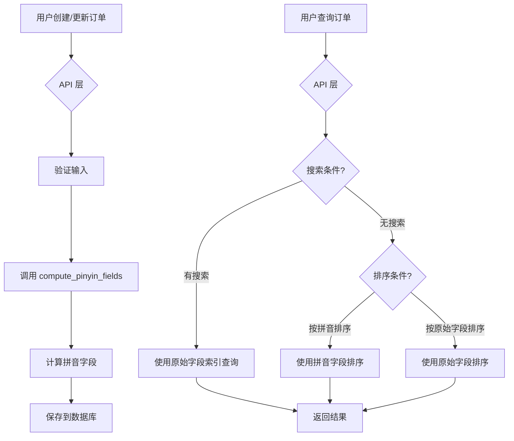

# 订单页面字段索引和拼音排序字段实施计划

## 任务概述
给订单页面的字段添加查询索引和拼音排序字段，提升搜索和排序性能。

## 需求澄清

### 索引和拼音排序的区别
1. **查询索引** - 建立在原始字段上，用于加速 WHERE 条件查询
2. **拼音排序字段** - 独立的拼音字段，用于按拼音字母顺序排序

## 实施计划

### 1. 修改 ReagentOrder 模型
**文件**: `app/models/reagent_order.py`

添加索引的字段：
- `name` → `Field(index=True, max_length=200)` 
- `category` → `Field(index=True, max_length=100)`
- `brand` → `Field(index=True, max_length=100)`
- `status` → `Field(index=True)` (已有)
- `created_at` → `Field(index=True)` (已有)

添加拼音排序字段（带索引）：
- `name_pinyin: Optional[str] = Field(default=None, index=True)`
- `brand_pinyin: Optional[str] = Field(default=None, index=True)`

### 2. 修改 ConsumableOrder 模型
**文件**: `app/models/consumable_order.py`

添加索引的字段：
- `name` → `Field(index=True, max_length=200)`
- `status` → `Field(index=True)` (已有)
- `created_at` → `Field(index=True)` (已有)

添加拼音排序字段（带索引）：
- `name_pinyin: Optional[str] = Field(default=None, index=True)`

### 3. 修改 DTO
**文件**: 
- `app/models/reagent_order.py`
- `app/models/consumable_order.py`

在 `ReagentOrderCreate`, `ReagentOrderUpdate`, `ReagentOrderResponse` 中添加拼音字段：
- `name_pinyin: Optional[str] = None`
- `brand_pinyin: Optional[str] = None`

在 `ConsumableOrderCreate`, `ConsumableOrderUpdate`, `ConsumableOrderResponse` 中添加：
- `name_pinyin: Optional[str] = None`

### 4. 修改 reagent_orders API
**文件**: `app/api/reagent_orders.py`

- 在 `create_reagent_order` 函数中，调用 `compute_pinyin_fields` 计算拼音字段
- 在 `update_reagent_order` 函数中，更新拼音字段
- 在 `list_reagent_orders` 函数中，添加拼音排序选项：
  - `name_pinyin` → `ReagentOrder.name_pinyin`
  - `brand_pinyin` → `ReagentOrder.brand_pinyin`

### 5. 修改 consumable_orders API
**文件**: `app/api/consumable_orders.py`

- 同样逻辑添加拼音字段计算和排序支持

### 6. 数据库迁移
创建 SQL 迁移脚本添加新列：
```sql
-- ReagentOrder 表
ALTER TABLE reagentorder ADD COLUMN name_pinyin VARCHAR(200);
ALTER TABLE reagentorder ADD COLUMN brand_pinyin VARCHAR(100);

-- ConsumableOrder 表  
ALTER TABLE consumableorder ADD COLUMN name_pinyin VARCHAR(200);

-- 创建索引
CREATE INDEX ix_reagentorder_name ON reagentorder(name);
CREATE INDEX ix_reagentorder_category ON reagentorder(category);
CREATE INDEX ix_reagentorder_brand ON reagentorder(brand);
CREATE INDEX ix_reagentorder_name_pinyin ON reagentorder(name_pinyin);
CREATE INDEX ix_reagentorder_brand_pinyin ON reagentorder(brand_pinyin);
CREATE INDEX ix_consumableorder_name ON consumableorder(name);
CREATE INDEX ix_consumableorder_name_pinyin ON consumableorder(name_pinyin);
```

### 7. 索引策略说明

#### 查询索引 vs 拼音字段索引
| 类型 | 用途 | 新增数据 | 现有数据 |
|------|------|----------|----------|
| 原始字段索引 | 加速 WHERE 查询 | 自动加入 | 自动加入 |
| 拼音字段索引 | 加速拼音排序 | 创建时自动计算 | 需迁移脚本填充 |

#### 全部索引的代价
- 写入性能：每次 INSERT/UPDATE 需维护索引（约 10-20% 开销）
- 存储空间：每个索引约增加 10-30% 存储
- 对于小数据量（<10万条）影响可忽略

#### 优化建议
- 订单表数据量预计 <10万条，可以全部添加索引
- 拼音字段在创建/更新时自动计算，无需额外操作
- 现有数据可选择性运行迁移脚本填充
**文件**: `frontend/src/pages/ReagentOrders.tsx`, `frontend/src/pages/ConsumableOrders.tsx`

- 添加拼音排序选项到表格列配置
- 参考库存页面的排序实现

## 数据流程图



## 预期效果
- 查询性能提升：索引字段的 WHERE 查询更快
- 排序性能提升：拼音字段排序比应用层排序更快
- 用户体验：支持按拼音字母顺序排序（如按名称拼音 A-Z 排序）
