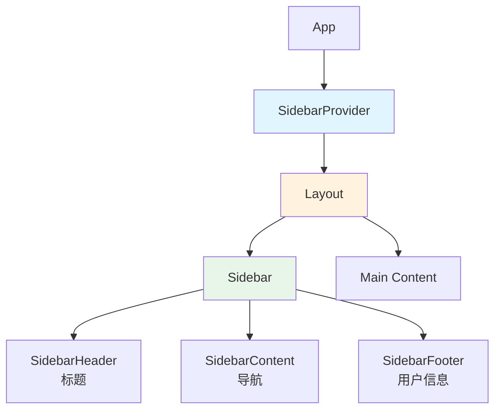

# 折叠侧边栏实现计划

## 概述

从 [shadcn-admin](D:/Code/shadcn-admin) 学习折叠侧边栏的实现方式，应用到实验室库存管理系统。

## 用户需求确认

采用 **icon 模式**（图标模式）：
- 折叠时侧边栏的图标不动
- 随着折叠文字淡出，最后只剩下图标按钮
- "实验室库存管理系统"标题折叠后不显示
- 用户信息部分折叠后显示头像
- 退出登录按钮和暗黑模式切换按钮折叠后上下并排
- 所有按钮都要水平居中且宽度一致

## 参考实现分析

### 核心文件

| 文件 | 说明 |
|------|------|
| `src/components/ui/sidebar.tsx` | 核心侧边栏组件 (728行) |
| `src/context/layout-provider.tsx` | 布局配置上下文 |
| `src/components/layout/app-sidebar.tsx` | 应用侧边栏组件 |
| `src/components/layout/authenticated-layout.tsx` | 认证布局 |

### 关键技术点

1. **SidebarProvider** - 状态管理
   - 使用Cookie持久化侧边栏状态 (7天)
   - 支持键盘快捷键 `Ctrl+B` / `Cmd+B` 切换
   - 提供 `toggleSidebar` 方法

2. **折叠模式** (collapsible)
   - `icon`: 图标模式 - **本次使用**
   - `offcanvas`: 完全隐藏
   - `none`: 不可折叠

3. **变体** (variant)
   - `sidebar`: 标准侧边栏 - **本次使用**
   - `floating`: 浮动样式
   - `inset`: 嵌入样式

4. **响应式**
   - 移动端使用 Sheet 组件
   - 桌面端使用固定定位

5. **Tooltips**
   - 折叠时显示悬停提示

## 实现步骤

### 1. 分析当前项目需求 ✅
- 确定使用 icon 模式
- 确定布局需求

### 2. 创建侧边栏组件
从shadcn-admin复制并适配：
- `sidebar.tsx` - 核心侧边栏组件
- 复制到 `frontend/src/components/ui/sidebar.tsx`

### 3. 复制依赖组件
需要复制的依赖：
- `components/ui/sheet.tsx` - 移动端抽屉
- `components/ui/tooltip.tsx` - 悬停提示
- `components/ui/collapsible.tsx` - 可折叠组件
- `components/ui/dropdown-menu.tsx` - 下拉菜单
- `lib/cookies.ts` - Cookie工具函数
- `hooks/use-mobile.tsx` - 移动端检测

### 4. 创建SidebarProvider
- 集成Cookie持久化
- 管理侧边栏状态

### 5. 创建LayoutProvider
- 控制collapsible模式为 `icon`
- 控制variant样式为 `sidebar`

### 6. 重构Layout.tsx
- 使用新的侧边栏组件替换现有实现
- 调整主内容区域的padding

### 7. 适配各个区域
- 导航菜单：折叠时文字淡出，图标保持不动，显示tooltip
- 标题区域：折叠后隐藏
- 用户区域：折叠后头像居中显示，按钮上下并排
- 按钮：水平居中，宽度一致

### 8. 添加SidebarTrigger
- 在Header中添加切换按钮

### 9. 添加SidebarRail
- 侧边栏边缘拖动区域

### 10. 测试
- 桌面端折叠/展开
- 移动端行为
- 暗黑模式

## UI布局设计

### 展开状态 (width: 256px / 16rem)
```
┌─────────────────────────────┐
│      实验室库存管理系统      │  <- 标题
├─────────────────────────────┤
│  📊 仪表盘                  │
│  🧪 试剂订单                │  <- 导航
│  🛒 耗材订单                │
│  📦 库存列表                │
│  📥 导入数据                │
│  👥 用户管理                │
├─────────────────────────────┤
│  [头像] 用户名    [退出][🌙] │  <- 用户区域
└─────────────────────────────┘
```

### 折叠状态 (width: 64px / 4rem)
```
┌────┐
│ 📊 │  <- 导航图标居中
│ 🧪 │
│ 🛒 │
│ 📦 │
│ 📥 │
│ 👥 │
├────┤
│ ○  │  <- 头像居中
│ ⎋ │  <- 退出按钮
│ 🌙 │  <- 暗黑模式
└────┘
```

## 架构图



## 用户确认的需求细节

1. **不需要SidebarRail** - 边缘拖动功能不需要
2. **Cookie持久化改为3天**
3. **标题位置** - 折叠后位置空出，图标不要向上移动
4. **切换按钮位置** - 在Header左上方

### 关键设计要求 ⚠️

1. **导航图标位置不变** - 图标始终保持在固定位置，不移动
2. **无闪烁无跳动** - 折叠/展开时元素对齐不因显示/隐藏而改变，避免位置闪烁

### 实现方案

- 导航图标使用固定宽度和居中对齐，确保位置始终不变
- 文字使用绝对定位覆盖在图标右侧，折叠时opacity transition
- 使用固定像素宽度而非动态计算，避免重排
- 整体容器使用flex布局，确保稳定性

## 注意事项

1. 使用shadcn-admin的 `icon` 折叠模式
2. 按钮使用 `justify-center` 实现水平居中
3. 用户区域按钮使用 `flex-col` 实现上下排列
4. 保持与现有暗黑模式的兼容性
5. Cookie持久化改为3天
6. 不实现SidebarRail组件
7. 切换按钮放在Header区域内
