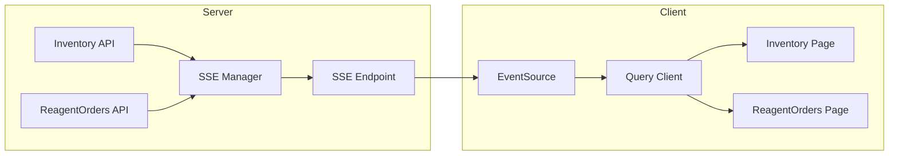
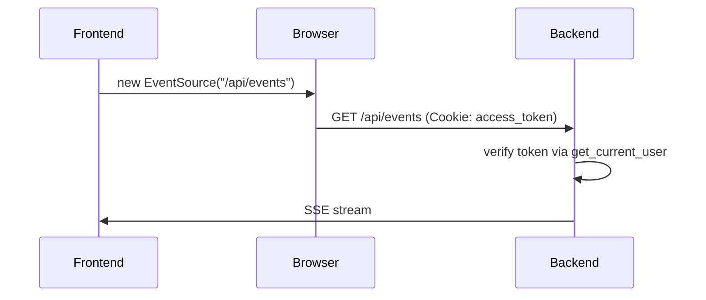

# SSE 实时推送方案（重构版）

## 1. 概述

使用 Server-Sent Events (SSE) 实现实时数据推送，替代现有的 `refetchInterval` 轮询方案。

### 架构图



## 2. 事件类型

| 事件名称 | 含义 |
|---------|------|
| `inventory:created` | 新增库存 |
| `inventory:updated` | 更新库存 |
| `inventory:deleted` | 删除库存 |
| `inventory:borrowed` | 库存借用 |
| `inventory:returned` | 库存归还 |
| `order:created` | 新建订单 |
| `order:updated` | 订单状态变更 |
| `order:deleted` | 删除订单 |

## 3. 实现步骤

### Step 1: 创建 SSE 管理器 (后端)

**文件**: `app/core/sse_manager.py` (新建)

```python
import asyncio
import json
import logging
from typing import List

logger = logging.getLogger(__name__)

class SSEManager:
    def __init__(self):
        # 存放所有活跃客户端的消息队列
        self.listeners: List[asyncio.Queue] = []

    async def subscribe(self) -> asyncio.Queue:
        """客户端建立连接时，分配一个独立的消息队列"""
        q = asyncio.Queue()
        self.listeners.append(q)
        logger.info(f"SSE Client connected. Total clients: {len(self.listeners)}")
        return q

    def unsubscribe(self, q: asyncio.Queue):
        """客户端断开时，移除对应的队列"""
        if q in self.listeners:
            self.listeners.remove(q)
            logger.info(f"SSE Client disconnected. Total clients: {len(self.listeners)}")

    async def broadcast(self, event_type: str, data: dict):
        """向所有在线客户端推送消息"""
        if not self.listeners:
            return

        # 组装统一格式的消息
        message = json.dumps({"type": event_type, "data": data}, ensure_ascii=False)
        
        # 将消息推入所有客户端的队列
        for q in self.listeners:
            await q.put(message)

# 全局单例
sse_manager = SSEManager()
```

### Step 2: 创建 SSE API 端点 (后端)

**文件**: `app/api/sse.py` (新建)

```python
from fastapi import APIRouter, Request, Depends
from fastapi.responses import StreamingResponse
from app.core.sse_manager import sse_manager
import asyncio

router = APIRouter()

@router.get("/events")
async def sse_endpoint(request: Request):
    """前端订阅此接口以接收实时更新"""
    # 1. 为当前请求创建一个消息队列
    q = await sse_manager.subscribe()

    async def event_generator():
        try:
            while True:
                # 2. 检查客户端是否已主动断开连接
                if await request.is_disconnected():
                    break
                
                # 3. 阻塞等待新消息，一旦有广播立刻推送
                message = await q.get()
                
                # SSE 必须遵循特定的文本格式：以 "data: " 开头，以 "\n\n" 结尾
                yield f"data: {message}\n\n"
                
        except asyncio.CancelledError:
            pass # 捕获由于客户端断开引起的取消异常
        finally:
            # 4. 无论如何，确保最终清理队列
            sse_manager.unsubscribe(q)

    return StreamingResponse(event_generator(), media_type="text/event-stream")
```

### Step 3: 在 main.py 中注册 SSE 路由

**文件**: `app/main.py` (修改)

```python
from app.api import sse

# Include routers
app.include_router(users.router, prefix="/api")
app.include_router(inventory.router, prefix="/api")
app.include_router(reagent_orders.router, prefix="/api")
app.include_router(consumable_orders.router, prefix="/api")
app.include_router(user_sessions.router, prefix="/api/users/me")
app.include_router(sse.router)  # 新增：无 prefix
```

### Step 4: 在现有 API 中触发广播

需要在以下位置添加广播调用：

**Inventory API (`app/api/inventory.py`)**:
- `manual_add_inventory` 函数 - 手动入库后广播
- `update_inventory` 函数 - 更新后广播
- `delete_inventory` 函数 - 删除后广播
- `borrow_item` 函数 - 借用后广播
- `return_item` 函数 - 归还后广播

**ReagentOrders API (`app/api/reagent_orders.py`)**:
- `create_reagent_order` 函数 - 创建订单后广播
- `approve_reagent_order` 函数 - 审批后广播
- `reject_reagent_order` 函数 - 驳回后广播
- `confirm_reagent_arrival` 函数 - 确认到货后广播
- `stock_in_reagent_order` 函数 - 入库后广播
- `delete_reagent_order` 函数 - 删除后广播

### Step 5: 创建前端 SSE Hook

**文件**: `frontend/src/hooks/useSSE.ts` (新建)

```typescript
import { useEffect } from 'react'
import { useQueryClient } from '@tanstack/react-query'

export function useSSE(url: string) {
  const queryClient = useQueryClient()

  useEffect(() => {
    // 建立 SSE 连接
    const eventSource = new EventSource(url)

    eventSource.onopen = () => {
      console.log('[SSE] Connected')
    }

    // 接收消息
    eventSource.onmessage = (event) => {
      try {
        const payload = JSON.parse(event.data)
        const { type } = payload

        // 根据事件类型，精准使其对应的缓存失效
        if (type.startsWith('inventory:')) {
          // 只要是库存变化（增删改），就让库存列表后台默默拉取最新数据
          queryClient.invalidateQueries({ queryKey: ['inventory'] })
        } 
        else if (type.startsWith('order:')) {
          // 订单变化
          queryClient.invalidateQueries({ queryKey: ['reagent-orders'] })
        }

      } catch (error) {
        console.error('[SSE] Parse error:', error)
      }
    }

    eventSource.onerror = (error) => {
      console.error('[SSE] Connection error/disconnected, auto-reconnecting...', error)
      // 注意：EventSource 遇到错误会自动尝试重连，不需要我们干预
    }

    // 组件卸载时关闭连接
    return () => {
      eventSource.close()
    }
  }, [url, queryClient])
}
```

### Step 6: 在页面组件中集成

**文件**: `frontend/src/pages/Inventory.tsx` (修改)

1. 删除 `refetchInterval: 10000`
2. 导入并使用 `useSSE` Hook
3. 在组件初始化时建立 SSE 连接

**文件**: `frontend/src/pages/ReagentOrders.tsx` (修改)

同上

## 4. 详细任务清单

| # | 任务 | 文件 | 类型 |
|---|------|------|------|
| 1 | 创建 SSE 管理器 | `app/core/sse_manager.py` | 新建 |
| 2 | 创建 SSE API 端点 | `app/api/sse.py` | 新建 |
| 3 | 注册 SSE 路由 | `app/main.py` | 修改 |
| 4 | 集成广播到 Inventory API | `app/api/inventory.py` | 修改 |
| 5 | 集成广播到 ReagentOrders API | `app/api/reagent_orders.py` | 修改 |
| 6 | 创建前端 SSE Hook | `frontend/src/hooks/useSSE.ts` | 新建 |
| 7 | 修改 Inventory 页面 | `frontend/src/pages/Inventory.tsx` | 修改 |
| 8 | 修改 ReagentOrders 页面 | `frontend/src/pages/ReagentOrders.tsx` | 修改 |

## 5. 身份鉴权方案（已简化）

### 现有认证机制分析

经过代码分析，发现项目使用：
- **Token 存储**：httpOnly Cookie (`access_token`)
- **前端**：axios 配置 `withCredentials: true`，自动发送 Cookie
- **后端**：`get_current_user` 已支持从 Cookie 读取 token

### SSE 鉴权方案

**无需额外处理！** SSE 请求会自动携带 Cookie，流程如下：



### 前端代码（重要：添加 withCredentials）

```typescript
// ✅ 必须添加 withCredentials: true 确保跨域时携带 Cookie
const eventSource = new EventSource('/api/events', { 
  withCredentials: true 
})
```

### 后端代码（重要：添加依赖注入）

```python
from fastapi import APIRouter, Request, Depends
from fastapi.responses import StreamingResponse
from app.core.sse_manager import sse_manager
from app.core.auth import get_current_user  # 引入鉴权函数

router = APIRouter()

# ✅ 必须添加 Depends 来确保只有登录用户才能建立连接
@router.get("/events")
async def sse_endpoint(
    request: Request, 
    current_user = Depends(get_current_user)  # 拦截未登录用户
):
    q = await sse_manager.subscribe()
    # ... 后面的 generator 逻辑保持不变 ...
```

**注意**：虽然 `current_user` 参数在函数内部未使用，但 `Depends(get_current_user)` 会在请求进入时验证 Cookie，拦截未登录用户，防止匿名连接占用服务器资源。

### 备选方案（如果未来需要显式鉴权）

如果未来 SSE 需要显式用户身份验证，可以使用 URL 参数：

```typescript
// 前端
const eventSource = new EventSource(`/api/events?token=${token}`)
```

```python
# 后端
@router.get("/events")
async def sse_endpoint(request: Request, token: str = Query(None)):
    if token:
        payload = decode_token(token)
        # 验证用户...
```

## 6. 注意事项

### 保持连接
SSE 原生支持断线自动重连，无需额外代码。

### 数据一致性
使用 `queryClient.invalidateQueries` 让 React Query 后台平滑拉取最新数据，确保排序和分页不会错乱。
