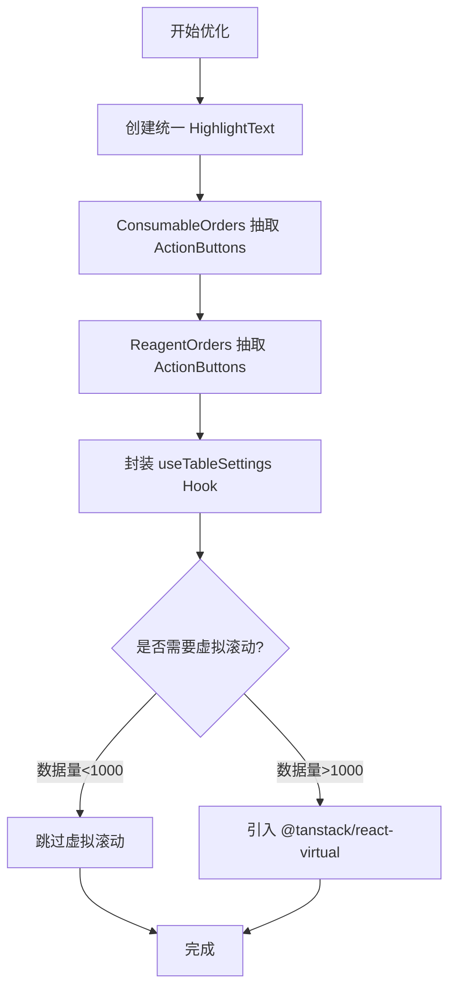

# 表格组件性能优化计划

## 一、现状分析确认

### 1.1 已确认的问题

| 问题 | Inventory.tsx | ConsumableOrders.tsx | ReagentOrders.tsx |
|------|---------------|---------------------|-------------------|
| HighlightText 组件 | 内联定义 (164-187行) | 内联定义 (98-121行) | 内联定义 (113-136行) |
| ActionButtons 组件 | 独立组件 (783-856行) + memo优化 | 内联在columns中 | 内联在columns中 |
| 操作列渲染 | 通过meta传递回调 | 内联回调函数 | 内联回调函数 |

### 1.2 性能瓶颈确认

**当前 HighlightText 实现分析：**
```typescript
// 当前实现（存在问题）
const regex = React.useMemo(() => new RegExp(`(${highlight})`, 'gi'), [highlight])
// 问题：500个单元格会创建500个相同的正则实例
```

**问题点：**
1. **正则实例冗余**：useMemo 在每个单元格组件内部创建，无法跨单元格共享
2. **字符串操作昂贵**：fuzzy 模式下使用 `replace()` 清理字符串会产生大量中间字符串
3. **大小写转换重复**：`toLowerCase()` 在每次渲染时都会被调用
4. **内联操作列**：ConsumableOrders 和 ReagentOrders 在 columns 定义中使用内联回调

---

## 二、优化方案

### 2.1 统一 HighlightText 组件（极致性能优化）

**文件位置：** `frontend/src/components/ui/HighlightText.tsx`

**优化策略：**

```typescript
// 模块级正则缓存（LRU模拟）
const regexCache = new Map<string, RegExp>()

function getOrCreateRegex(pattern: string, flags: string): RegExp {
  const key = `${pattern}:${flags}`
  if (!regexCache.has(key)) {
    regexCache.set(key, new RegExp(pattern, flags))
  }
  return regexCache.get(key)!
}

// 早退机制
if (!highlight || !text) return <>{text}</>

// 精确匹配：使用 split + 捕获组替代 replace
// 模糊匹配：使用正则探测替代字符串清洗
```

**预期收益：**
- 正则实例从 O(n) 减少到 O(1)
- 消除 replace 产生的中间字符串
- 减少 toLowerCase 调用次数

### 2.2 抽取 ActionButtons 组件

**ConsumableOrders ActionButtons 设计：**
```typescript
interface ActionButtonsProps {
  order: ConsumableOrder
  isAdmin: boolean
  onEdit: (order: ConsumableOrder) => void
  onApprove: (id: number) => void
  onReject: (id: number) => void
  onComplete: (id: number) => void
}
```

**ReagentOrders ActionButtons 设计：**
```typescript
interface ActionButtonsProps {
  order: ReagentOrder
  isAdmin: boolean
  onEdit: (order: ReagentOrder) => void
  onApprove: (id: number) => void
  onReject: (id: number) => void
  onConfirm: (id: number) => void  // 确认收货
  onComplete: (id: number) => void
}
```

**实现要点：**
- 使用 React.memo 包装
- 自定义 isEqual 函数，只在关键属性变化时重渲染
- 参考 Inventory.tsx 的实现模式

### 2.3 封装 useTableSettings Hook

**设计：**
```typescript
export function useTableSettings<T>(options: {
  storageKey: string
  defaultSort?: SortingState
}) {
  // 列宽缓存（带防抖）
  // 搜索防抖
  // 全局过滤器
  // 展开状态
}
```

### 2.4 虚拟滚动评估

**当前数据量分析：**
- 每页 50 条记录
- 无限滚动加载

**评估结论：**
- 当前数据量（<500条）暂不需要虚拟滚动
- 建议在数据量超过 1000 条时考虑引入 @tanstack/react-virtual

---

## 三、实施步骤

### 步骤 1：创建统一 HighlightText 组件
- [ ] 创建 `frontend/src/components/ui/HighlightText.tsx`
- [ ] 实现模块级正则缓存
- [ ] 实现早退机制
- [ ] 优化精确匹配和模糊匹配逻辑
- [ ] 在三个页面中替换内联定义

### 步骤 2：ConsumableOrders ActionButtons 抽取
- [ ] 创建 OrderActionButtons 组件
- [ ] 使用 React.memo + 自定义 isEqual
- [ ] 修改 columns 配置使用独立组件
- [ ] 通过 meta 传递回调函数

### 步骤 3：ReagentOrders ActionButtons 抽取
- [ ] 同步骤 2

### 步骤 4：封装 useTableSettings Hook
- [ ] 创建 `frontend/src/hooks/useTableSettings.tsx`
- [ ] 封装列宽缓存逻辑
- [ ] 封装搜索防抖逻辑
- [ ] 在三个页面中替换

---

## 四、Mermaid 工作流程



---

## 五、优先级建议

| 优先级 | 任务 | 预期收益 | 复杂度 |
|--------|------|----------|--------|
| P0 | 统一 HighlightText | 高（表格级性能） | 中 |
| P1 | 抽取 ActionButtons | 中（行级性能） | 低 |
| P2 | useTableSettings Hook | 中（代码复用） | 低 |
| P3 | 虚拟滚动 | 低（未来考虑） | 高 |

---

## 六、风险与注意事项

1. **正则缓存内存泄漏**：需要设置缓存上限（建议 100 个）
2. **Hook 抽取破坏现有逻辑**：需要充分测试
3. **虚拟滚动影响现有功能**：需要评估展开行、列宽拖拽等兼容性
