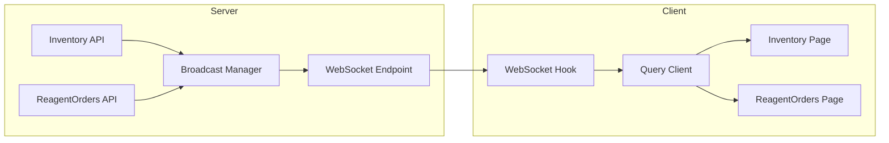

# WebSocket 实时推送方案详细计划

## 1. 概述

使用 WebSocket 实现实时数据推送，替代现有的 `refetchInterval` 轮询方案。

### 架构图



## 2. 事件类型定义

| 事件名称 | 含义 | Payload 示例 |
|---------|------|-------------|
| `inventory:created` | 新增库存 | `{ id, name, cas_number, ... }` |
| `inventory:updated` | 更新库存 | `{ id, name, remaining_quantity, status, ... }` |
| `inventory:deleted` | 删除库存 | `{ id }` |
| `inventory:borrowed` | 库存借用 | `{ id, borrower_id, borrower_name }` |
| `inventory:returned` | 库存归还 | `{ id, remaining_quantity, status }` |
| `order:created` | 新建订单 | `{ id, name, cas_number, ... }` |
| `order:updated` | 订单状态变更 | `{ id, status, previous_status }` |
| `order:deleted` | 删除订单 | `{ id }` |

## 3. 实现步骤

### Step 1: 创建 WebSocket 工具类 (后端)

**文件**: `app/core/websocket_manager.py` (新建)

```python
from typing import Dict, List, Callable
from fastapi import WebSocket
import asyncio
import json
import logging

logger = logging.getLogger(__name__)

class ConnectionManager:
    """WebSocket 连接管理器"""
    
    def __init__(self):
        # 活跃连接列表
        self.active_connections: List[WebSocket] = []
    
    async def connect(self, websocket: WebSocket):
        await websocket.accept()
        self.active_connections.append(websocket)
        logger.info(f"WebSocket connected. Total: {len(self.active_connections)}")
    
    def disconnect(self, websocket: WebSocket):
        self.active_connections.remove(websocket)
        logger.info(f"WebSocket disconnected. Total: {len(self.active_connections)}")
    
    async def broadcast(self, message: dict):
        """广播消息到所有连接"""
        if not self.active_connections:
            return
        
        message_str = json.dumps(message, ensure_ascii=False)
        # 移除无效连接
        disconnected = []
        
        for connection in self.active_connections:
            try:
                await connection.send_text(message_str)
            except Exception as e:
                logger.warning(f"Failed to send to connection: {e}")
                disconnected.append(connection)
        
        # 清理断开的连接
        for conn in disconnected:
            self.disconnect(conn)

# 全局实例
manager = ConnectionManager()
```

### Step 2: 创建 WebSocket API 端点 (后端)

**文件**: `app/api/websocket.py` (新建)

```python
from fastapi import APIRouter, WebSocket, WebSocketDisconnect
from app.core.websocket_manager import manager
from app.core.auth import get_current_user
from app.models.user import User
import logging

router = APIRouter()
logger = logging.getLogger(__name__)

@router.websocket("/ws")
async def websocket_endpoint(websocket: WebSocket):
    """WebSocket 端点"""
    await manager.connect(websocket)
    try:
        while True:
            # 保持连接，可选：处理客户端消息
            data = await websocket.receive_text()
            # 目前不需要客户端消息
    except WebSocketDisconnect:
        manager.disconnect(websocket)
    except Exception as e:
        logger.error(f"WebSocket error: {e}")
        manager.disconnect(websocket)
```

### Step 3: 创建广播辅助函数 (后端)

**文件**: `app/services/broadcast.py` (新建)

```python
from app.core.websocket_manager import manager
from typing import Any, Dict
import logging

logger = logging.getLogger(__name__)

async def broadcast_inventory_created(item: Dict[str, Any]):
    """广播库存新增事件"""
    await manager.broadcast({
        "type": "inventory:created",
        "data": item
    })

async def broadcast_inventory_updated(item: Dict[str, Any]):
    """广播库存更新事件"""
    await manager.broadcast({
        "type": "inventory:updated",
        "data": item
    })

async def broadcast_inventory_deleted(inventory_id: int):
    """广播库存删除事件"""
    await manager.broadcast({
        "type": "inventory:deleted",
        "data": {"id": inventory_id}
    })

async def broadcast_order_created(order: Dict[str, Any]):
    """广播订单创建事件"""
    await manager.broadcast({
        "type": "order:created",
        "data": order
    })

async def broadcast_order_updated(order_id: int, status: str, previous_status: str = None):
    """广播订单状态变更事件"""
    await manager.broadcast({
        "type": "order:updated",
        "data": {
            "id": order_id,
            "status": status,
            "previous_status": previous_status
        }
    })
```

### Step 4: 在 main.py 中注册 WebSocket 路由

**文件**: `app/main.py` (修改)

```python
from app.api import websocket  # 新增

# Include routers
app.include_router(users.router, prefix="/api")
app.include_router(inventory.router, prefix="/api")
app.include_router(reagent_orders.router, prefix="/api")
app.include_router(consumable_orders.router, prefix="/api")
app.include_router(user_sessions.router, prefix="/api/users/me")
app.include_router(websocket.router)  # 新增：无 prefix
```

### Step 5: 在现有 API 中集成广播 (后端)

需要在以下位置添加广播调用：

**Inventory API (`app/api/inventory.py`)**:
- `manual_add_inventory` 函数 - 手动入库后广播
- `update_inventory` 函数 - 更新后广播
- `delete_inventory` 函数 - 删除后广播
- `borrow_item` 函数 - 借用后广播
- `return_item` 函数 - 归还后广播

**ReagentOrders API (`app/api/reagent_orders.py`)**:
- `create_reagent_order` 函数 - 创建订单后广播
- `approve_reagent_order` 函数 - 审批后广播
- `reject_reagent_order` 函数 - 驳回后广播
- `confirm_reagent_arrival` 函数 - 确认到货后广播
- `stock_in_reagent_order` 函数 - 入库后广播
- `delete_reagent_order` 函数 - 删除后广播

### Step 6: 创建前端 WebSocket Hook

**文件**: `frontend/src/hooks/useWebSocket.ts` (新建)

```typescript
import { useEffect, useRef, useCallback } from 'react'
import { useQueryClient } from '@tanstack/react-query'

interface WebSocketMessage {
  type: string
  data: any
}

export function useWebSocket(url: string) {
  const ws = useRef<WebSocket | null>(null)
  const queryClient = useQueryClient()
  const reconnectTimeout = useRef<NodeJS.Timeout>()

  const connect = useCallback(() => {
    if (ws.current?.readyState === WebSocket.OPEN) return

    ws.current = new WebSocket(url)

    ws.current.onopen = () => {
      console.log('[WebSocket] Connected')
    }

    ws.current.onmessage = (event) => {
      try {
        const message: WebSocketMessage = JSON.parse(event.data)
        handleMessage(message)
      } catch (e) {
        console.error('[WebSocket] Parse error:', e)
      }
    }

    ws.current.onclose = () => {
      console.log('[WebSocket] Disconnected, reconnecting...')
      // 自动重连
      reconnectTimeout.current = setTimeout(connect, 3000)
    }

    ws.current.onerror = (error) => {
      console.error('[WebSocket] Error:', error)
    }
  }, [])

  const handleMessage = useCallback((message: WebSocketMessage) => {
    const { type, data } = message

    switch (type) {
      case 'inventory:created':
        // 新增库存：使第一页缓存失效
        queryClient.invalidateQueries({ queryKey: ['inventory'] })
        break

      case 'inventory:updated':
      case 'inventory:deleted':
        // 更新/删除：精确更新缓存
        queryClient.setQueryData(['inventory'], (old: any) => {
          if (!old?.pages) return old
          return {
            ...old,
            pages: old.pages.map((page: any) => ({
              ...page,
              data: page.data.map((item: any) =>
                item.id === data.id
                  ? (type === 'inventory:deleted' ? null : { ...item, ...data })
                  : item
              ).filter(Boolean)
            }))
          }
        })
        break

      case 'order:created':
        // 新增订单：使列表缓存失效
        queryClient.invalidateQueries({ queryKey: ['reagent-orders'] })
        break

      case 'order:updated':
      case 'order:deleted':
        // 更新/删除：精确更新缓存
        queryClient.setQueryData(['reagent-orders'], (old: any) => {
          if (!old?.pages) return old
          return {
            ...old,
            pages: old.pages.map((page: any) => ({
              ...page,
              data: page.data.map((item: any) =>
                item.id === data.id
                  ? (type === 'order:deleted' ? null : { ...item, ...data })
                  : item
              ).filter(Boolean)
            }))
          }
        })
        break
    }
  }, [queryClient])

  useEffect(() => {
    connect()

    return () => {
      if (reconnectTimeout.current) {
        clearTimeout(reconnectTimeout.current)
      }
      ws.current?.close()
    }
  }, [connect])

  return { connected: ws.current?.readyState === WebSocket.OPEN }
}
```

### Step 7: 在页面组件中集成 Hook

**文件**: `frontend/src/pages/Inventory.tsx` (修改)

1. 删除 `refetchInterval: 10000`
2. 导入并使用 `useWebSocket` Hook
3. 在组件初始化时建立 WebSocket 连接

**文件**: `frontend/src/pages/ReagentOrders.tsx` (修改)

同上

## 4. 详细任务清单

| # | 任务 | 文件 | 类型 |
|---|------|------|------|
| 1 | 创建 WebSocket 连接管理器 | `app/core/websocket_manager.py` | 新建 |
| 2 | 创建 WebSocket API 端点 | `app/api/websocket.py` | 新建 |
| 3 | 创建广播辅助函数 | `app/services/broadcast.py` | 新建 |
| 4 | 注册 WebSocket 路由 | `app/main.py` | 修改 |
| 5 | 集成广播到 Inventory API | `app/api/inventory.py` | 修改 |
| 6 | 集成广播到 ReagentOrders API | `app/api/reagent_orders.py` | 修改 |
| 7 | 创建前端 WebSocket Hook | `frontend/src/hooks/useWebSocket.ts` | 新建 |
| 8 | 修改 Inventory 页面 | `frontend/src/pages/Inventory.tsx` | 修改 |
| 9 | 修改 ReagentOrders 页面 | `frontend/src/pages/ReagentOrders.tsx` | 修改 |

## 5. 注意事项

1. **连接认证**：当前实现无认证，生产环境需要传递 token
2. **重连机制**：前端实现了 3 秒自动重连
3. **消息可靠性**：当前为广播模式，无消息确认机制
4. **性能考虑**：SQLite WAL 模式已确保并发写入性能
5. **向后兼容**：保留手动刷新按钮，以防 WebSocket 断开

## 6. 替代方案：Server-Sent Events (SSE)

如果只需要单向推送（服务器→客户端），SSE 更简单：

```python
from fastapi import SSE
from fastapi.responses import StreamingResponse
import asyncio

@app.get("/sse")
async def sse():
    async def event_generator():
        while True:
            # 等待事件
            event = await event_queue.get()
            yield f"data: {json.dumps(event)}\n\n"
    
    return StreamingResponse(event_generator(), media_type="text/event-stream")
```

SSE 优点：更简单，单向推送，自动重连
WebSocket 优点：双向通信，低延迟

考虑到当前需求，WebSocket 是更好的选择，因为：
- 可以扩展为双向通信
- 支持更丰富的事件类型
- 浏览器支持良好
