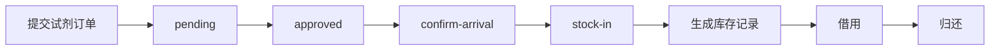
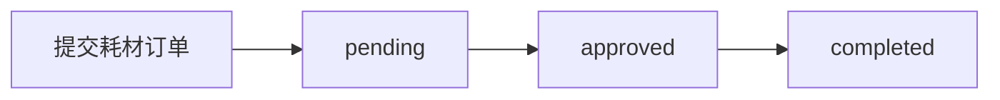
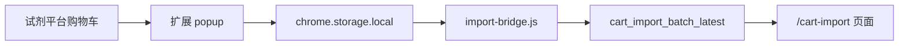

# 业务流程

## 试剂主流程

说明：

- 试剂订单支持后续入库和库存追踪
- 入库后才会生成库存记录
- 借用和归还会写入借用日志

## 耗材主流程

说明：

- 耗材当前实现不进入试剂库存那套瓶级流转

## 浏览器扩展导入流程

## 参考代码

- `app/api/reagent_orders_workflow.py`
- `app/models/reagent_order.py:107`
- `app/models/consumable_order.py:17`
- `app/api/cart_sync.py:169`
- `browser-extension/content/import-bridge.js:48`
