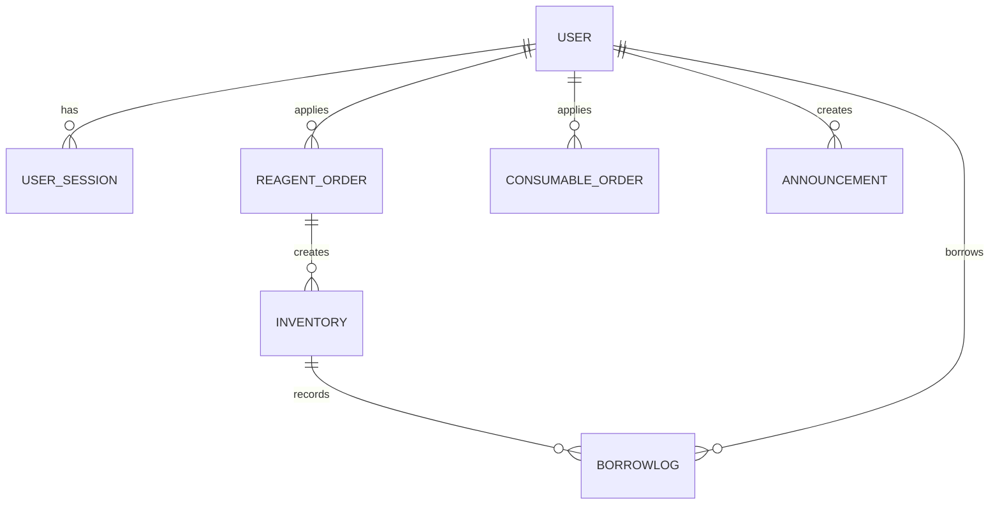

# 数据模型

## 主要实体

| 实体 | 作用 | 关键字段 |
| --- | --- | --- |
| `User` | 用户与角色 | `username`, `full_name`, `role`, `is_active` |
| `UserSession` | 设备和会话追踪 | `device_id`, `ip_address`, `token_hash`, `expires_at` |
| `ReagentOrder` | 试剂采购 | `cas_number`, `specification`, `quantity`, `status` |
| `ConsumableOrder` | 耗材采购 | `product_number`, `specification`, `quantity`, `status` |
| `Inventory` | 试剂库存瓶级记录 | `internal_code`, `remaining_quantity`, `status`, `is_common` |
| `BorrowLog` | 借还历史 | `inventory_id`, `borrower_id`, `borrow_time`, `return_time` |
| `Announcement` | 公告 | `title`, `content`, `images`, `is_pinned` |

## 关系理解

- `User` 与 `ReagentOrder` / `ConsumableOrder`：申请关系
- `ReagentOrder` 与 `Inventory`：入库后从订单派生库存
- `Inventory` 与 `BorrowLog`：借还历史
- `User` 与 `UserSession`：一对多设备登录

## ER 视图

## 当前实现里值得注意的字段

- `User.role` 当前包含 `admin`、`user`、`public`
- `Inventory.is_common` 用来区分常用货架和普通库存
- `remaining_percent` 用于库存可视化与筛选
- 多个模型持有拼音字段，服务于排序和搜索

## 参考代码

- `app/models/user.py:19`
- `app/models/user_session.py:13`
- `app/models/reagent_order.py:82`
- `app/models/consumable_order.py:47`
- `app/models/announcement.py:27`
