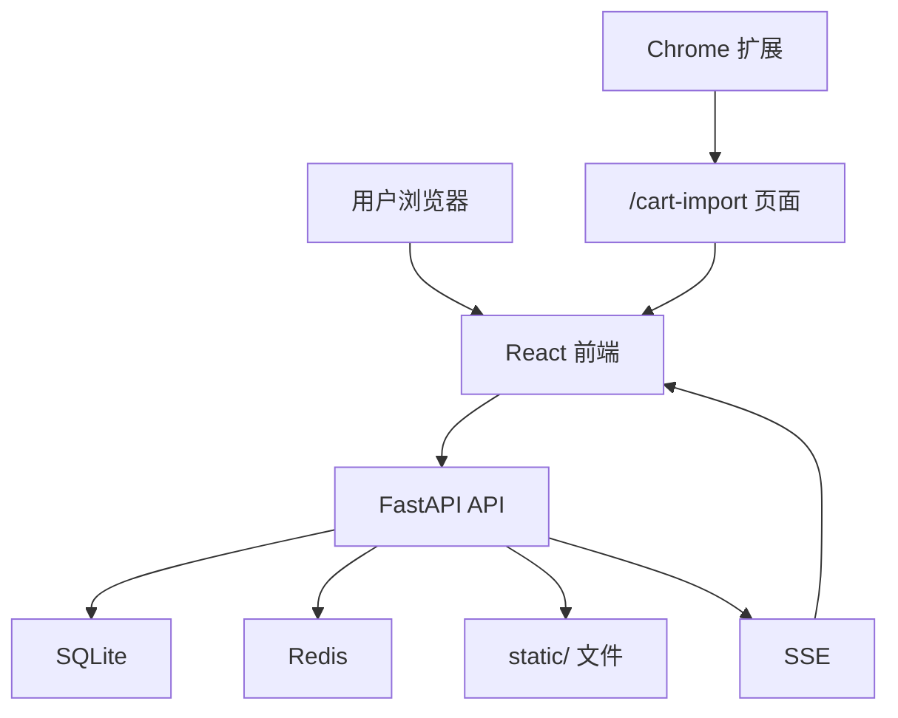

# 系统总览

## 一句话理解

这个项目的核心结构可以概括成一句话：后端是唯一事实源，前端负责业务操作界面，浏览器扩展负责把外部购物车数据桥接进系统。

## 架构分层

可以按四层来理解：

1. 展示层：React 页面、组件、浏览器扩展
2. 接口层：FastAPI 路由、依赖注入、权限校验
3. 领域层：订单、库存、借用、会话、公告
4. 基础设施层：SQLite、Redis、static 文件、Nginx、Docker

## 交互路径

## 三个子系统如何协作

- `frontend/` 负责用户看到的所有页面、表格和弹窗。
- `app/` 负责认证、业务规则、数据库读写、上传文件和事件广播。
- `browser-extension/` 不直接写数据库，而是把批次带到 `/cart-import` 页面，再由系统完成导入。

## 关键边界

- 前端通过 `api/client.ts` 调用后端
- 后端通过 `get_current_user`、管理员依赖等机制限制写操作
- 扩展不直接写数据库，而是先把批次写入浏览器存储，再桥接进导入页
- Nginx 负责把 `/api`、`/static` 和前端静态资源拼接成一套对外入口

## 设计重点

- 试剂和耗材分流，避免用一套过重模型处理所有物品。
- SQLite 打开 WAL，保障单库部署下的并发读写体验。
- 用户会话和设备管理独立建模，适合共享终端和多设备使用。
- 拼音字段预计算，方便中文环境下的排序和检索。
- Redis 不可用时会退化，不把缓存故障放大成系统故障。

## 使用者能感知到的结果

- 页面切换和列表筛选更顺畅。
- 查库存、查订单时更容易找到中文名称、品牌和位置。
- 管理员能更清楚地追溯“谁借了什么、谁创建了什么、谁还在线”。
- 扩展导入不会绕过系统权限，而是回到系统页面完成最后确认。

## 参考代码

- `app/main.py:191`
- `frontend/src/App.tsx:46`
- `frontend/src/api/client.ts:1`
- `browser-extension/content/import-bridge.js:15`
- `docker/nginx/default.conf:16`
