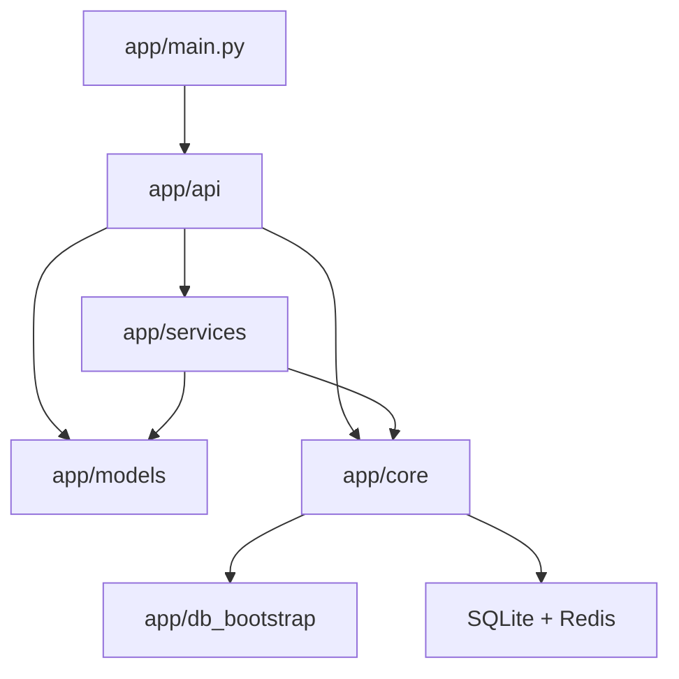

# 后端服务地图

后端代码按“HTTP 入口 -> 业务服务 -> 数据模型 -> 运行时基础设施”分层组织。`app/api/*.py` 负责请求入口和权限边界，`app/services/` 承担可复用业务逻辑，`app/models/` 定义实体与 DTO，`app/core/` 集中认证、配置、Redis 与运行时常量，`app/db_bootstrap/` 承担 SQLite 启动期准备。本页用于快速定位代码归属和新增逻辑的推荐落点。

## 分层总览

## 路由层 `app/api/`

路由层只处理 HTTP 相关职责：

- 定义 HTTP 路径
- 绑定权限依赖
- 处理请求参数和返回模型
- 调用底层 service / query / util

主要文件：

| 文件 | 负责什么 |
| --- | --- |
| `users.py` | 登录、登出、用户 CRUD、头像、密码 |
| `user_sessions.py` | 设备会话管理 |
| `inventory.py` | 库存基础 CRUD |
| `inventory_extended_routes.py` | 导入导出、借还、仪表盘等库存扩展路由 |
| `dashboard.py` | 仪表盘聚合、分页 section 和窗口统计路由 |
| `common_shelf.py` | 常用货架专用路由 |
| `reagent_orders.py` | 试剂订单基础 CRUD |
| `reagent_orders_workflow.py` | 试剂审批、到货、入库工作流 |
| `reagent_brands.py` | 试剂品牌主数据 |
| `consumable_orders.py` | 耗材订单 CRUD 与状态流转 |
| `announcements.py` | 公告管理与图片上传 |
| `cart_sync.py` | 购物车匹配与导入 |
| `chem.py` | 结构缓存、PubChem 解析和子结构检索 |
| `events.py` | SSE 长连接入口 |

## 认证、配置与运行时 `app/core/`

这层不直接承载业务流程，但几乎所有请求都会经过它：

| 文件 | 作用 |
| --- | --- |
| `auth.py` | JWT、当前用户、管理员依赖、token 校验 |
| `config.py` | 配置项、secure runtime、算法与路径 |
| `redis.py` | Redis 客户端、key 前缀、断路器 |
| `constants.py` | 上传路径、SSE 房间、限额和常量 |
| `request_utils.py` | 客户端 IP、request id 等请求工具 |
| `time_utils.py` | UTC 时间和格式化 |

## 订单与库存核心服务

### 仪表盘聚合

| 文件 | 作用 |
| --- | --- |
| `dashboard/common.py` | 仪表盘常量、结构化 item builder 和通用分页辅助 |
| `dashboard/summary.py` | 管理员汇总、成员看板、公用账户看板和 section 分发 |
| `dashboard/items.py` | 待办、风险、库存告警、最近动作和系统状态 item 构造 |
| `dashboard/metrics.py` | 管理端计数、近期窗口统计和自然天阈值判断 |

### 查询与搜索

| 文件 | 作用 |
| --- | --- |
| `inventory_queries.py` | 库存查询拼装 |
| `inventory_fts.py` | 库存全文搜索入口与异常 |
| `order_fts.py` | 订单 FTS |
| `order_list_search.py` | 订单列表搜索参数和查询辅助 |
| `order_status_times.py` | 订单状态时间字段计算 |
| `search_matchers.py` | 搜索字段分类、子查询合并、匹配逻辑 |
| `search_completion_entity_index.py` | 搜索补全实体候选索引构建 |
| `search_completion_ranker.py` | 搜索补全候选排序和置信度判断 |
| `chemical_name_map_fts.py` | CAS 主数据 FTS 查询 |
| `common_shelf_queries.py` | 常用货架分组查询、筛选和排序 |
| `search_query_log_service.py` | 搜索查询日志记录 |
| `sql_utils.py` | 搜索词清洗、排序辅助 |

### 标准化与预处理

| 文件 | 作用 |
| --- | --- |
| `cas_utils.py` | CAS 清洗与校验 |
| `spec_utils.py` | 规格字符串解析与格式化 |
| `shelf_utils.py` | 货架位置标准化 |
| `pinyin_utils.py` | 拼音与首字母预计算 |
| `reagent_brand_service.py` | 试剂品牌名称标准化与拼音字段 |

### 库存创建与编号

| 文件 | 作用 |
| --- | --- |
| `inventory_creation.py` | 创建库存时的共用逻辑 |
| `inventory_import_preview_sessions.py` | 库存导入预览会话和临时文件管理 |
| `inventory_state_guards.py` | 库存状态变更前置校验 |
| `internal_code.py` | 生成瓶级内部编号 |
| `common_shelf_creation.py` | 常用货架创建逻辑 |
| `common_shelf_group_records.py` | 常用货架分组记录维护 |

## 用户、会话与限流服务

| 文件 | 作用 |
| --- | --- |
| `session_service.py` | 会话创建、清理、踢出旧设备 |
| `rate_limit.py` | 速率限制辅助 |
| `user_service.py` | 用户数据查询 |
| `user_utils.py` | 批量用户名补全、响应辅助 |
| `audit_logger.py` | 审计日志记录 |

## 文件、导入导出与外围能力

| 文件 | 作用 |
| --- | --- |
| `excel_service.py` | Excel 导入解析 |
| `xlsx_export.py` | 导出文件生成 |
| `image_service.py` | 图片保存、重命名、删除 |
| `chemical_info.py` | CAS 对应化学信息获取与翻译 |
| `error_logger.py` | 错误记录能力 |
| `api_utils.py` | API 层缓存清理和通用辅助 |
| `archive_scheduler.py` | 后端内置日志归档调度，支持固定时间、每周和周期模式 |
| `cache_reset_service.py` | 运行时缓存版本和缓存重置 |
| `export_rate_limit.py` | 导出接口限流 |
| `log_queue.py` | 异步文件日志队列 |

### 化学结构

| 文件 | 作用 |
| --- | --- |
| `pubchem_resolver.py` | PubChem CAS 与 CID 解析 |
| `structure_cache_repo.py` | 结构缓存读写 |
| `structure_cache_tasks.py` | 结构缓存后台任务 |
| `structure_cache_workflow.py` | 自动解析、候选确认和人工结构写入 |
| `structure_backfill.py` | 结构缓存补全任务 |
| `structure_index.py` | RDKit 子结构索引 |
| `structure_inventory_summary.py` | 结构检索结果的库存汇总 |
| `structure_normalizer.py` | MolBlock 规范化 |
| `structure_search_cache.py` | 结构检索短期缓存 |
| `rdkit_smiles.py` | RDKit SMILES 解析与规范化 |

### 操作日志时间线

| 文件 | 作用 |
| --- | --- |
| `order_operation_logger.py` | 试剂与耗材订单操作日志 |
| `inventory_operation_logger.py` | 库存操作日志 |
| `common_shelf_operation_logger.py` | 常用货架操作日志 |
| `user_operation_logger.py` | 用户操作日志 |
| `log_timeline_projection.py` | 源日志投影到时间线读模型 |
| `log_timeline_detail_text.py` | 日志详情搜索文本构造 |
| `log_timeline_renderer.py` | 时间线详情渲染 |
| `log_timeline_detail_backfill.py` | 时间线详情文本补全 |
| `log_timeline_consistency.py` | 时间线触发器和孤儿记录清理 |

## 实时能力

| 文件 | 作用 |
| --- | --- |
| `sse_manager.py` | 本地 SSE 客户端管理、序号、心跳 |
| `sse_redis.py` | 跨实例 pub/sub |

## 数据库启动层 `app/db_bootstrap/`

| 文件 | 作用 |
| --- | --- |
| `schema_upgrades.py` | 兼容字段、常用货架分组和结构缓存字段补齐 |
| `sqlite_indexes.py` | SQLite 复合索引和统计信息刷新 |
| `sqlite_fts.py` | FTS 表、触发器、重建和一致性检查 |
| `schema_consistency.py` | SQLModel metadata 与 SQLite schema 对齐检查 |

## 数据模型层 `app/models/`

模型层通常分成两类：

- 表模型：`User`、`Inventory`、`CommonShelf`、`CommonShelfGroup`、`ReagentOrder`、`ReagentBrand`、`ConsumableOrder`、`Announcement`、`UserSession`、`BorrowLog`、`CompoundStructureCache`、`LogTimeline`
- DTO / Response：`Create`、`Update`、`Response` 等输入输出模型

实体关系和字段职责可继续对照 [数据模型](/database/data-model) 与 [字段参考](/database/field-reference)。

## 定位规则

### 登录、Cookie、Token、管理员权限

相关文件：

- `app/core/auth.py`
- `app/services/session_service.py`
- [认证与安全](/backend/auth-security)

### 列表搜索的实现分层

相关文件：

- `search_matchers.py`
- `inventory_fts.py`
- `order_fts.py`
- `sql_utils.py`
- `search_completion_entity_index.py`
- `search_completion_ranker.py`
- 细节见 [搜索补全建议](/dev-guide/search-completions)

### 订单转库存的实现入口

相关文件：

- `reagent_orders_workflow.py`
- `inventory_creation.py`
- `internal_code.py`
- `inventory.py`

### 前端列表自动刷新的事件链路

相关文件：

- `events.py`
- `sse_manager.py`
- `sse_redis.py`

## 二次开发规则

- 如果逻辑只为某个 HTTP 动作服务，优先留在 `api/`
- 如果逻辑会被多个路由复用，放进 `services/`
- 如果是认证、配置、缓存、常量，优先放 `core/`
- 如果是输入格式清洗，不要散落在前端或多个路由里，统一放标准化服务

## 参考代码

- [app/api](https://github.com/hzb666/LabStorageManager/tree/main/app/api)
- [app/core/auth.py](https://github.com/hzb666/LabStorageManager/blob/main/app/core/auth.py)
- [app/core/config.py](https://github.com/hzb666/LabStorageManager/blob/main/app/core/config.py)
- [app/db_bootstrap](https://github.com/hzb666/LabStorageManager/tree/main/app/db_bootstrap)
- [app/models](https://github.com/hzb666/LabStorageManager/tree/main/app/models)
- [app/services](https://github.com/hzb666/LabStorageManager/tree/main/app/services)
