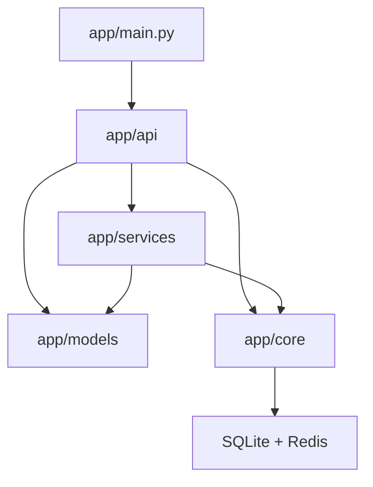

# 后端服务地图

后端代码按“HTTP 入口 -> 业务服务 -> 数据模型 -> 运行时基础设施”分层组织。`app/api/*.py` 负责请求入口和权限边界，`app/services/` 承担可复用业务逻辑，`app/models/` 定义实体与 DTO，`app/core/` 则集中认证、配置、Redis 与运行时常量。本页用于快速定位代码归属和新增逻辑的推荐落点。

## 分层总览

## 路由层 `app/api/`

路由层只处理 HTTP 相关职责：

- 定义 HTTP 路径
- 绑定权限依赖
- 处理请求参数和返回模型
- 调用底层 service / query / util

主要文件：

| 文件 | 负责什么 |
| --- | --- |
| `users.py` | 登录、登出、用户 CRUD、头像、密码 |
| `user_sessions.py` | 设备会话管理 |
| `inventory.py` | 库存基础 CRUD |
| `inventory_extended_routes.py` | 导入导出、借还、仪表盘等库存扩展路由 |
| `common_shelf.py` | 常用货架专用路由 |
| `reagent_orders.py` | 试剂订单基础 CRUD |
| `reagent_orders_workflow.py` | 试剂审批、到货、入库工作流 |
| `consumable_orders.py` | 耗材订单 CRUD 与状态流转 |
| `announcements.py` | 公告管理与图片上传 |
| `cart_sync.py` | 购物车匹配与导入 |
| `events.py` | SSE 长连接入口 |

## 认证、配置与运行时 `app/core/`

这层不直接承载业务流程，但几乎所有请求都会经过它：

| 文件 | 作用 |
| --- | --- |
| `auth.py` | JWT、当前用户、管理员依赖、token 校验 |
| `config.py` | 配置项、secure runtime、算法与路径 |
| `redis.py` | Redis 客户端、key 前缀、断路器 |
| `constants.py` | 上传路径、SSE 房间、限额和常量 |
| `request_utils.py` | 客户端 IP、request id 等请求工具 |
| `time_utils.py` | UTC 时间和格式化 |

## 订单与库存核心服务

### 查询与搜索

| 文件 | 作用 |
| --- | --- |
| `inventory_queries.py` | 库存查询拼装 |
| `inventory_fts.py` | 库存全文搜索入口与异常 |
| `order_fts.py` | 订单 FTS |
| `search_matchers.py` | 搜索字段分类、子查询合并、匹配逻辑 |
| `sql_utils.py` | 搜索词清洗、排序辅助 |

### 标准化与预处理

| 文件 | 作用 |
| --- | --- |
| `cas_utils.py` | CAS 清洗与校验 |
| `spec_utils.py` | 规格字符串解析与格式化 |
| `shelf_utils.py` | 货架位置标准化 |
| `pinyin_utils.py` | 拼音与首字母预计算 |
| `common_name_utils.py` | 名称归一化辅助 |

### 库存创建与编号

| 文件 | 作用 |
| --- | --- |
| `inventory_creation.py` | 创建库存时的共用逻辑 |
| `internal_code.py` | 生成瓶级内部编号 |

## 用户、会话与限流服务

| 文件 | 作用 |
| --- | --- |
| `session_service.py` | 会话创建、清理、踢出旧设备 |
| `rate_limit.py` | 速率限制辅助 |
| `user_service.py` | 用户数据查询 |
| `user_utils.py` | 批量用户名补全、响应辅助 |
| `audit_logger.py` | 审计日志记录 |

## 文件、导入导出与外围能力

| 文件 | 作用 |
| --- | --- |
| `excel_service.py` | Excel 导入解析 |
| `xlsx_export.py` | 导出文件生成 |
| `image_service.py` | 图片保存、重命名、删除 |
| `chemical_info.py` | CAS 对应化学信息获取与翻译 |
| `error_logger.py` | 错误记录能力 |
| `api_utils.py` | API 层缓存清理和通用辅助 |

## 实时能力

| 文件 | 作用 |
| --- | --- |
| `sse_manager.py` | 本地 SSE 客户端管理、序号、心跳 |
| `sse_redis.py` | 跨实例 pub/sub |

## 数据模型层 `app/models/`

模型层通常分成两类：

- 表模型：`User`、`Inventory`、`ReagentOrder`、`ConsumableOrder`、`Announcement`、`UserSession`、`BorrowLog`
- DTO / Response：`Create`、`Update`、`Response` 等输入输出模型

实体关系和字段职责可继续对照 [数据模型](/database/data-model) 与 [字段参考](/database/field-reference)。

## 定位建议

### 登录、Cookie、Token、管理员权限

相关文件：

- `app/core/auth.py`
- `app/services/session_service.py`
- [认证与安全](/backend/auth-security)

### 列表搜索的实现分层

相关文件：

- `search_matchers.py`
- `inventory_fts.py`
- `order_fts.py`
- `sql_utils.py`

### 订单转库存的实现入口

相关文件：

- `reagent_orders_workflow.py`
- `inventory_creation.py`
- `internal_code.py`
- `inventory.py`

### 前端列表自动刷新的事件链路

相关文件：

- `events.py`
- `sse_manager.py`
- `sse_redis.py`

## 二次开发建议

- 如果逻辑只为某个 HTTP 动作服务，优先留在 `api/`
- 如果逻辑会被多个路由复用，放进 `services/`
- 如果是认证、配置、缓存、常量，优先放 `core/`
- 如果是输入格式清洗，不要散落在前端或多个路由里，统一放标准化服务

## 参考代码

- [app/api](https://github.com/hzb666/LabStorageManager/tree/main/app/api)
- [app/core/auth.py](https://github.com/hzb666/LabStorageManager/blob/main/app/core/auth.py)
- [app/core/config.py](https://github.com/hzb666/LabStorageManager/blob/main/app/core/config.py)
- [app/models](https://github.com/hzb666/LabStorageManager/tree/main/app/models)
- [app/services](https://github.com/hzb666/LabStorageManager/tree/main/app/services)
