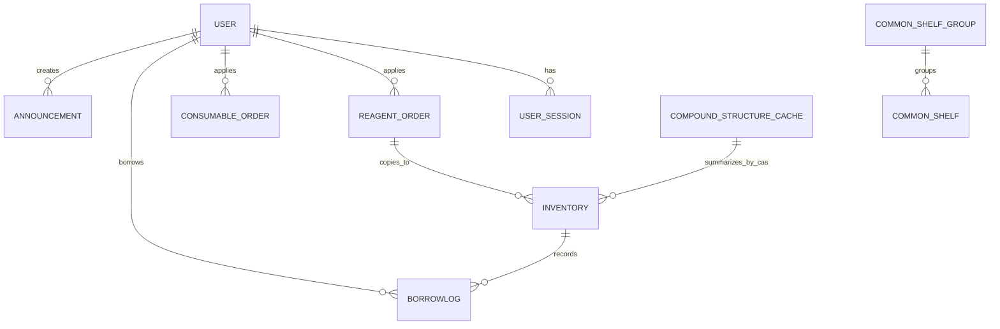

# 数据模型

本项目的复杂度不在表数量，而在一条业务通常会跨越订单、库存、借还历史、会话和公告多个模型。先理解实体关系，再看搜索、权限和工作流实现，会更容易定位问题。字段细节可以继续对照 [字段参考](/database/field-reference)。

## 主要实体

| 实体 | 作用 | 关键字段 |
| --- | --- | --- |
| `User` | 用户、角色与显示信息 | `username`, `full_name`, `role`, `is_active`, `username_version` |
| `UserSession` | 多设备会话与 IP 追踪 | `device_id`, `device_name`, `ip_address`, `last_ip_address`, `token_hash`, `expires_at` |
| `ReagentOrder` | 试剂采购与入库前状态机 | `cas_number`, `name`, `quantity`, `price`, `order_reason`, `status` |
| `ConsumableOrder` | 耗材采购与完成状态机 | `name`, `product_number`, `specification`, `quantity`, `status` |
| `Inventory` | 瓶级普通库存 | `internal_code`, `remaining_quantity`, `remaining_percent`, `status` |
| `CommonShelf` | 常用货架瓶级记录 | `internal_code`, `cas_number`, `brand_normalized`, `specification_normalized`, `storage_location` |
| `CommonShelfGroup` | 常用货架分组身份 | `cas_number`, `brand_normalized`, `specification_normalized`, `is_deleted` |
| `BorrowLog` | 借用与归还历史 | `inventory_id`, `borrower_id`, `borrow_time`, `return_time`, `quantity_borrowed` |
| `Announcement` | 系统公告与图片引用 | `title`, `content`, `images`, `is_pinned`, `is_visible` |
| `CompoundStructureCache` | CAS 对应结构缓存 | `cas_number`, `smiles_canonical`, `molblock`, `status`, `manually_verified` |
| `LogTimeline` | 多来源操作日志读模型 | `source_table`, `source_log_id`, `search_text`, `detail_search_text` |

## 关系结构

- `User` 与 `ReagentOrder` / `ConsumableOrder` 是申请关系。
- `ReagentOrder` 与 `Inventory` 是订单转库存的来源关系，字段通过复制保留审计线索。
- `Inventory` 与 `BorrowLog` 是一对多关系，一条库存可以对应多次借还记录。
- `CommonShelfGroup` 与 `CommonShelf` 通过 CAS、品牌和规格归一化字段形成分组关系。
- `User` 与 `UserSession` 是一对多关系，用于设备管理与踢出设备。
- `User` 与 `Announcement` 是创建关系，公告同时带有可见性和置顶策略。
- 多类操作日志会投影到 `LogTimeline`，用于用户日志分页、筛选和搜索。

## ER 视图

## 与搜索和排序有关的字段

### User

- `username` 是唯一键，也是登录标识。
- `username_version` 用于使旧 token 失效。
- `full_name_pinyin` 与 `full_name_pinyin_initials` 服务于排序和搜索。

### UserSession

- `token_hash` 是实际的会话检索键。
- `device_id` + `user_id` 共同决定同一设备是复用会话还是新建会话。
- `expires_at`、`last_active_at` 支撑设备清理与活跃状态刷新。

### ReagentOrder

- `cas_number` 是试剂订单最重要的业务标识。
- `order_reason` 会影响部分后续流程，例如是否属于公用常用场景。
- `name_pinyin`、`category_pinyin`、`brand_pinyin` 支持中文语义搜索与排序。

### ConsumableOrder

- `product_number` 用于对接外部商品编号。
- `specification` 直接保留原始规格描述，不像试剂那样拆成数量和单位两个核心库存字段。
- `name_pinyin` 与 `name_pinyin_initials` 使耗材列表也具备快速搜索能力。

### Inventory

`Inventory` 只承担普通库存语义：

- `internal_code` 是每瓶库存的唯一编号。
- `remaining_percent` 是显式存储字段，用于提升排序和筛选效率。
- `borrower_id`、`last_borrower_id`、`temporary_keeper_id` 分别描述当前借用人、上次借用人和临时保管人。
- `source_order_id` 保留库存来源于哪张试剂订单。
- `name_pinyin`、`category_pinyin`、`brand_pinyin`、`storage_location_pinyin` 及其 initials 是搜索优化基础。

### CommonShelf / CommonShelfGroup

- `CommonShelf` 是常用货架的瓶级记录，每一瓶都有独立 `internal_code`。
- `CommonShelfGroup` 保存 CAS、品牌和规格的稳定分组身份，即使当前瓶数为 0 也能保留分组。
- `brand_normalized`、`specification_normalized`、`storage_location_normalized` 用于分组、合并和位置统计。
- `storage_location_pinyin` 与首字母字段用于常用货架位置搜索。

### BorrowLog

- `quantity_borrowed`、`quantity_returned` 使系统能够记录数量变化，而不仅是状态变化。

### Announcement

- `images` 以 JSON 数组形式保存文件引用，而不是将图片本体写入数据库。
- `is_pinned` 与 `is_visible` 共同决定前台公告的展示顺序和可见性。

### CompoundStructureCache

- `cas_number` 是主键，进入缓存前会做 CAS 标准化和校验。
- `smiles_canonical`、`smiles_isomeric`、`molblock`、`inchikey` 支撑 RDKit 索引和结构检索。
- `english_name`、`chinese_name` 与 `name_last_resolved_at` 缓存外部名称解析结果。
- `manually_verified` 保护人工确认结构，避免自动解析覆盖。

### LogTimeline

- `source_table` 与 `source_log_id` 指向库存、订单、常用货架、用户操作或借还源日志。
- `actor_user_id` 与 `subject_user_id` 分别描述操作人和被影响用户。
- `search_text`、`search_text_pinyin`、`detail_search_text` 用于日志页搜索。

## 枚举与追溯

- 试剂订单状态：`PENDING/APPROVED/REJECTED/ARRIVED/STOCKED/DELETED`。
- 耗材订单状态：`PENDING/APPROVED/REJECTED/COMPLETED`。
- 库存状态：`NOT_IN_STOCK/IN_STOCK/RUN_SHORT/BORROWED/CONSUMED`。
- 结构缓存状态：`PENDING/RESOLVED/AMBIGUOUS/NOT_FOUND/UNSUPPORTED/INVALID_CAS/ERROR`。
- 追溯链路：`inventory.source_order_id` 指向 `reagent_order.id`，用于还原订单 -> 库存的来源关系。
- 会话控制：`user_sessions` 记录设备、IP 和 UA，配合 `token_hash` 与 `username_version` 实现会话失效。

## 索引与 FTS

- `ensure_sqlite_performance_indexes` 会在启动时创建复合索引，覆盖订单状态、库存状态、借用日志、操作日志、日志时间线和用户会话等高频筛选字段。
- `inventory_fts`、`reagent_order_fts`、`consumable_order_fts`、`users_fts`、`chemical_name_map_fts`、`log_timeline_fts` 使用 trigram 分词，并通过 insert/update/delete 触发器保持同步。
- 启动时会对比源表与 FTS 表行数，不一致时自动重建；触发器缺失时也会触发重建。

这些索引并不是装饰，而是支撑 SQLite 在普通库存、常用货架、拼音搜索和大列表排序场景下保持可用的基础。

## 变更约束

- 新增字段若未同步到 FTS schema 和触发器，搜索结果会缺失。
- 修改模型后必须同步更新 `app/db_bootstrap/` 中的 schema 补齐、索引、FTS setup 与 rebuild SQL。
- 若关闭 WAL 或未执行 `PRAGMA foreign_keys=ON`，并发与约束会失效。
- 默认管理员仅在空用户表时创建；生产环境应替换初始密码并配置正式 RSA key。

## 验证建议

- 启动后核对 `PRAGMA journal_mode;` 和 `PRAGMA foreign_keys;`。
- 检查六张 FTS 表与源表的行数是否一致。
- 新增字段后重新启动，确认会触发 FTS 重建日志。

## 模型同步检查

1. 在 `app/models/*` 增加字段或枚举前，先确认它是否影响搜索、排序、导出和 SSE payload。
2. 同步更新 `app/db_bootstrap/` 中的索引与 FTS 初始化语句。
3. 运行数据库体检流程，确认 schema、index、FTS 和 trigger 保持一致。
4. 再更新前端 `validationSchemas.ts`、`formConfigs.tsx` 与 API 类型定义，确保端到端字段一致。

如果新增字段会进入搜索、排序或 FTS，可以继续对照 [数据与搜索](/database/data-search)。

## 参考代码

- [app/database.py](https://github.com/hzb666/LabStorageManager/blob/main/app/database.py)
- [app/db_bootstrap](https://github.com/hzb666/LabStorageManager/tree/main/app/db_bootstrap)
- [app/models/common_shelf.py](https://github.com/hzb666/LabStorageManager/blob/main/app/models/common_shelf.py)
- [app/models/compound_structure.py](https://github.com/hzb666/LabStorageManager/blob/main/app/models/compound_structure.py)
- [app/models/consumable_order.py](https://github.com/hzb666/LabStorageManager/blob/main/app/models/consumable_order.py)
- [app/models/inventory.py](https://github.com/hzb666/LabStorageManager/blob/main/app/models/inventory.py)
- [app/models/log_timeline.py](https://github.com/hzb666/LabStorageManager/blob/main/app/models/log_timeline.py)
- [app/models/reagent_order.py](https://github.com/hzb666/LabStorageManager/blob/main/app/models/reagent_order.py)
- [app/models/user_session.py](https://github.com/hzb666/LabStorageManager/blob/main/app/models/user_session.py)
