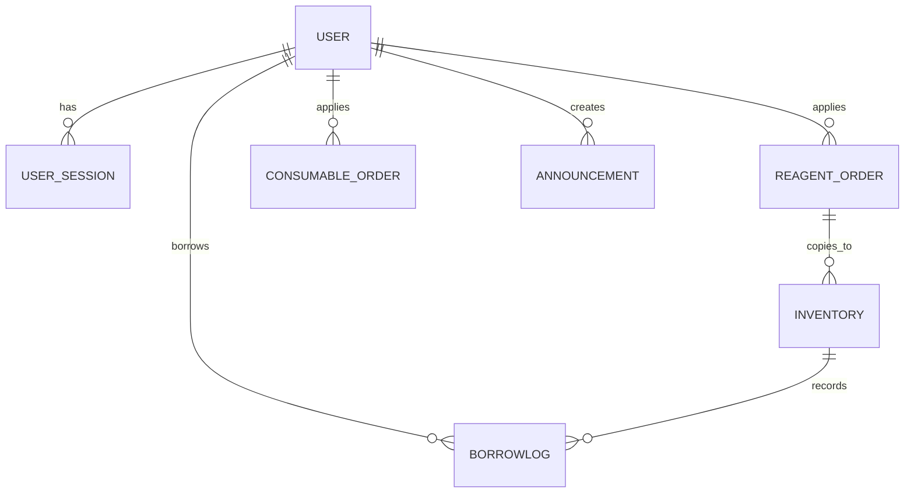

# 数据模型

## 为什么这一组模型重要

本项目的业务复杂度不在于表数量本身，而在于同一条业务往往会跨越订单、库存、借还历史、会话和公告等多个模型。理解模型字段及其关系后，通常也能同时理解搜索、排序、权限与工作流的实现方式。

如果你更关心“某个字段具体是干什么的”，继续看 [字段参考](/database/field-reference)。

## 主要实体

| 实体 | 作用 | 关键字段 |
| --- | --- | --- |
| `User` | 用户、角色与显示信息 | `username`, `full_name`, `role`, `is_active`, `username_version` |
| `UserSession` | 多设备会话与 IP 追踪 | `device_id`, `device_name`, `ip_address`, `last_ip_address`, `token_hash`, `expires_at` |
| `ReagentOrder` | 试剂采购与入库前状态机 | `cas_number`, `name`, `quantity`, `price`, `order_reason`, `status` |
| `ConsumableOrder` | 耗材采购与完成状态机 | `name`, `product_number`, `specification`, `quantity`, `status` |
| `Inventory` | 瓶级库存与常用货架共表实体 | `internal_code`, `is_common`, `remaining_quantity`, `remaining_percent`, `status` |
| `BorrowLog` | 借用、消耗与归还历史 | `inventory_id`, `borrower_id`, `borrow_time`, `return_time`, `is_consume` |
| `Announcement` | 系统公告与图片引用 | `title`, `content`, `images`, `is_pinned`, `is_visible` |

## 关系理解

- `User` 与 `ReagentOrder` / `ConsumableOrder` 是申请关系。
- `ReagentOrder` 与 `Inventory` 是“订单转库存”的来源关系，字段通过复制保留审计线索。
- `Inventory` 与 `BorrowLog` 是一对多关系，一条库存可以对应多次借还记录。
- `User` 与 `UserSession` 是一对多关系，用于设备管理与踢出设备。
- `User` 与 `Announcement` 是创建关系，公告本身同时带有可见性和置顶策略。

## ER 视图

## 对搜索和排序有意义的字段

### User

- `username` 是唯一键，也是登录标识。
- `username_version` 用于使旧 token 失效。
- `full_name_pinyin` 与 `full_name_pinyin_initials` 服务于排序与搜索。

### UserSession

- `token_hash` 是实际的会话检索键。
- `device_id` + `user_id` 共同决定同一设备是复用会话还是新建会话。
- `expires_at`、`last_active_at` 支撑设备清理与活跃状态刷新。

### ReagentOrder

- `cas_number` 是试剂订单最重要的业务标识。
- `order_reason` 会影响部分后续流程，例如是否属于公用常用场景。
- `name_pinyin` / `category_pinyin` / `brand_pinyin` 支持中文语义搜索与排序。

### ConsumableOrder

- `product_number` 用于对接外部商品编号。
- `specification` 直接保留原始规格描述，不像试剂那样拆分为数量和单位两个核心库存字段。
- `name_pinyin` 与 `name_pinyin_initials` 使耗材列表也具备快速搜索能力。

### Inventory

`Inventory` 是最关键的模型之一，因为它同时承担普通库存和常用货架语义：

- `internal_code` 是每瓶库存的唯一编号。
- `is_common` 决定其属于普通库存还是常用货架语义。
- `remaining_percent` 是显式存储字段，用于提升排序和筛选效率。
- `borrower_id`、`last_borrower_id`、`temporary_keeper_id` 分别描述当前借用人、上次借用人和临时保管人。
- `source_order_id` 保留该库存来源于哪张试剂订单。
- `name_pinyin`、`category_pinyin`、`brand_pinyin`、`storage_location_pinyin` 及其 initials 是搜索优化的重要基础。

### BorrowLog

- `is_consume` 用于区分“借出后归还”和“直接消耗”两类场景。
- `quantity_borrowed`、`quantity_returned` 使系统能够记录数量变化，而不仅是状态变化。

### Announcement

- `images` 以 JSON 数组形式保存文件引用，而不是将图片本体写入数据库。
- `is_pinned` 与 `is_visible` 共同决定前台公告的展示顺序和可见性。

## 补充：枚举与追溯字段

- 试剂订单状态：`PENDING/APPROVED/REJECTED/ARRIVED/STOCKED/DELETED`（<InlineCodeRef href="https://github.com/hzb666/LabStorageManager/blob/main/app/models/reagent_order.py#L21-L28" />）
- 耗材订单状态：`PENDING/APPROVED/REJECTED/COMPLETED`（<InlineCodeRef href="https://github.com/hzb666/LabStorageManager/blob/main/app/models/consumable_order.py#L20-L26" />）
- 库存状态：`IN_STOCK/BORROWED/LOW_STOCK/OUT_OF_STOCK/EXPIRED/DELETED`（<InlineCodeRef href="https://github.com/hzb666/LabStorageManager/blob/main/app/models/inventory.py#L32-L44" />）
- 追溯链路：`inventory.source_order_id` 指向 `reagent_order.id`，用于还原订单 -> 库存的来源关系（<InlineCodeRef href="https://github.com/hzb666/LabStorageManager/blob/main/app/models/inventory.py#L113-L118" />）
- 会话控制：`user_sessions` 记录设备、IP 和 UA，配合 `token_hash` 与 `username_version` 实现会话失效（<InlineCodeRef href="https://github.com/hzb666/LabStorageManager/blob/main/app/models/user_session.py#L15-L75" />）

## 索引与 FTS 触发器

- 性能索引：启动时由 `ensure_sqlite_performance_indexes` 创建复合索引，覆盖订单状态、库存状态、借用日志和用户会话等高频筛选字段（<InlineCodeRef href="https://github.com/hzb666/LabStorageManager/blob/main/app/database.py#L52-L118" />）
- FTS5：`inventory_fts`、`reagent_order_fts`、`consumable_order_fts`、`users_fts` 使用 trigram 分词，并通过 insert/update/delete 三类触发器保持同步（<InlineCodeRef href="https://github.com/hzb666/LabStorageManager/blob/main/app/database.py#L120-L207" />）
- 重建策略：启动时对比源表与 FTS 表的行数，不一致时自动重建；触发器缺失时也会触发重建（<InlineCodeRef href="https://github.com/hzb666/LabStorageManager/blob/main/app/database.py#L725-L768" />）

## 为什么模型里存在大量索引

这些模型并非简单的 CRUD 结构。以 `Inventory` 为例，模型定义中直接围绕以下高频查询路径建立了多组索引：

- `is_common + cas_number + created_at`
- `is_common + 各类拼音字段 + created_at`
- `is_common + remaining_percent + created_at`
- `borrower_id + status + updated_at`

这也是项目能够在 SQLite 上同时支持普通库存、常用货架、拼音搜索和大列表排序的关键原因。

## 边界与风险

- 新增字段若未同步到 FTS schema 和触发器，搜索结果会缺失；修改模型后必须同步更新 `SQLITE_*_FTS_SETUP` 与 rebuild SQL。
- 若关闭 WAL 或未执行 `PRAGMA foreign_keys=ON`，并发与约束会失效；必须保留 `on_connect` 回调（<InlineCodeRef href="https://github.com/hzb666/LabStorageManager/blob/main/app/database.py#L30-L41" />）
- 默认管理员仅在空用户表时创建；生产环境应替换初始密码并配置正式 RSA key。

## 验证建议

- 启动后执行数据库只读核对：`PRAGMA journal_mode;`、`PRAGMA foreign_keys;`，并检查四张 FTS 表与源表行数是否一致。
- 新增字段后重新启动，应观察到 FTS 重建日志；若未出现，应检查触发器声明是否已同步更新。

## 与优化思路的关系

在进行二次开发或模型扩展时，新增字段前通常需要明确以下问题：

- 是否参与搜索
- 是否参与排序
- 是否进入 FTS 表
- 是否需要标准化或预计算

相关思路可继续参阅 [优化思路](/optimization/optimization) 与 [数据与搜索](/database/data-search)。

## 状态枚举速查

- 试剂订单：`ReagentOrderStatus` 包含 `pending/approved/rejected/arrived/stocked`，覆盖审批到入库全流程（<InlineCodeRef href="https://github.com/hzb666/LabStorageManager/blob/main/app/models/reagent_order.py" />）
- 耗材订单：`ConsumableOrderStatus` 包含 `pending/approved/rejected/completed`，不进入瓶级库存管理（<InlineCodeRef href="https://github.com/hzb666/LabStorageManager/blob/main/app/models/consumable_order.py" />）
- 库存状态：`InventoryStatus` 用于标识在库、借出和待处理等状态，并结合 `remaining_quantity/remaining_percent` 判断业务可用性（<InlineCodeRef href="https://github.com/hzb666/LabStorageManager/blob/main/app/models/inventory.py" />）

## 模型变更建议流程

1. 在 `app/models/*` 增加字段或枚举前，先确认其是否影响搜索、排序、导出和 SSE payload。
2. 同步更新 `app/database.py` 中的索引与 FTS 初始化语句，避免模型变更后查询逻辑滞后。
3. 运行数据库体检流程，确认 schema、index、fts 和 trigger 保持一致。
4. 再更新前端 `validationSchemas.ts`、`formConfigs.tsx` 与 API 类型定义，确保端到端字段一致。

## 参考代码

- [app/database.py](https://github.com/hzb666/LabStorageManager/blob/main/app/database.py)（行30，52，120，725）
- [app/models/consumable_order.py](https://github.com/hzb666/LabStorageManager/blob/main/app/models/consumable_order.py)（行20）
- [app/models/inventory.py](https://github.com/hzb666/LabStorageManager/blob/main/app/models/inventory.py)（行32，113）
- [app/models/reagent_order.py](https://github.com/hzb666/LabStorageManager/blob/main/app/models/reagent_order.py)（行21）
- [app/models/user_session.py](https://github.com/hzb666/LabStorageManager/blob/main/app/models/user_session.py)（行15）
