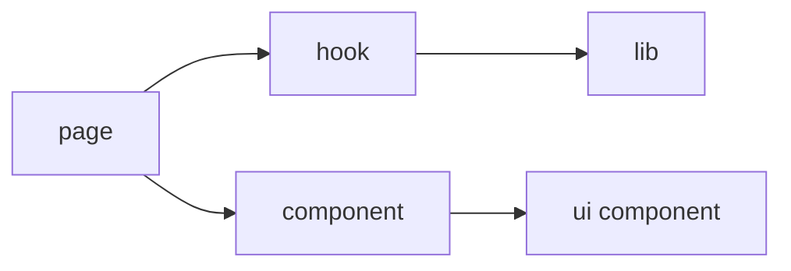

# 组件介绍

## 组件分层

`frontend/src/components/` 主要分成两层：

- `components/ui/`：基础 UI 组件和通用交互组件
- `components/*.tsx`：业务组件，面向具体页面或业务对象

## 1. 基础 UI 组件 `components/ui/`

### 表单与输入

| 组件 | 作用 |
| --- | --- |
| `Input` / `Textarea` / `Select` / `Checkbox` / `RadioGroup` | 基础输入控件 |
| `PasswordInput` | 密码输入体验封装 |
| `Autocomplete` | 带提示的输入控件 |
| `FormField` | 表单字段容器 |
| `Label` / `Separator` | 基础展示辅助 |

### 对话框与反馈

| 组件 | 作用 |
| --- | --- |
| `Dialog` | 通用弹窗壳 |
| `Toast` | 全局通知容器 |
| `Tooltip` | 提示层 |
| `LoadingButton` | 带 loading 态按钮 |

### 表格与列表

| 组件 | 作用 |
| --- | --- |
| `DataTable` | 表格骨架 |
| `DataTableHeader` | 头部排序和列宽 |
| `DataTableBody` | 行渲染、展开与虚拟区 |
| `FilterTable` | 表格页整合组件 |
| `TableFilters` | 搜索、筛选与空状态 |
| `Pagination` | 分页器 |
| `StaleBanner` | SSE stale 提示 |

### 展示组件

| 组件 | 作用 |
| --- | --- |
| `StatusBadge` | 状态标签 |
| `QuantityIndicator` | 数量状态可视化 |
| `HighlightText` | 关键字高亮 |
| `HazardousIcon` | 危险品标识 |
| `NoteDisplay` | 长文本备注展示 |
| `MoleculeStructure` | 分子结构展示 |
| `Avatar` / `Card` / `Tabs` | 通用展示组件 |

## 2. 业务组件

### 表单和对话框

| 组件 | 作用 |
| --- | --- |
| `BaseForm` | 基于配置渲染表单 |
| `BorrowDialog` | 借用确认弹窗 |
| `UserEditDialog` | 用户编辑和头像 / 密码管理 |
| `EditDialogActions` | 编辑弹窗底部动作 |

### 表格展开与详情

| 组件 | 作用 |
| --- | --- |
| `ReagentOrderExpandedRow` | 试剂订单展开详情 |
| `ConsumableOrderExpandedRow` | 耗材订单展开详情 |
| `ReagentCasDuplicateWarning` | 同 CAS 风险提示 |

### 公告与反馈

| 组件 | 作用 |
| --- | --- |
| `AnnouncementBanner` | 顶部公告条 |
| `AnnouncementButton` | 公告入口按钮 |
| `AnnouncementDetail` | 公告详情弹层 |
| `BugReportButton` | Bug 反馈按钮 |

### 其他页面级组件

| 组件 | 作用 |
| --- | --- |
| `SidebarLogo` | 侧栏品牌展示 |
| `TableActionButtons` | 列表操作按钮集合 |
| `ErrorBoundary` | 页面级错误兜底 |

## 组件和其他层的边界

### 组件不该做什么

- 不应该自己拼接后端地址
- 不应该自己维护复杂的缓存策略
- 不应该把整套表单规则写死在 JSX 里

这些职责更适合在：

- `hooks/`
- `lib/`
- `api/client.ts`

### 组件更适合做什么

- 视觉渲染
- 交互触发
- 局部 UI 状态
- 基于 props 的组合

## 最常见的组合方式

## 如果要新增组件

优先判断：

1. 这是原子 UI 组件，还是业务组件
2. 这份逻辑能否抽成 hook
3. 字段和校验是否应该放到 `lib`

## 阅读顺序建议

### 想理解表格页

1. `FilterTable`
2. `DataTable`
3. `DataTableHeader`
4. `DataTableBody`
5. `TableFilters`

### 想理解表单体系

1. `BaseForm`
2. `FormField`
3. `Dialog`
4. 对应 `lib/formConfigs.tsx`
5. 对应 `lib/validationSchemas.ts`

## 参考代码

- [frontend/src/components/AnnouncementBanner.tsx](https://github.com/hzb666/LabStorageManager/blob/main/frontend/src/components/AnnouncementBanner.tsx)
- [frontend/src/components/BaseForm.tsx](https://github.com/hzb666/LabStorageManager/blob/main/frontend/src/components/BaseForm.tsx)
- [frontend/src/components/BorrowDialog.tsx](https://github.com/hzb666/LabStorageManager/blob/main/frontend/src/components/BorrowDialog.tsx)
- [frontend/src/components/ErrorBoundary.tsx](https://github.com/hzb666/LabStorageManager/blob/main/frontend/src/components/ErrorBoundary.tsx)
- [frontend/src/components/ReagentOrderExpandedRow.tsx](https://github.com/hzb666/LabStorageManager/blob/main/frontend/src/components/ReagentOrderExpandedRow.tsx)
- [frontend/src/components/TableActionButtons.tsx](https://github.com/hzb666/LabStorageManager/blob/main/frontend/src/components/TableActionButtons.tsx)
- [frontend/src/components/UserEditDialog.tsx](https://github.com/hzb666/LabStorageManager/blob/main/frontend/src/components/UserEditDialog.tsx)
- [frontend/src/components/ui/DataTable.tsx](https://github.com/hzb666/LabStorageManager/blob/main/frontend/src/components/ui/DataTable.tsx)
- [frontend/src/components/ui/FilterTable.tsx](https://github.com/hzb666/LabStorageManager/blob/main/frontend/src/components/ui/FilterTable.tsx)
- [frontend/src/components/ui/Toast.tsx](https://github.com/hzb666/LabStorageManager/blob/main/frontend/src/components/ui/Toast.tsx)
