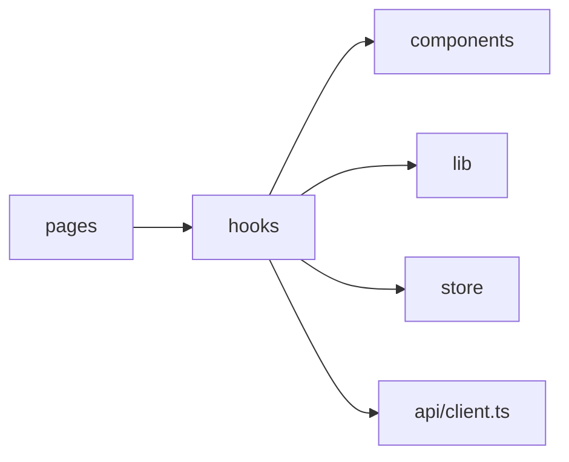

# 前端 Hooks

## 这页看什么

`frontend/src/hooks/` 承担了前端的大部分基础设施：

- 表格状态
- URL 状态同步
- SSE 连接和列表增量更新
- 主题与设备偏好
- 对话框和表单弹窗控制
- 错误采集

## Hooks 分类

### 1. 表格与列表状态

| Hook | 作用 | 典型调用方 |
| --- | --- | --- |
| `useTableState` | 统一管理筛选、排序、分页、列宽、展开、数据拉取 | 库存页、订单页、管理页 |
| `useTableUrlState` | 把筛选和分页同步到 URL | 带筛选表格的页面 |
| `useBulkExpand` | 统一控制展开/收起全部行 | 可展开明细表格 |
| `useColumnResize` | 列宽拖拽和持久化 | DataTable |
| `useDataTableScroll` | 表格滚动容器和虚拟列表协作 | DataTable / FilterTable |

### 2. 实时同步

| Hook | 作用 | 典型调用方 |
| --- | --- | --- |
| `useSSE` | 建立 `/api/events` 长连接、管理订阅房间和重连 | 页面级 SSE 接入 |
| `useListSSE` | 把 SSE 事件应用到列表缓存或标记 stale | 库存、订单、仪表盘列表 |

### 3. 业务专用 Hook

| Hook | 作用 |
| --- | --- |
| `useReagentCasDuplicateCheck` | 创建试剂订单时做同 CAS 风险检查 |
| `useRememberedUser` | 记住登录用户名等轻量偏好 |
| `useErrorLogger` | 捕获前端异常和 API 错误，形成错误上报 |

### 4. UI / 交互状态

| Hook | 作用 |
| --- | --- |
| `useTheme` | 明暗主题切换 |
| `useDialogState` | 统一开关弹窗状态 |
| `useFormModal` | 表单弹窗的打开、关闭、重置和提交协作 |
| `useMobile` | 响应式断点判断 |

## 最值得先读的几个 Hook

### `useTableState`

这是表格页的“总控 hook”，处理：

- 筛选
- 排序
- 查询参数
- 无限分页
- 列宽
- 展开状态
- 数据刷新

### `useSSE` + `useListSSE`

这对组合决定了：

- SSE 什么时候连接
- 哪些房间被订阅
- 什么情况下做局部 patch
- 什么情况下只打 `stale` 标记并要求全量刷新

### `useErrorLogger`

这个 hook 负责把：

- 运行时异常
- Promise 错误
- API 请求错误

转成统一的错误记录行为。

## hooks 与其他目录的关系

## 阅读顺序建议

### 想改表格页

1. `useTableState`
2. `useTableUrlState`
3. `useColumnResize`
4. `useBulkExpand`
5. `useDataTableScroll`

### 想改实时更新

1. `useSSE`
2. `useListSSE`
3. `frontend/src/store/sseStore.ts`

### 想改主题或弹窗体验

1. `useTheme`
2. `useDialogState`
3. `useFormModal`

## 二次开发建议

- 页面里出现大段状态管理时，优先考虑抽到 hooks，而不是继续堆在页面组件里
- 业务专用 hook 和通用 hook 要分开，不要把页面特例塞进 `useTableState`
- 涉及 URL、表格和缓存联动时，先确认有没有现成 hook 可以复用

## 参考代码

- [frontend/src/hooks/useColumnResize.ts](https://github.com/hzb666/LabStorageManager/blob/main/frontend/src/hooks/useColumnResize.ts)
- [frontend/src/hooks/useDataTableScroll.ts](https://github.com/hzb666/LabStorageManager/blob/main/frontend/src/hooks/useDataTableScroll.ts)
- [frontend/src/hooks/useDialogState.tsx](https://github.com/hzb666/LabStorageManager/blob/main/frontend/src/hooks/useDialogState.tsx)
- [frontend/src/hooks/useErrorLogger.tsx](https://github.com/hzb666/LabStorageManager/blob/main/frontend/src/hooks/useErrorLogger.tsx)
- [frontend/src/hooks/useFormModal.tsx](https://github.com/hzb666/LabStorageManager/blob/main/frontend/src/hooks/useFormModal.tsx)
- [frontend/src/hooks/useListSSE.ts](https://github.com/hzb666/LabStorageManager/blob/main/frontend/src/hooks/useListSSE.ts)
- [frontend/src/hooks/useReagentCasDuplicateCheck.ts](https://github.com/hzb666/LabStorageManager/blob/main/frontend/src/hooks/useReagentCasDuplicateCheck.ts)
- [frontend/src/hooks/useSSE.ts](https://github.com/hzb666/LabStorageManager/blob/main/frontend/src/hooks/useSSE.ts)
- [frontend/src/hooks/useTableState.tsx](https://github.com/hzb666/LabStorageManager/blob/main/frontend/src/hooks/useTableState.tsx)
- [frontend/src/hooks/useTableUrlState.ts](https://github.com/hzb666/LabStorageManager/blob/main/frontend/src/hooks/useTableUrlState.ts)
- [frontend/src/hooks/useTheme.ts](https://github.com/hzb666/LabStorageManager/blob/main/frontend/src/hooks/useTheme.ts)
