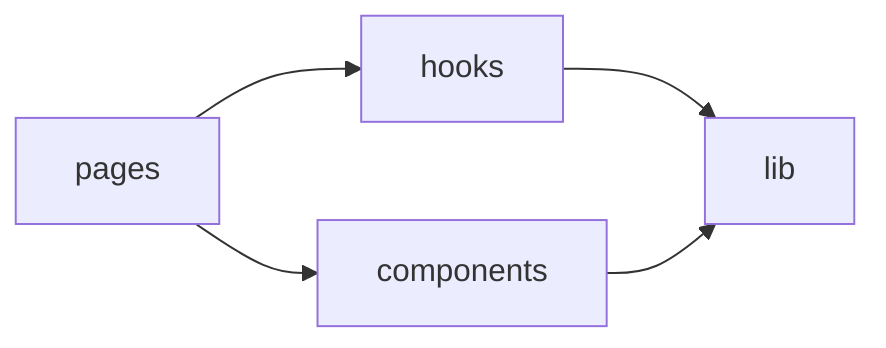

# 前端 Lib 工具箱

## 这页看什么

`frontend/src/lib/` 承接了前端很多“非组件、非 hook、但又必须统一”的基础能力。

它主要分成六组：

- 校验 schema
- 表单配置
- 表格列配置
- 常量与选项
- API / 环境工具
- 通用 UI 和数据处理工具

## 1. 校验与错误归一化

### `validationSchemas.ts`

这是前端输入验证中心，负责：

- 各类表单 schema
- CAS 校验与规格解析
- 用户、密码、设备名等字段规则
- API 错误转字段错误 / 友好文案

## 2. 表单配置

### `formConfigs.tsx`

负责把“字段有哪些”从页面组件中抽出来：

- 默认值
- 字段顺序
- 标签、占位符、类型
- 不同表单的字段组合

### `inputConfigs.ts`

定义输入控件层面的样式和配置映射，供 `BaseForm` 等组件复用。

## 3. 表格配置

### `tableConfigs.tsx`

定义各业务表格的列：

- 库存
- 试剂订单
- 耗材订单
- 常用货架
- 管理员用户
- 设备管理

### `tableExpandStorage.ts`

负责展开态、模糊搜索等表格偏好的本地持久化。

## 4. 常量与选项

### `constants.ts`

集中定义：

- 状态文案
- badge 样式映射
- 角色文案
- 本地存储 key
- 导入模板列

### `options.ts`

定义用于下拉框或表单枚举的选项：

- 申购原因
- 试剂分类
- 品牌
- 常用货架分类和品牌

### `dashboardUtils.tsx`

负责仪表盘 tab、筛选选项、本地列表处理和分组拍平逻辑。

## 5. API 与环境工具

### `apiConfig.ts`

统一构造后端地址：

- `getApiBaseUrl`
- `getBackendOrigin`
- `buildBackendUrl`

### `deviceId.ts`

生成和维护设备标识与设备名，用于登录和会话管理。

## 6. 通用 UI / 数据处理工具

### `utils.ts`

提供：

- `cn`
- 日期格式化
- 截断
- 图片 URL 拼接
- 下载 blob
- 备注文本清洗

### `toast.ts`

提供统一的 toast 发布和订阅能力。

### 其他轻量工具

| 文件 | 作用 |
| --- | --- |
| `bugReportButtonStorage.ts` | Bug 反馈按钮显隐持久化 |
| `chemicalProperties.ts` | 化学性质相关缓存或展示辅助 |

## lib 与 hooks / components 的关系

## 最常改的几个文件

### 加字段或改表单

通常同时会改：

1. `validationSchemas.ts`
2. `formConfigs.tsx`
3. 页面组件
4. 后端 DTO

### 改列表列展示

通常会改：

1. `tableConfigs.tsx`
2. 对应页面
3. 有时顺带改 `constants.ts`

## 二次开发建议

- 新的表单规则优先加到 `validationSchemas.ts`
- 新的下拉选项优先集中到 `options.ts` 或 `constants.ts`
- 新的表格列优先在 `tableConfigs.tsx` 配置，不要每页自己拼列定义

## 参考代码

- [frontend/src/lib/apiConfig.ts](https://github.com/hzb666/LabStorageManager/blob/main/frontend/src/lib/apiConfig.ts)
- [frontend/src/lib/constants.ts](https://github.com/hzb666/LabStorageManager/blob/main/frontend/src/lib/constants.ts)
- [frontend/src/lib/dashboardUtils.tsx](https://github.com/hzb666/LabStorageManager/blob/main/frontend/src/lib/dashboardUtils.tsx)
- [frontend/src/lib/deviceId.ts](https://github.com/hzb666/LabStorageManager/blob/main/frontend/src/lib/deviceId.ts)
- [frontend/src/lib/formConfigs.tsx](https://github.com/hzb666/LabStorageManager/blob/main/frontend/src/lib/formConfigs.tsx)
- [frontend/src/lib/options.ts](https://github.com/hzb666/LabStorageManager/blob/main/frontend/src/lib/options.ts)
- [frontend/src/lib/tableConfigs.tsx](https://github.com/hzb666/LabStorageManager/blob/main/frontend/src/lib/tableConfigs.tsx)
- [frontend/src/lib/tableExpandStorage.ts](https://github.com/hzb666/LabStorageManager/blob/main/frontend/src/lib/tableExpandStorage.ts)
- [frontend/src/lib/toast.ts](https://github.com/hzb666/LabStorageManager/blob/main/frontend/src/lib/toast.ts)
- [frontend/src/lib/utils.ts](https://github.com/hzb666/LabStorageManager/blob/main/frontend/src/lib/utils.ts)
- [frontend/src/lib/validationSchemas.ts](https://github.com/hzb666/LabStorageManager/blob/main/frontend/src/lib/validationSchemas.ts)
