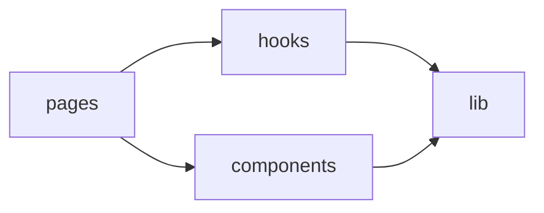

# Lib 层

`frontend/src/lib/` 承接不适合放进组件或 Hook、但需要集中维护的基础能力。它是前端的规则中心和配置中心。

## 结构划分

### 验证与错误归一化

#### `validationSchemas.ts`

这是前端输入验证中心，负责：

- 各类表单 schema
- CAS 校验与规格解析
- 用户、密码、设备名等字段规则
- API 错误到字段错误或友好文案的转换

### 表单配置

#### `formConfigs.tsx`

用于把“字段有哪些”从页面中抽离出来，统一描述：

- 默认值
- 字段顺序
- 标签、占位符、类型
- 不同表单的字段组合

#### `inputConfigs.ts`

定义输入控件层面的样式和映射关系，供 `BaseForm` 等组件复用。

### 表格配置

#### `tableConfigs.tsx`

定义业务表格的列结构，覆盖：

- 库存
- 试剂订单
- 耗材订单
- 常用货架
- 管理员用户
- 设备管理

#### `tableExpandStorage.ts`

负责展开态、模糊搜索等表格偏好的本地持久化。

### 常量与选项

#### `constants.ts`

集中维护：

- 状态文案
- badge 样式映射
- 角色文案
- 本地存储 key
- 导入模板列

#### `options.ts`

定义下拉框和表单枚举所需选项，例如：

- 申购原因
- 试剂分类
- 品牌
- 常用货架分类和品牌

#### `dashboardUtils.tsx`

负责仪表盘 tab、筛选选项、本地列表处理和分组拍平逻辑。

### API 与环境工具

#### `apiConfig.ts`

统一构造后端地址：

- `getApiBaseUrl`
- `getBackendOrigin`
- `buildBackendUrl`

#### `deviceId.ts`

生成和维护设备标识与设备名，用于登录和会话管理。

### 通用 UI 与数据处理工具

#### `utils.ts`

提供：

- `cn`
- 日期格式化
- 截断
- 图片 URL 拼接
- 下载 blob
- 备注文本清洗

#### `toast.ts`

提供统一的 toast 发布和订阅能力。

### 其他轻量工具

| 文件 | 职责 |
| --- | --- |
| `bugReportButtonStorage.ts` | 维护 Bug 反馈按钮显隐状态 |
| `chemicalProperties.ts` | 提供化学性质相关缓存或展示辅助 |

## 与其他层的关系

## 改动入口

- 表单字段、默认值和组合关系，优先改 `formConfigs.tsx`
- 输入校验、格式标准化和错误映射，优先改 `validationSchemas.ts`
- 列定义、展示文案和表格偏好，优先改 `tableConfigs.tsx`、`constants.ts`、`tableExpandStorage.ts`
- API 地址和环境拼接，优先改 `apiConfig.ts`
- 可复用的字符串、日期和数据处理，优先改 `utils.ts`

## 阅读顺序

### 修改表单

1. `validationSchemas.ts`
2. `formConfigs.tsx`
3. 页面组件
4. 后端 DTO

### 修改列表列展示

1. `tableConfigs.tsx`
2. 对应页面
3. 必要时补充 `constants.ts`

## 验证建议

- 新表单规则是否都进入 `validationSchemas.ts`
- 新下拉选项是否集中在 `options.ts` 或 `constants.ts`
- 新表格列是否优先通过 `tableConfigs.tsx` 配置
- API 地址拼接是否仍然统一由 `apiConfig.ts` 处理

## 参考代码
- [frontend/src/lib/apiConfig.ts](https://github.com/hzb666/LabStorageManager/blob/main/frontend/src/lib/apiConfig.ts)
- [frontend/src/lib/constants.ts](https://github.com/hzb666/LabStorageManager/blob/main/frontend/src/lib/constants.ts)
- [frontend/src/lib/dashboardUtils.tsx](https://github.com/hzb666/LabStorageManager/blob/main/frontend/src/lib/dashboardUtils.tsx)
- [frontend/src/lib/deviceId.ts](https://github.com/hzb666/LabStorageManager/blob/main/frontend/src/lib/deviceId.ts)
- [frontend/src/lib/formConfigs.tsx](https://github.com/hzb666/LabStorageManager/blob/main/frontend/src/lib/formConfigs.tsx)
- [frontend/src/lib/options.ts](https://github.com/hzb666/LabStorageManager/blob/main/frontend/src/lib/options.ts)
- [frontend/src/lib/tableConfigs.tsx](https://github.com/hzb666/LabStorageManager/blob/main/frontend/src/lib/tableConfigs.tsx)
- [frontend/src/lib/tableExpandStorage.ts](https://github.com/hzb666/LabStorageManager/blob/main/frontend/src/lib/tableExpandStorage.ts)
- [frontend/src/lib/toast.ts](https://github.com/hzb666/LabStorageManager/blob/main/frontend/src/lib/toast.ts)
- [frontend/src/lib/utils.ts](https://github.com/hzb666/LabStorageManager/blob/main/frontend/src/lib/utils.ts)
- [frontend/src/lib/validationSchemas.ts](https://github.com/hzb666/LabStorageManager/blob/main/frontend/src/lib/validationSchemas.ts)
