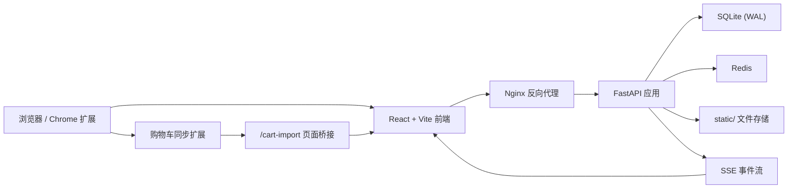

# 核心导读

这页写给已经能独立接手系统设计、代码治理和线上问题定位的开发者。你不需要先知道每个页面怎么点，但需要先抓住项目的核心架构洞见。

## 一个最重要的架构洞见

这个项目最值得抓住的不是“FastAPI + React + SQLite”这套技术名词，而是它把实验室业务拆成了两条强分离的主链路：

- 试剂链路：订单 -> 到货 -> 入库 -> 借用/归还 -> 借用日志
- 耗材链路：订单 -> 审批 -> 完成

系统大部分复杂性都来自这条分流，而不是 UI 或 ORM 本身。只要你理解“试剂要进入库存瓶级管理，耗材不进入”，后续很多设计都会顺下来，包括：

- 为什么 `ReagentOrder` 和 `ConsumableOrder` 是两套模型
- 为什么库存表只承载试剂瓶级记录
- 为什么导入、SSE、搜索、仪表盘都围着库存和订单状态流转设计

用 JavaScript 伪代码描述，这个系统的核心分派逻辑更像这样：

```js
function handleOrder(order) {
  if (order.kind === 'reagent') {
    approve(order)
    confirmArrival(order)
    createInventoryItems(order)
    return trackBorrowAndReturn(order)
  }

  approve(order)
  return markConsumableCompleted(order)
}
```

## 系统架构图



## 你应该优先读什么

1. [系统总览](/architecture/system-overview)
2. [业务流程](/architecture/business-flows)
3. [数据模型](/architecture/data-model)
4. [后端运行时与入口](/backend/runtime)
5. [前端应用骨架](/frontend/app-shell)

## 设计取舍

## SQLite 而不是独立数据库集群

- 优点：部署简单，适合单实验室或小团队
- 代价：高并发能力有限，因此必须启用 WAL，并用索引、FTS 和分页控制读写成本

## Redis 是辅助层，不是主数据源

- Redis 当前用于登录限流和部分会话相关能力
- 真实业务状态仍以 SQLite 和文件系统为准

## 文档和代码曾经存在漂移

- 根目录 `README.md` 与 `docs/API.md` 不能直接当事实源
- 真正可靠的是 `app/`、`frontend/src/`、`browser-extension/` 和 `docker/` 下的当前实现

## 去哪里深挖

- 搜索和性能：看 [数据与搜索](/backend/data-search)
- 权限与会话：看 [认证与安全](/backend/auth-security)
- 列表页复用：看 [表格与表单体系](/frontend/table-form-system)
- 浏览器扩展导入：看 [购物车同步扩展](/extension/cart-sync)

## 参考代码

- `app/main.py:167`
- `app/database.py:32`
- `app/models/reagent_order.py:17`
- `app/models/consumable_order.py:17`
- `frontend/src/App.tsx:29`
- `docker-compose.yml:1`
