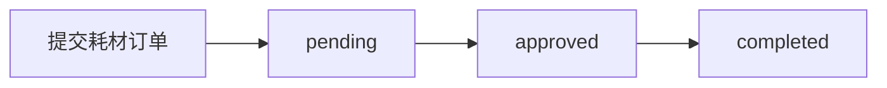
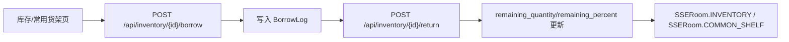

# 业务流程

## 试剂主流程

说明：

- `frontend` 的 `ReagentOrders` 页面会通过 `reagentOrderAPI.list/create/approve/confirmArrival/stockIn` 与 `/api/reagent-orders` 交互，<InlineCodeRef href="https://github.com/hzb666/LabStorageManager/blob/main/app/api/reagent_orders.py" /> 提供基本 CRUD，<InlineCodeRef href="https://github.com/hzb666/LabStorageManager/blob/main/app/api/reagent_orders_workflow.py" /> 提供审批、到货与入库。
- `confirm-arrival` 会检查 `OrderReason`，根据 `COMMON_PUBLIC` 或是否填了 `storage_location` 决定直接入库、写入常用货架或暂存，并调用 `_create_inventory_items_from_order`。
- `stock-in` 要求 `ReagentOrderStatus` 为 `approved` 或 `arrived`，生成 `Inventory` 记录并同步 `InventoryStatus`、`is_common`、`remaining_percent`、拼音字段，最终通过 SSE `SSERoom.REAGENT_ORDERS` 触发状态刷新。
- 借用/归还会创建 `BorrowLog`（<InlineCodeRef href="https://github.com/hzb666/LabStorageManager/blob/main/app/models/inventory.py" />）并按 `remaining_quantity` 更新 `InventoryStatus`；接口在 <InlineCodeRef href="https://github.com/hzb666/LabStorageManager/blob/main/app/api/inventory.py" />，SSE 房间 `inventory` 会广播 `INVENTORY_UPDATED`。

## 耗材主流程

说明：

- 耗材从 `frontend` 的 `ConsumableOrders` 页面调用 `consumableOrderAPI`，<InlineCodeRef href="https://github.com/hzb666/LabStorageManager/blob/main/app/api/consumable_orders.py" /> 负责创建、更新、审批、拒绝、完成、查询与导出；前端通过 `FilterTable` + `validationSchemas` 管理表单。
- `complete` 接口仅允许申请人或管理员调用，并强制 `status == approved`，然后将状态设为 `completed` 并通过 SSE `SSERoom.CONSUMABLE_ORDERS` 推送。
- 耗材不生成 `Inventory` 记录，所有数据留在 `consumable_order` 表，`inventory` 仅用于试剂瓶级跟踪。

## 浏览器扩展导入流程

```mermaid
flowchart LR
    Cart["试剂平台购物车"] --> Popup["扩展 popup"]
    Popup --> Storage["chrome.storage.local"]
    Storage --> Bridge["import-bridge.js"]
    Bridge --> PageCache["cart_import_batch_latest"]
    PageCache --> Import["/cart-import 页面"]
    Import --> ApiCartSync["cartSyncAPI.importItems"]
    ApiCartSync --> CartSync["app/api/cart_sync.py"]
```

说明：

- 扩展通过 <InlineCodeRef href="https://github.com/hzb666/LabStorageManager/blob/main/browser-extension/content/script.js" /> 抓取 `reagent.bjmu.edu.cn` 购物车数据，以 `CartItem` 结构保存在 `chrome.storage.local.import_batch_latest`。
- `/cart-import` 页面加载 `useCartSyncForm`，将数据拆成耗材/试剂，调用 `cartSyncAPI.importItems`，前端使用 `ValidationSchemas` 和 `FilterTable` 统一 UI。
- <InlineCodeRef href="https://github.com/hzb666/LabStorageManager/blob/main/app/api/cart_sync.py" /> 依赖 `normalize_cas`、`parse_specification`、`compute_pinyin_fields`，根据 `order_type` 创建 `ConsumableOrder` 或 `ReagentOrder`，并在 `success` 结果中返回 `created` 计数。
- 匹配流程先尝试 `ReagentOrder` 中姓名或 CAS 精确匹配，未匹配则视为新订单，避免重复导入。

## 库存借用与常用货架

说明：

- `inventory.py` 提供借用（`INVENTORY_BORROWED`）、归还、手动添加、导入、导出等接口，`_normalize_update_payload` 处理 CAS/规格/地址等字段，`_attach_user_names` 通过 `batch_get_user_names` 将人员信息附加到响应。
- 常用货架由 `register_common_shelf` 提供，支持 `consume-one`、`manual-add`、`group update/delete`，前端 `CommonShelf` 页面仅订阅 `common_shelf` SSE 房间避免全量刷新。
- SSE 房间 `SSERoom.INVENTORY` 与 `SSERoom.COMMON_SHELF` 由 <InlineCodeRef href="https://github.com/hzb666/LabStorageManager/blob/main/app/services/sse_manager.py" /> 广播，`frontend` 的 `useSSE` 通过 `processSeq` 检查重复与缺失，并在 `sseStore` 标记 `stale`。

## 双轨状态机对照（开发重点）

| 维度 | 试剂订单 | 耗材订单 |
| --- | --- | --- |
| 状态枚举 | `pending/approved/rejected/arrived/stocked` | `pending/approved/rejected/completed` |
| 是否进入库存 | 是（`stock-in` 后复制为 `Inventory`） | 否 |
| 核心校验字段 | `cas_number`、规格解析、拼音字段 | `product_number`、规格文本、拼音字段 |
| 角色敏感动作 | 审批/驳回通常由管理员执行 | 审批/驳回/完成受角色控制 |
| 实时事件 | `reagent_orders` + `inventory` + `common_shelf` | `consumable_orders` |

## 流程一致性校验点

- 订单到库存必须是 Copy，不得删除订单审计记录。
- `confirm-arrival` 的分支（普通入库/常用货架/暂存）要保持互斥且可追溯。
- `common-shelf` 相关更新必须同时校验分组字段与并发修改冲突。
- 借还与消耗要写 `BorrowLog`，不可只更新 `Inventory` 数量。
- 前端局部 patch 失败时必须标记 stale 并允许用户一键刷新，不得静默丢事件。

## 参考代码
- [app/api/cart_sync.py](https://github.com/hzb666/LabStorageManager/blob/main/app/api/cart_sync.py)
- [app/api/consumable_orders.py](https://github.com/hzb666/LabStorageManager/blob/main/app/api/consumable_orders.py)
- [app/api/inventory.py](https://github.com/hzb666/LabStorageManager/blob/main/app/api/inventory.py)
- [app/api/reagent_orders_workflow.py](https://github.com/hzb666/LabStorageManager/blob/main/app/api/reagent_orders_workflow.py)
- [app/api/reagent_orders.py](https://github.com/hzb666/LabStorageManager/blob/main/app/api/reagent_orders.py)
- [app/models/inventory.py](https://github.com/hzb666/LabStorageManager/blob/main/app/models/inventory.py)
- [app/services/sse_manager.py](https://github.com/hzb666/LabStorageManager/blob/main/app/services/sse_manager.py)
- [browser-extension/content/import-bridge.js](https://github.com/hzb666/LabStorageManager/blob/main/browser-extension/content/import-bridge.js)
- [browser-extension/content/script.js](https://github.com/hzb666/LabStorageManager/blob/main/browser-extension/content/script.js)

