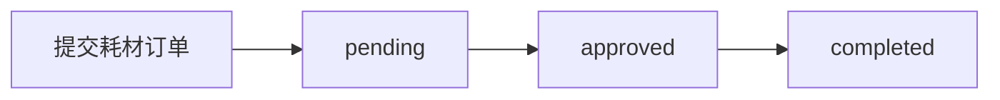
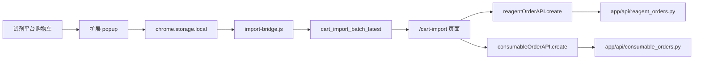
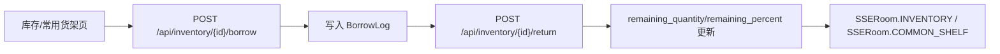

# 业务流程

## 试剂主流程

说明：

- `frontend` 的 `ReagentOrders` 页面通过 `reagentOrderAPI.list/create/approve/confirmArrival/stockIn` 访问后端。
- <InlineCodeRef href="https://github.com/hzb666/LabStorageManager/blob/main/app/api/reagent_orders.py" /> 提供试剂订单基础 CRUD，<InlineCodeRef href="https://github.com/hzb666/LabStorageManager/blob/main/app/api/reagent_orders_workflow.py" /> 提供审批、到货和入库。
- `confirm-arrival` 会根据订单原因和存储信息决定直接入库、进入常用货架或暂存。
- `stock-in` 会把试剂订单复制为 `Inventory` 记录，并同步库存状态、常用货架标记、剩余量和拼音字段。
- 借用与归还会写入 <InlineCodeRef href="https://github.com/hzb666/LabStorageManager/blob/main/app/models/inventory.py" /> 中的 `BorrowLog`，并通过 <InlineCodeRef href="https://github.com/hzb666/LabStorageManager/blob/main/app/api/inventory.py" /> 更新库存状态。

## 耗材主流程

说明：

- 耗材从 `frontend` 的 `ConsumableOrders` 页面进入 <InlineCodeRef href="https://github.com/hzb666/LabStorageManager/blob/main/app/api/consumable_orders.py" />。
- 该接口负责创建、更新、审批、拒绝、完成、查询与导出。
- `complete` 仅允许申请人或管理员调用，并要求订单处于已审批状态。
- 耗材不生成库存记录，数据保留在 `consumable_order` 表中。

## 浏览器扩展导入流程

说明：

- 扩展通过 <InlineCodeRef href="https://github.com/hzb666/LabStorageManager/blob/main/browser-extension/content/script.js" /> 抓取购物车数据，并写入 `chrome.storage.local.import_batch_latest`。
- `/cart-import` 页面再通过 <InlineCodeRef href="https://github.com/hzb666/LabStorageManager/blob/main/browser-extension/content/import-bridge.js" /> 读取页面缓存。
- 前端导入页逐条调用标准的 `reagentOrderAPI.create` 或 `consumableOrderAPI.create`，由试剂订单与耗材订单路由完成落库。
- <InlineCodeRef href="https://github.com/hzb666/LabStorageManager/blob/main/app/api/cart_sync.py" /> 提供 `/api/cart-sync`，用于匹配分析场景。
- 导入前会做基础校验和标准化，减少重复和脏数据进入数据库。

## 库存借用与常用货架

说明：

- `inventory.py` 提供借用、归还、手动添加、导入和导出等接口。
- 常用货架由 `register_common_shelf` 提供，前端 `CommonShelf` 页面只订阅相关 SSE 房间。
- <InlineCodeRef href="https://github.com/hzb666/LabStorageManager/blob/main/app/services/sse_manager.py" /> 负责广播 `inventory` 和 `common_shelf` 相关事件，前端通过 `useSSE` 和 `sseStore` 处理重复、缺失和 stale 状态。

## 双轨状态机对照

| 维度 | 试剂订单 | 耗材订单 |
| --- | --- | --- |
| 状态枚举 | `pending/approved/rejected/arrived/stocked` | `pending/approved/rejected/completed` |
| 是否进入库存 | 是（`stock-in` 后复制为 `Inventory`） | 否 |
| 核心校验字段 | `cas_number`、规格解析、拼音字段 | `product_number`、规格文本、拼音字段 |
| 角色敏感动作 | 审批/驳回通常由管理员执行 | 审批/驳回/完成受角色控制 |
| 实时事件 | `reagent_orders` + `inventory` + `common_shelf` | `consumable_orders` |

## 流程一致性校验点

- 订单转库存必须保留订单审计记录。
- `confirm-arrival` 的不同分支需要保持互斥且可追溯。
- `common-shelf` 更新要关注分组字段和并发修改。
- 借还与消耗要写 `BorrowLog`，不能只改库存数量。
- 前端局部 patch 失败时要标记 stale，并允许用户刷新。

## 参考代码
- [app/api/cart_sync.py](https://github.com/hzb666/LabStorageManager/blob/main/app/api/cart_sync.py)
- [app/api/consumable_orders.py](https://github.com/hzb666/LabStorageManager/blob/main/app/api/consumable_orders.py)
- [app/api/inventory.py](https://github.com/hzb666/LabStorageManager/blob/main/app/api/inventory.py)
- [app/api/reagent_orders_workflow.py](https://github.com/hzb666/LabStorageManager/blob/main/app/api/reagent_orders_workflow.py)
- [app/api/reagent_orders.py](https://github.com/hzb666/LabStorageManager/blob/main/app/api/reagent_orders.py)
- [app/models/inventory.py](https://github.com/hzb666/LabStorageManager/blob/main/app/models/inventory.py)
- [app/services/sse_manager.py](https://github.com/hzb666/LabStorageManager/blob/main/app/services/sse_manager.py)
- [browser-extension/content/import-bridge.js](https://github.com/hzb666/LabStorageManager/blob/main/browser-extension/content/import-bridge.js)
- [browser-extension/content/script.js](https://github.com/hzb666/LabStorageManager/blob/main/browser-extension/content/script.js)
