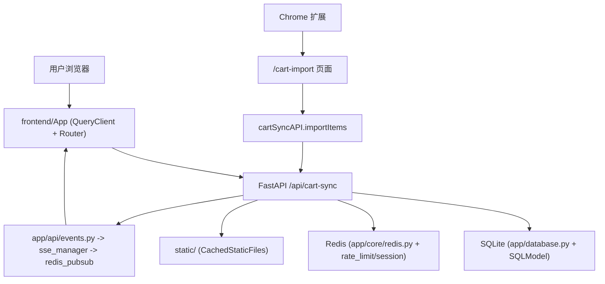

# 系统总览

## 一句话理解

当前系统以 FastAPI + SQLite 作为事实源，前端负责业务操作和实时刷新，浏览器扩展只负责把外部购物车数据送到 `/cart-import`，不直接参与后端写入。

## 架构分层

1. 展示层：<InlineCodeRef href="https://github.com/hzb666/LabStorageManager/tree/main/frontend/src/pages" /> 和 `components` 负责表格、导入、设备和公告等交互，<InlineCodeRef href="https://github.com/hzb666/LabStorageManager/tree/main/browser-extension" /> 负责扩展页面与桥接逻辑。
2. 接口层：<InlineCodeRef href="https://github.com/hzb666/LabStorageManager/blob/main/frontend/src/api/client.ts" /> 封装全部 `/api` 调用，<InlineCodeRef href="https://github.com/hzb666/LabStorageManager/tree/main/app/api" /> 提供路由、依赖注入和事件输出。
3. 领域层：<InlineCodeRef href="https://github.com/hzb666/LabStorageManager/tree/main/app/models" /> 定义业务对象，<InlineCodeRef href="https://github.com/hzb666/LabStorageManager/tree/main/app/services" /> 负责清洗、拼音、内码、匹配、缓存和 SSE 广播，<InlineCodeRef href="https://github.com/hzb666/LabStorageManager/blob/main/app/api/reagent_orders_workflow.py" /> 负责试剂工作流。
4. 基础设施层：<InlineCodeRef href="https://github.com/hzb666/LabStorageManager/blob/main/app/database.py" /> 初始化 SQLite，<InlineCodeRef href="https://github.com/hzb666/LabStorageManager/blob/main/app/core/auth.py" /> 和 `redis.py` 处理认证与会话，`docker` 与 `nginx` 处理部署边界。

## 请求与事件路径

## 三个子系统协作细节

- `frontend/`：`App.tsx` 负责路由守卫和页面加载，`useSSE.ts` 连接 `/api/events?rooms=...`，`useListSSE.ts` 为列表页维护房间切换和 stale 标记。
- `app/`：<InlineCodeRef href="https://github.com/hzb666/LabStorageManager/blob/main/app/main.py" /> 负责中间件、生命周期和路由注入；`inventory.py`、`reagent_orders.py`、`reagent_orders_workflow.py`、`consumable_orders.py`、`cart_sync.py` 和 `events.py` 分别覆盖库存、订单、导入和事件；<InlineCodeRef href="https://github.com/hzb666/LabStorageManager/tree/main/app/services" /> 提供清洗、缓存和 SSE 支撑。
- `browser-extension/`：`manifest.json` 声明权限，`content/script.js` 抓取购物车，`content/import-bridge.js` 把数据同步到页面缓存，最终由前端调用 <InlineCodeRef href="https://github.com/hzb666/LabStorageManager/blob/main/app/api/cart_sync.py" />。

## 关键边界与安全

- 所有写操作都通过 `/api`，并保留 `CurrentUser`、`require_admin` 和 `UserRole` 校验。
- <InlineCodeRef href="https://github.com/hzb666/LabStorageManager/blob/main/app/main.py" /> 负责安全头和静态资源缓存策略。
- <InlineCodeRef href="https://github.com/hzb666/LabStorageManager/blob/main/app/services/api_utils.py" /> 提供列表缓存，列表写操作需要配合失效逻辑使用。
- Redis 主要用于 SSE、登录限流和会话黑名单，不可用时系统仍保留 SQLite 读取能力。
- SSE 的 `seq` 由 <InlineCodeRef href="https://github.com/hzb666/LabStorageManager/blob/main/app/services/sse_manager.py" /> 维护，前端用序号检查重复和缺失事件。

## 设计重点

- 试剂和耗材是两条不同工作流，试剂会继续流转到库存，耗材在完成后结束。
- SQLite 的索引和 FTS 在 <InlineCodeRef href="https://github.com/hzb666/LabStorageManager/blob/main/app/database.py" /> 中统一初始化。
- SSE 是增量通知，不是第二事实源；前端仍需通过 HTTP 查询获取权威数据。
- 浏览器扩展只做采集和桥接，数据清洗和订单创建仍由后端完成。

## 预期感知

- 页面切换与筛选应保持顺畅，列表页主要依赖分页、拼音和 FTS。
- 审计链路应能追踪审批、入库、借用和完成等关键动作。
- SSE 应只承担实时刷新，不替代主查询接口。
- 扩展导入的最终数据链路应能回到 <InlineCodeRef href="https://github.com/hzb666/LabStorageManager/blob/main/app/api/cart_sync.py" />。

## 面向开发者的关键校验点

- 生产模式下确认 `/docs`、`/redoc` 和 `/openapi.json` 的开放策略符合预期。
- 试剂必须走完整的审批、到货和入库链路，耗材完成后不应写入库存。
- 修改库存或订单后，应能看到对应 SSE 房间事件。
- 列表写操作后要检查缓存失效和前端 stale 提示。
- 扩展只能采集和桥接，导入入口仍然是 `/api/cart-sync/import`。

## 从 zread 融合到当前代码的差异说明

- 本地联调由前端 `VITE_API_URL` 指向后端 API，不依赖 Vite dev proxy。
- 常用货架前端路径是 `/common-shelf`，接口路径是 `/api/inventory/common-shelf*`。
- 当前数据库 FTS 覆盖 `inventory`、`reagent_order`、`consumable_order` 和 `users`。
- Redis 是增强层，不是唯一事实源；不可用时系统仍保持 SQLite 可用。

## 参考代码
- [app/api/cart_sync.py](https://github.com/hzb666/LabStorageManager/blob/main/app/api/cart_sync.py)
- [app/api/reagent_orders_workflow.py](https://github.com/hzb666/LabStorageManager/blob/main/app/api/reagent_orders_workflow.py)
- [app/core/auth.py](https://github.com/hzb666/LabStorageManager/blob/main/app/core/auth.py)
- [app/core/redis.py](https://github.com/hzb666/LabStorageManager/blob/main/app/core/redis.py)
- [app/database.py](https://github.com/hzb666/LabStorageManager/blob/main/app/database.py)
- [app/main.py](https://github.com/hzb666/LabStorageManager/blob/main/app/main.py)
- [app/services](https://github.com/hzb666/LabStorageManager/tree/main/app/services)
- [app/services/api_utils.py](https://github.com/hzb666/LabStorageManager/blob/main/app/services/api_utils.py)
- [app/services/rate_limit.py](https://github.com/hzb666/LabStorageManager/blob/main/app/services/rate_limit.py)
- [app/services/sse_manager.py](https://github.com/hzb666/LabStorageManager/blob/main/app/services/sse_manager.py)
- [app/services/sse_redis.py](https://github.com/hzb666/LabStorageManager/blob/main/app/services/sse_redis.py)
- [browser-extension/content/import-bridge.js](https://github.com/hzb666/LabStorageManager/blob/main/browser-extension/content/import-bridge.js)
- [docker/nginx/default.conf](https://github.com/hzb666/LabStorageManager/blob/main/docker/nginx/default.conf)
- [frontend/src/api/client.ts](https://github.com/hzb666/LabStorageManager/blob/main/frontend/src/api/client.ts)
- [frontend/src/App.tsx](https://github.com/hzb666/LabStorageManager/blob/main/frontend/src/App.tsx)
