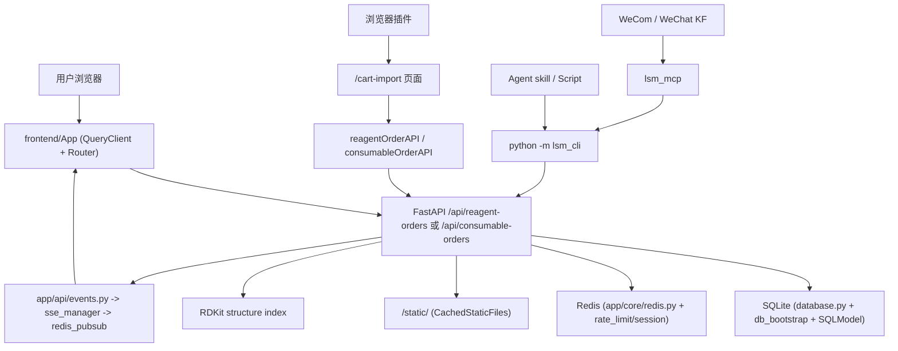

# 系统总览

## 一句话理解

当前系统以 FastAPI + SQLite 作为事实源，前端负责业务操作和实时刷新，浏览器插件只负责把外部购物车批次桥接到 `/cart-import`，Agent skill、CLI、MCP、企业微信智能机器人和微信客服都通过后端 API 收口。

## 架构分层

1. 展示层：<InlineCodeRef href="https://github.com/hzb666/LabStorageManager/tree/main/frontend/src/pages" /> 和 `components` 负责表格、导入、设备和公告等交互，<InlineCodeRef href="https://github.com/hzb666/LabStorageManager/tree/main/browser-extension" /> 负责浏览器插件页面与桥接逻辑。
2. 接口层：<InlineCodeRef href="https://github.com/hzb666/LabStorageManager/blob/main/frontend/src/api/client.ts" /> 封装全部 `/api` 调用，<InlineCodeRef href="https://github.com/hzb666/LabStorageManager/tree/main/app/api" /> 提供路由、依赖注入和事件输出。
3. 自动化入口层：Agent skill 和脚本通过 `lsm_cli/` 访问系统，`lsm_mcp/` 通过 CLI 子进程暴露受控工具，`robot/` 处理企业微信智能机器人和微信客服消息。
4. 领域层：<InlineCodeRef href="https://github.com/hzb666/LabStorageManager/tree/main/app/models" /> 定义业务对象，<InlineCodeRef href="https://github.com/hzb666/LabStorageManager/tree/main/app/services" /> 负责清洗、拼音、内码、匹配、缓存和 SSE 广播，<InlineCodeRef href="https://github.com/hzb666/LabStorageManager/blob/main/app/api/reagent_orders_workflow.py" /> 负责试剂工作流。
5. 基础设施层：<InlineCodeRef href="https://github.com/hzb666/LabStorageManager/blob/main/app/database.py" /> 与 <InlineCodeRef href="https://github.com/hzb666/LabStorageManager/tree/main/app/db_bootstrap" /> 初始化 SQLite，<InlineCodeRef href="https://github.com/hzb666/LabStorageManager/blob/main/app/core/auth.py" /> 和 `redis.py` 处理认证与会话，`docker` 与 `nginx` 处理部署边界。

## 请求与事件路径

## 三个子系统协作细节

- `frontend/`：`App.tsx` 负责路由守卫和页面加载，`useSSE.ts` 连接 `/api/events?rooms=...`，`useListSSE.ts` 为列表页维护房间切换和 stale 标记。
- `app/`：<InlineCodeRef href="https://github.com/hzb666/LabStorageManager/blob/main/app/main.py" /> 负责中间件、生命周期和路由注入；`inventory.py`、`reagent_orders.py`、`reagent_orders_workflow.py`、`consumable_orders.py`、`cart_sync.py` 和 `events.py` 分别覆盖库存、订单、导入和事件；<InlineCodeRef href="https://github.com/hzb666/LabStorageManager/tree/main/app/services" /> 提供清洗、缓存和 SSE 支撑。
- `browser-extension/`：构建期 manifest 声明权限，`content/script.js` 抓取购物车，`content/import-bridge.js` 把数据同步到页面缓存；`CartImport` 页面逐条调用标准试剂或耗材订单创建接口。
- `lsm_cli/`、Agent skill、`lsm_mcp/` 和 `robot/`：按受控命令面处理脚本、MCP、企业微信智能机器人和微信客服入口，写操作仍由后端权限控制。

## 关键边界与安全

- 所有写操作都通过 `/api`，并保留 `CurrentUser`、`require_admin` 和 `UserRole` 校验。
- <InlineCodeRef href="https://github.com/hzb666/LabStorageManager/blob/main/app/main.py" /> 负责安全头和 `/static/` 缓存策略。
- <InlineCodeRef href="https://github.com/hzb666/LabStorageManager/blob/main/app/services/api_utils.py" /> 提供列表缓存，列表写操作需要配合失效逻辑使用。
- Redis 主要用于 SSE、登录限流和会话黑名单，不可用时系统仍保留 SQLite 读取能力。
- SSE 的 `seq` 由 <InlineCodeRef href="https://github.com/hzb666/LabStorageManager/blob/main/app/services/sse_manager.py" /> 维护，前端用序号检查重复和缺失事件。
- Agent skill 和 MCP 不直接访问数据库，也不开放 CLI 未显式暴露的 API。

## 设计重点

- 试剂和耗材是两条不同工作流，试剂会继续流转到库存，耗材在完成后结束。
- SQLite 的连接行为在 <InlineCodeRef href="https://github.com/hzb666/LabStorageManager/blob/main/app/database.py" /> 中初始化，索引、FTS 和 schema 校验在 <InlineCodeRef href="https://github.com/hzb666/LabStorageManager/tree/main/app/db_bootstrap" /> 中维护。
- SSE 承担增量通知职责；前端仍需通过 HTTP 查询获取权威数据。
- 浏览器插件只做采集和桥接，数据清洗和订单创建仍由后端完成。
- 企业微信入口只作为受控消息入口，查询和写入最终仍走 MCP、CLI 和后端 API。

## 预期感知

- 页面切换与筛选应保持顺畅，列表页主要依赖分页、拼音和 FTS。
- 审计链路应能追踪审批、入库、借用和完成等关键动作。
- SSE 应只承担实时刷新，不替代主查询接口。
- 插件导入的最终数据链路应回到标准订单创建接口；<InlineCodeRef href="https://github.com/hzb666/LabStorageManager/blob/main/app/api/cart_sync.py" /> 提供匹配分析接口。

## 面向开发者的关键校验点

- 生产模式下确认 `/docs`、`/redoc` 和 `/openapi.json` 的开放策略符合预期。
- 试剂必须走完整的审批、到货和入库链路，耗材完成后不应写入库存。
- 修改库存或订单后，应能看到对应 SSE 房间事件。
- 列表写操作后要检查缓存失效和前端 stale 提示。
- 浏览器插件只能采集和桥接，导入页主链路应逐条调用标准订单创建接口。

## 实现边界说明

- 本地联调由前端 `VITE_API_URL` 指向后端 API，不依赖 Vite dev proxy。
- 常用货架前端路径是 `/common-shelf`，接口路径是 `/api/common-shelf*`。
- 数据库 FTS 覆盖 `inventory`、`reagent_order`、`consumable_order`、`users`、`chemical_name_map` 和 `log_timeline`。
- 结构检索默认开启，可关闭；启用后由 `chem` API、结构缓存表和 RDKit 索引共同工作。
- Redis 承担增强层职责；不可用时系统仍保持 SQLite 可用。

## 参考代码
- [app/api/cart_sync.py](https://github.com/hzb666/LabStorageManager/blob/main/app/api/cart_sync.py)
- [app/api/chem.py](https://github.com/hzb666/LabStorageManager/blob/main/app/api/chem.py)
- [app/api/reagent_orders_workflow.py](https://github.com/hzb666/LabStorageManager/blob/main/app/api/reagent_orders_workflow.py)
- [app/core/auth.py](https://github.com/hzb666/LabStorageManager/blob/main/app/core/auth.py)
- [app/core/redis.py](https://github.com/hzb666/LabStorageManager/blob/main/app/core/redis.py)
- [app/database.py](https://github.com/hzb666/LabStorageManager/blob/main/app/database.py)
- [app/db_bootstrap](https://github.com/hzb666/LabStorageManager/tree/main/app/db_bootstrap)
- [app/main.py](https://github.com/hzb666/LabStorageManager/blob/main/app/main.py)
- [app/services](https://github.com/hzb666/LabStorageManager/tree/main/app/services)
- [app/services/api_utils.py](https://github.com/hzb666/LabStorageManager/blob/main/app/services/api_utils.py)
- [app/services/rate_limit.py](https://github.com/hzb666/LabStorageManager/blob/main/app/services/rate_limit.py)
- [app/services/sse_manager.py](https://github.com/hzb666/LabStorageManager/blob/main/app/services/sse_manager.py)
- [app/services/sse_redis.py](https://github.com/hzb666/LabStorageManager/blob/main/app/services/sse_redis.py)
- [browser-extension/content/import-bridge.js](https://github.com/hzb666/LabStorageManager/blob/main/browser-extension/content/import-bridge.js)
- [docker/nginx/default.conf](https://github.com/hzb666/LabStorageManager/blob/main/docker/nginx/default.conf)
- [frontend/src/api/client.ts](https://github.com/hzb666/LabStorageManager/blob/main/frontend/src/api/client.ts)
- [frontend/src/App.tsx](https://github.com/hzb666/LabStorageManager/blob/main/frontend/src/App.tsx)
- [lsm_cli](https://github.com/hzb666/LabStorageManager/tree/main/lsm_cli)
- [lsm_mcp](https://github.com/hzb666/LabStorageManager/tree/main/lsm_mcp)
- [robot](https://github.com/hzb666/LabStorageManager/tree/main/robot)
