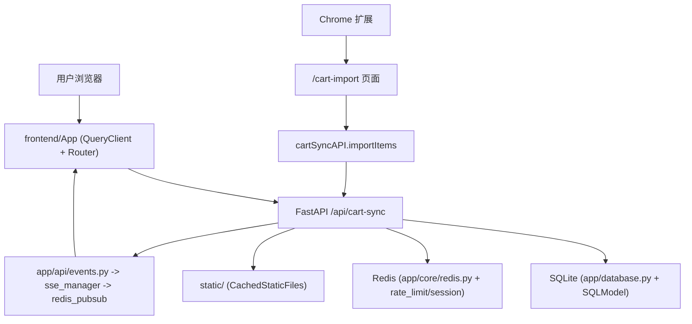

# 系统总览

## 一句话理解

后端是唯一事实源（SQLite + Redis + static + SSE），前端负责业务操作界面与 SSE 订阅，浏览器扩展负责把外部购物车数据桥接进 `/cart-import`。

## 架构分层（按职责）

1. 展示层：<InlineCodeRef href="https://github.com/hzb666/LabStorageManager/tree/main/frontend/src/pages" /> + `components` 提供表格、导入、设备/公告管理，<InlineCodeRef href="https://github.com/hzb666/LabStorageManager/tree/main/browser-extension" /> 提供 popup/bridge 加载逻辑。
2. 接口层：<InlineCodeRef href="https://github.com/hzb666/LabStorageManager/blob/main/frontend/src/api/client.ts" /> 封装所有 `/api` 调用，<InlineCodeRef href="https://github.com/hzb666/LabStorageManager/tree/main/app/api" /> 通过 FastAPI 路由、依赖注入（`get_current_user`、角色依赖）与 SSE 事件输出。
3. 领域层：<InlineCodeRef href="https://github.com/hzb666/LabStorageManager/tree/main/app/models" /> 定义 SQLModel，<InlineCodeRef href="https://github.com/hzb666/LabStorageManager/tree/main/app/services" /> 管理 CAS/规格清洗、拼音、`internal_code`、购物车匹配、SSE 广播、索引/缓存，<InlineCodeRef href="https://github.com/hzb666/LabStorageManager/blob/main/app/api/reagent_orders_workflow.py" /> 负责审批→到货→入库。
4. 基础设施层：<InlineCodeRef href="https://github.com/hzb666/LabStorageManager/blob/main/app/database.py" /> 创建 SQLite 引擎、启用 WAL/外键、FTS 索引，<InlineCodeRef href="https://github.com/hzb666/LabStorageManager/blob/main/app/core/auth.py" /> & `redis.py` 管理 JWT + Redis 会话，`docker` 与 `nginx` 提供部署边界。

## 请求与事件路径

## 三个子系统协作细节

- `frontend/`：`App.tsx` 构建路由 + `ProtectedRoute`/`AdminRoute`；`useSSE.ts` 以 `/api/events?rooms=...` 连接 `EventSource`；`useListSSE.ts` 为表格在 `inventory`、`common_shelf`、`reagent_orders`、`consumable_orders` 房间之间切换并标记 stale。
- `app/`：<InlineCodeRef href="https://github.com/hzb666/LabStorageManager/blob/main/app/main.py" /> 负责中间件（CORS、HTTPS 重定向、CSRF、日志、安全头）、生命周期（`init_db()`）、路由注入；`inventory.py`、`reagent_orders.py`、`reagent_orders_workflow.py`、`consumable_orders.py`、`cart_sync.py`、`events.py` 分别暴露库存/订单/导入/事件；<InlineCodeRef href="https://github.com/hzb666/LabStorageManager/tree/main/app/services" /> 支持拼音、规格、缓存、SSE。
- `browser-extension/`：`manifest.json` 授权 `reagent.bjmu.edu.cn`，`content/script.js` 抓取购物车写入 `chrome.storage.local.import_batch_latest`，`content/import-bridge.js` 将其同步到页面 `localStorage.cart_import_batch_latest`，最终由前端 `cartSyncAPI.importItems` 调用 <InlineCodeRef href="https://github.com/hzb666/LabStorageManager/blob/main/app/api/cart_sync.py" />。

## 关键边界与安全

- 所有写操作通过 `/api`，通过依赖注入保留 `CurrentUser`、`require_admin`、`UserRole` 校验，Public 角色只能读取。
- <InlineCodeRef href="https://github.com/hzb666/LabStorageManager/blob/main/app/main.py" /> 通过 `_apply_security_headers` 附加 `CSP`/`Strict-Transport-Security`/`X-Frame-Options`，`CachedStaticFiles` 还附带 `Cache-Control`。
- <InlineCodeRef href="https://github.com/hzb666/LabStorageManager/blob/main/app/services/api_utils.py" /> + `SEARCH_CACHE` 实现列表页内存缓存，`inventory.py` + `consumable_orders.py` 只在首页/无搜索时使用 `get_cached_result`。
- `redis` 用于 SSE、登录限流、会话黑名单；不可用时应用仍可降级为 SQLite 读取，Redis 相关代码集中在 <InlineCodeRef href="https://github.com/hzb666/LabStorageManager/blob/main/app/core/redis.py" />、<InlineCodeRef href="https://github.com/hzb666/LabStorageManager/blob/main/app/services/sse_redis.py" /> 与 <InlineCodeRef href="https://github.com/hzb666/LabStorageManager/blob/main/app/services/rate_limit.py" />。
- SSE 的 `seq` 由 <InlineCodeRef href="https://github.com/hzb666/LabStorageManager/blob/main/app/services/sse_manager.py" /> 维护，本地广播 + Redis PubSub，慢客户端会被断开，前端 `processSeq` 跳过重复/缺失事件。

## 设计重点

- 试剂 vs 耗材：`ReagentOrderStatus` 织就审批→到货→入库，`InventoryStatus` 用于库存状态与 `is_common` 标记，耗材只需 `ConsumableOrderStatus` 完成流程。
- SQLite：在 <InlineCodeRef href="https://github.com/hzb666/LabStorageManager/blob/main/app/database.py" /> 中创建索引/FTS（`inventory_fts`, `reagent_order_fts`, `consumable_order_fts`, `users_fts`），`SQLITE_PERFORMANCE_INDEX_UPGRADES` 依据场景建复合索引。
- SSE：`events.py` 仅允许授权客户端访问，`useSSE` 每次连接设 `rooms`、`handlers`、`withCredentials`，`sseStore` 跟踪 `reconnectCount` 与 `stale` 标记。
- 浏览器扩展导入：扩展永远不直接写数据库，数据通过 `/cart-import` 页面，由前端再消费 `cartSyncAPI`，后端用 `compute_pinyin_fields` + `normalize_cas` 清洗，并创建对应订单。

## 预期感知

- 页面切换/筛选流畅（分页、拼音、FTS + TanStack Table）。
- 管理员可追踪“谁借/审批/入库/完成”，设备与会话在 `device management` 页面清晰列出。
- SSE 实时刷新 `inventory`/`commonShelf`/`orders`，慢连接会自动刷新。
- 扩展导入仍保留权限与审计，最终数据链路在 <InlineCodeRef href="https://github.com/hzb666/LabStorageManager/blob/main/app/api/cart_sync.py" /> 里可追溯。

## 面向开发者的关键校验点

- 安全运行模式：`ENV=production` 时，确认 `/docs`、`/redoc`、`/openapi.json` 关闭，且 HTTPS/HSTS/CSRF 策略生效。
- 双轨业务一致性：试剂必须经过 `approve -> confirm-arrival -> stock-in` 或到货分支，耗材 `complete` 不应写入库存。
- 事件一致性：修改库存/订单后，除 REST 返回外还应看到对应 SSE 房间事件（`inventory`、`common_shelf`、`reagent_orders`、`consumable_orders`）。
- 缓存一致性：列表写操作后应触发后端缓存失效，前端 stale 提示能引导手动刷新。
- 扩展边界：扩展只做采集和桥接，不直接写数据库；后端导入入口仍是 `/api/cart-sync/import`。

## 从 zread 融合到当前代码的差异说明

- 本地联调并非依赖 Vite dev proxy；当前实现由前端 `VITE_API_URL` 指向后端 API。
- Common Shelf 的前端路径是 `/common-shelf`，接口路径是 `/api/inventory/common-shelf*`，文档和代码均应区分。
- 当前数据库 FTS 为四张表（`inventory`、`reagent_order`、`consumable_order`、`users`），并非单表模式。
- Redis 在本系统中是“增强层”而不是“唯一事实源”：Redis 不可用时会有降级逻辑，SQLite 仍保持可用。

## 参考代码
- [app/api/cart_sync.py](https://github.com/hzb666/LabStorageManager/blob/main/app/api/cart_sync.py)
- [app/api/reagent_orders_workflow.py](https://github.com/hzb666/LabStorageManager/blob/main/app/api/reagent_orders_workflow.py)
- [app/core/auth.py](https://github.com/hzb666/LabStorageManager/blob/main/app/core/auth.py)
- [app/core/redis.py](https://github.com/hzb666/LabStorageManager/blob/main/app/core/redis.py)
- [app/database.py](https://github.com/hzb666/LabStorageManager/blob/main/app/database.py)
- [app/main.py](https://github.com/hzb666/LabStorageManager/blob/main/app/main.py)
- [app/services](https://github.com/hzb666/LabStorageManager/tree/main/app/services)
- [app/services/api_utils.py](https://github.com/hzb666/LabStorageManager/blob/main/app/services/api_utils.py)
- [app/services/rate_limit.py](https://github.com/hzb666/LabStorageManager/blob/main/app/services/rate_limit.py)
- [app/services/sse_manager.py](https://github.com/hzb666/LabStorageManager/blob/main/app/services/sse_manager.py)
- [app/services/sse_redis.py](https://github.com/hzb666/LabStorageManager/blob/main/app/services/sse_redis.py)
- [browser-extension/content/import-bridge.js](https://github.com/hzb666/LabStorageManager/blob/main/browser-extension/content/import-bridge.js)
- [docker/nginx/default.conf](https://github.com/hzb666/LabStorageManager/blob/main/docker/nginx/default.conf)
- [frontend/src/api/client.ts](https://github.com/hzb666/LabStorageManager/blob/main/frontend/src/api/client.ts)
- [frontend/src/App.tsx](https://github.com/hzb666/LabStorageManager/blob/main/frontend/src/App.tsx)

