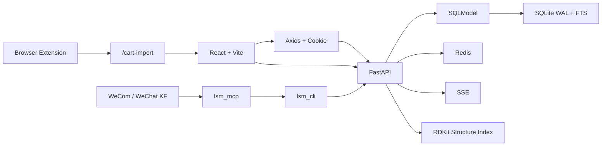

# 技术栈

## 总览

当前技术选型围绕四个目标展开：

- 用 SQLite 支撑中小规模实验室业务，并保持可接受的检索能力。
- 用 React + Vite 提供高密度业务界面。
- 用 Redis 增强会话、限流和 SSE，同时允许降级。
- 用 RDKit 和 Ketcher 支撑可选结构检索。
- 用浏览器插件对接外部采购平台。
- 用 Agent skill、CLI、MCP 和企业微信入口提供受控自动化访问。

## 后端

### FastAPI

- 用途：提供 REST API、SSE、静态资源和运行时中间件。
- 落点：<InlineCodeRef href="https://github.com/hzb666/LabStorageManager/blob/main/app/main.py" />

### SQLModel + SQLAlchemy

- 用途：定义模型、DTO 和 SQLite 映射。
- 落点：`app/models/*.py`

### SQLite

- 用途：主数据库。
- 落点：<InlineCodeRef href="https://github.com/hzb666/LabStorageManager/blob/main/app/database.py" /> 与 <InlineCodeRef href="https://github.com/hzb666/LabStorageManager/tree/main/app/db_bootstrap" />
- 关键配置：`WAL`、`foreign_keys=ON`、复合索引、FTS5 虚拟表和触发器。

### JWT + python-jose

- 用途：登录认证。
- 落点：`app/core/auth.py`
- 模式：浏览器使用 HttpOnly Cookie，脚本或调试工具可使用 Bearer Token。

### Redis

- 用途：会话缓存、登录限流和 SSE pub/sub。
- 落点：`app/core/redis.py`、`app/services/sse_redis.py`
- 特点：具备降级能力，不可用时部分功能仍可继续。

### Ruff

- 用途：后端 lint。
- 验证命令：`ruff check app/`

## 前端

### React 19

- 用途：页面和组件开发。
- 落点：`frontend/src/`

### TypeScript 5.9

- 用途：前端类型系统。

### Vite 8

- 用途：前端构建与开发服务器。
- 落点：`frontend/`

### React Router DOM 7

- 用途：页面路由。
- 落点：`frontend/src/App.tsx`

### Zustand

- 用途：认证状态、UI 状态和 SSE 状态。
- 落点：`frontend/src/store/`

### TanStack Table 8 + React Virtual

- 用途：高密度列表和虚拟滚动。
- 落点：`frontend/src/components/ui/DataTable.tsx`、`frontend/src/hooks/useTableState.tsx`

### React Hook Form + Valibot

- 用途：表单状态管理与输入校验。
- 落点：`frontend/src/lib/validationSchemas.ts`、`frontend/src/lib/formConfigs.tsx`

### Tailwind CSS 4 + Radix UI

- 用途：样式系统和基础无障碍组件。
- 落点：`frontend/src/components/ui/`

## 实时通信与外围能力

### SSE

- 用途：库存、订单和仪表盘的局部更新。
- 后端：`app/api/events.py`、`app/services/sse_manager.py`
- 前端：`frontend/src/hooks/useSSE.ts`、`frontend/src/hooks/useListSSE.ts`

### 浏览器插件

- 用途：采集外部购物车并导入系统。
- 落点：`browser-extension/`
- 关键桥接路径：`/cart-import`、`reagentOrderAPI.create`、`consumableOrderAPI.create`
- 匹配分析接口：`/api/cart-sync`

### 结构检索

- 用途：按绘制结构或结构文本检索库存 CAS。
- 后端：`app/api/chem.py`、`app/models/compound_structure.py`、`app/services/structure_index.py`
- 前端：`frontend/src/components/chem/StructureSearchDialog.tsx`、`frontend/src/api/structureSearchApi.ts`
- 边界：默认关闭，需启用 `CHEM_STRUCTURE_FEATURE_ENABLED`。

### Agent skill、CLI 与 MCP

- 用途：为 Agent skill、脚本、企业微信智能机器人和微信客服提供受控命令面。
- CLI 落点：`lsm_cli/`
- MCP 落点：`lsm_mcp/`
- 边界：Agent skill 直接复用 CLI；MCP 通过 CLI 子进程调用后端 API，不直接访问数据库。

### 企业微信入口

- 用途：通过企业微信智能机器人和微信客服处理库存、订单、常用货架、借用和归还。
- 落点：`robot/`
- 边界：写操作需要先确认，实际执行仍通过 MCP、CLI 和后端 API。

## 文档与部署

### VitePress

- 用途：当前 wiki。
- 落点：`wiki/`

### Docker + Nginx

- 用途：部署后端、前端、Redis 和统一入口。
- 落点：`docker/`、`docker-compose.yml`

## 技术选型之间的关系

## 开发时最常接触的工具链

| 场景 | 工具 |
| --- | --- |
| 后端 lint | `ruff check app/` |
| 前端 lint | `cd frontend && npm run lint` |
| wiki 本地开发 | `cd wiki && npm run dev` |
| wiki 构建 | `cd wiki && npm run build` |
| 浏览器插件配置生成 | `npm run build:extension` |
| 后端启动 | `python -m uvicorn app.main:app --reload --host 0.0.0.0 --port 8000` |
| 前端启动 | `cd frontend && npm run dev` |

## 相关主题

- 代码目录划分：参见 [目录结构](/overview/directory-structure)
- 接口组织方式：参见 [API 边界与导航](/overview/api-boundary)
- 后端职责分层：参见 [后端服务地图](/backend/service-map)
- 前端基础设施：参见 [前端 Hooks](/frontend/hooks) 和 [前端 Lib 工具箱](/frontend/lib-overview)
- 数据库实体与字段：参见 [数据模型](/database/data-model) 和 [字段参考](/database/field-reference)

## 参考代码
- [app/core/auth.py](https://github.com/hzb666/LabStorageManager/blob/main/app/core/auth.py)
- [app/database.py](https://github.com/hzb666/LabStorageManager/blob/main/app/database.py)
- [app/db_bootstrap](https://github.com/hzb666/LabStorageManager/tree/main/app/db_bootstrap)
- [app/api/chem.py](https://github.com/hzb666/LabStorageManager/blob/main/app/api/chem.py)
- [app/main.py](https://github.com/hzb666/LabStorageManager/blob/main/app/main.py)
- [browser-extension/build-config.mjs](https://github.com/hzb666/LabStorageManager/blob/main/browser-extension/build-config.mjs)
- [docker-compose.yml](https://github.com/hzb666/LabStorageManager/blob/main/docker-compose.yml)
- [frontend/src/App.tsx](https://github.com/hzb666/LabStorageManager/blob/main/frontend/src/App.tsx)
- [frontend/src/lib/validationSchemas.ts](https://github.com/hzb666/LabStorageManager/blob/main/frontend/src/lib/validationSchemas.ts)
- [frontend/src/store/useStore.ts](https://github.com/hzb666/LabStorageManager/blob/main/frontend/src/store/useStore.ts)
- [lsm_cli](https://github.com/hzb666/LabStorageManager/tree/main/lsm_cli)
- [lsm_mcp](https://github.com/hzb666/LabStorageManager/tree/main/lsm_mcp)
- [robot](https://github.com/hzb666/LabStorageManager/tree/main/robot)
